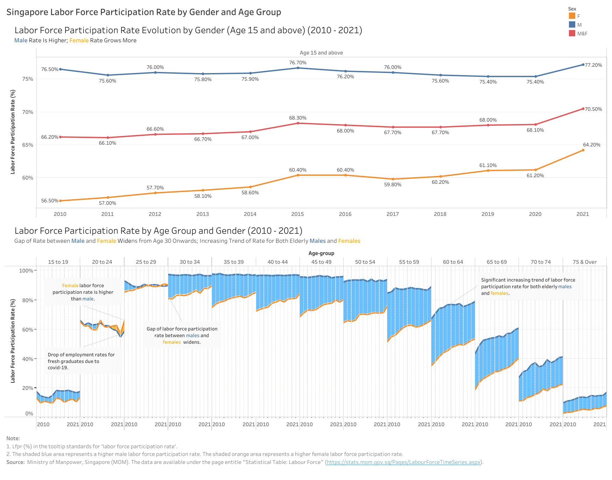

```{r setup, include=FALSE}

knitr::opts_chunk$set(echo = TRUE,
                      eval = TRUE,
                      warning = FALSE,
                      message = FALSE,
                      fig.retina = 3)

```

# 1. The Task

The task is to critisize the original data visualization in below Figure 1, suggest the alternative presentation, design the the proposed data visualization using Tableau, describe the step-by-step preparation and interpret the observations revealed by the data visualization prepared. 


The data source of above visualization is Ministry of Manpower, Singapore (MOM). The data are available under the page entitle [Statistical Table: Labour Force](https://stats.mom.gov.sg/Pages/LabourForceTimeSeries.aspx). For the purpose of this Dataviz Makeover exercise, the data on *Resident Labour Force Participation Rate by Age and Sex* was downloaded.

# 2. Critique of Visualisation

## 2.1 Clarity

***(a) Vague graph title:*** The chart title is too brief to convey enough information. Datasheet contains data on Singapore male, female and total labor force participation rate by age group from 1991 to 2021. The title fails to display location information, gender, grouping criteria and time period.

***(b) Incomplete/hidden x-axis labels:*** X axis length is too short to show the full names of all the x-axis labels. For the upper x-axis, "75&O.." and "70&Ov.." are incomplete labels. For the lower x-axis, each section contains the data from 2010 to 2021, but the label only shows year 2015, which is confusing.

***(c) Unclear y-axis title:***  "Lfpr" is not clear to tell the readers what the y-axis represents. There is also no unit displayed.


***(d) Disordered age-group legend*** Age-group order in the legend is disordered. It is confusing and difficult for readers to quickly understand the grouping rules. In addition, there is overlapping of age group for "70 & Over" and "75 & Over".


***(e) Missing annotation and caption*** There is no annotation highlighting the significant findings. There is also no recognition of the data source.


## 2.2 Aesthetic

***(a) Redundant color usage by age group:*** Each column of the chart shows the participation rate by each age group as labelled on the upper x-axis. Legend color by age group looks fancy but doesn't convey any additional information.

***(b) Too few x axis tick marks:*** For each age group, the visualization contains data from 2010 to 2011. However, there are only 3 tick marks in each age group.

***(c) Improper minor gridline interval*** Vertical minor gridline has uneven interval, which is ugly. There is missing horizontal minor gridline between 2 wide y-axis labels. Overall, both horizontal and vertical minor gridlines fail to provide additional guidance on reading the numbers.

***(d) Repeated x-axis title:*** "Year" label on the x axis are repeated for 14 times in the chart, which is abundant and not beautiful.

***(e) Improper data ink:*** There is data ink on the axes but not in the values of the tick marks.


# 3. Proposed Design


## 3.1 Clarity


## 3.2 Aesthetic


# 3. Proposed Visualisation on Tableau
Please view the proposed visualisation on Tableau Public [here](https://public.tableau.com/app/profile/sun.shengmei/viz/DataViz_16446851228940/Sheet1?publish=yes).
{width=100%}

# 4. Step-by-step Preparation
No.|Step                                                |Action
---|----------------------------------------------------|-----------------------------------------------------------------------------------------------------------------------
1  |Load the excel file into Tableau Prep Builders. Drag 'mrsd_Res_LFPR_2' worksheet into the main pane for 2 times. Click the check box of 'Use Data Interpreter'. Rename the 1st sheet as 'Data1' and the 2nd sheet as 'Data2'. |{width=100%}
2  |Remove the data from year 1991-2009 for both 'Data1' and 'Data2' by deselect the check box. |{width=100%}
3  |Initiate the clean node 'Clean 1' from 'Data1' and 'Clean 1' from 'Data2' by clicking the '+' sign. |{width=100%}
4  |Under 'Clean 1', Ctrl and select row 'Females', 'Males', and 'Total' in the 'Age(Years)/Sex' field at the same time. Right click and select 'Exclude'. |{width=100%}
5  |Under 'Clean 1', right click the 'Age(Years)/Sex' field, select 'Create Calculated Field' > 'Custom Calculation'|{width=100%}
6  |Input formula '{PARTITION [Age (Years) / Sex]: {ORDERBY[Age (Years) / Sex]:ROW_NUMBER()}}', apply and save. A new field 'Calculation1' is created. Change the data type from 'Number' to 'string'. |{width=100%}
7  |Rename 'Calculation1' to 'Sex' by double clicking the name. Rename '1' to 'F', '2' to 'M', and '3' to 'M&F' by double clicking the name. |{width=100%}
8  |Rename 'Age(Years)/Sex' to 'Age-group' by double clicking the name. |{width=100%}
9  |Add a pivot node 'Pivot 1' after 'Clean 1'. |{width=100%}
10 |Under 'Pivot 1', Ctrl and select year 2010 to 2021. Drag all the selected fields to 'Pivoted Fields'. |{width=100%}
11 |Rename 'Pivot1 Names' to 'Year' and 'Pivot1 Values' to 'LFPR'. |{width=100%}
12 |Under 'Clean 2', Ctrl and select all the rows at the same time, except 'Females', 'Males', and 'Total' in the 'Age(Years)/Sex' field. Right click and select 'Exclude'. |{width=100%}
13 |Under 'Clean 2', repeat the same step of 5 and 6 here. Rename 'Calculation1' to 'Age-group'. Rename '1' to 'Total'. Rename 'Age(Years)/Sex' to 'Sex'. Rename 'Females' to 'F', 'Males' to 'M', and 'Total' to 'M&F'. |{width=100%}
14 |Add a pivot node 'Pivot 2' after 'Clean 2'. Ctrl and select year 2010 to 2021. Drag all the selected fields to 'Pivoted Fields'. Rename 'Pivot1 Names' to 'Year' and 'Pivot1 Values' to 'LFPR'. |{width=100%}
15 |Drag 'Pivot 2' towards 'Pivot 1' to form a union 'Union 1'. |{width=100%}
16 |Under 'Union 1', remove field 'Table Names'. For 'Age-group', exclude "70 & Over'. Change 'Year' type from 'String' to 'Date'. Cleaned data frame is shown on the right. |{width=100%}
17 |Create a Output node 'Output' after 'Union 1’ node and save output as ‘Singapore LFPR’. |{width=100%}
18 |Set up a connection on Tableau Desktop to the ‘Singapore LFPR’ hyper’s extract. 
19 |Create a 'Sheet 1'. Drag 'Age-group' and 'Year' into 'Columns'. Drag 'Lfpr' into rows. Change 'Year' type to 'Continuous'.|{width=100%}
20 |Drag 'Sex' to 'Filters' and select 'F', and 'M'.|{width=100%}
21 |Drag 'Sex' to 'Color' under 'Marks'. Click 'Color', 'Edit Colors', and change the color of 'F' to orange and the color of 'M' to blue. |{width=100%}
22 |Drag 'Age-group' to 'Filters' and deselect 'Total'. Change graph type to 'Area' under 'Marks'. |{width=100%}
23 |Click 'Analysis', 'Stack Marks', and 'Off'. |{width=100%}
24 |Under ‘Analysis’, select ‘Create Calculated Field’ to create a new variable called ‘Smaller%’ to select the minimum ‘LFPR’ irrespective of ‘Sex’ based on each time period.|{width=100%}
25 |Drag ‘Smaller%’ variable onto the ‘Lfpr’ axis to create a ‘combined axis’.|{width=100%}
26 |Drag ‘Measure Names’ from ‘Rows’ shelf to ‘Detail’ under ‘Marks’. Then click on the ‘Detail’ icon next to ‘Measure Names’ and change it to ‘Color’. |{width=100%}
27 |Click on ‘Colors’ under ‘Marks’ and edit the colors of the variables with ‘Smaller%’ to white. Change opacity to 100%.|{width=100%}
28 |Drag ‘Lfpr’ to the secondary axis on the chart. There will be a new section appearing under ‘Marks’. Change the chart type to ‘Line’ under the dropdown and remove ‘Measure Names’. Remove the secondary axis header|{width=100%}
29 |At the bottom x-axis, right click and select 'Edit Axis'. In 'General', change the range to fixed, starting from 2010 and ending at 2021. Delete the 'Title'. In 'Tick Marks', change the major tick marks to fixed, starting from 2010 and with tick interval '11'. Change the minor tick marks to be fixed as well, starting from 2010 and with tick interval '1'. |{width=100%}
30 |Add in reference lines from year 2011 to 2020. Set value to be constant, no label, dotted line with grey color. |{width=100%}
31 |Right click y-axis, and select 'Edit Axis'. Under scale, change the numbers to be integer with no decimal points and suffix with %. Double click y-axis and change the y-axis title to 'Labor Force Participation Rate (%). |{width=100%}
32 |Bold the age-group, Y-axis and X-axis values. Add a title and subtitle to the chart.|{width=100%}
33 |Add annotation to points whereby there are interesting insights. |{width=100%}
34 |Show caption to add in notes and data source. |{width=100%}
35 |Save to Tableau Public. |{width=100%}

# 5. Major Observations

1. **Male labor force participation rate is higher than female.** Except for age group of 20 to 24, male labor force participation rate is in general higher than female labor force. For the age group of 20 to 24, female labor force participation rate has been higher than male labor force since 2018. Big increase of female labor force participation rate for the early 20's is observed from year 2020 to 2021. 

2. **Female labor force participation rate has been increasing faster than male since 2010.** Male labor force participation rate between age 25 to 59 has been relatively stable, compared to the increasing trend of female labor force participation rate. The gap of labor force participation rate between male and female has been shrinking since 2010. 

3. **The elderly labor force participation rate for both male and female has been increasing.** This observation is for people who are older than 60. 

4. **The highest male labor force participation rate falls in the 30s groups. The highest female labor force participation rate falls in the late 20s. ** This could be because of women's commitments to family after marriage.  

5. **Sharp drop of labor force participation rate for the early 20s happened in 2020.** This could be of the negative impact of the Covid-19 on the employment rate for the graduates.

