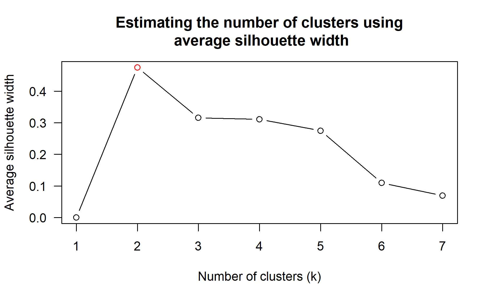
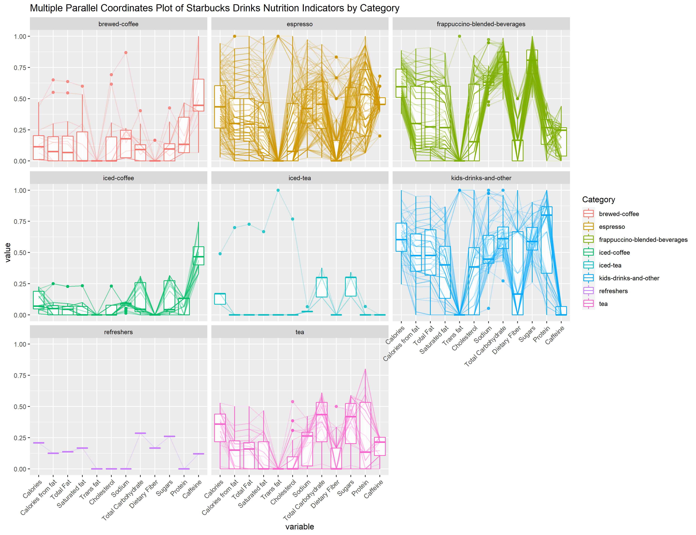
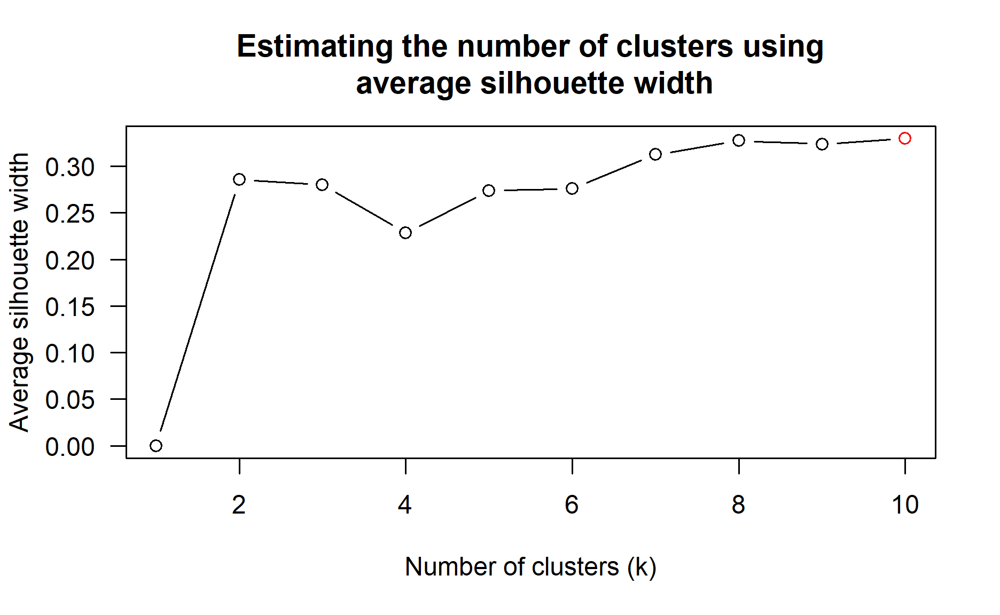

# 1.0 Introduction

In this task we are going to use heatmap and parallel coordinate plot to segment kid drinks and other by nutrition indicators.

**Heatmaps** visualise data through variations in coloring. Heatmaps are useful for cross-examining multivariate data, through placing variables in the columns and observation (or records) in rows and coloring the cells within the table. Heatmaps are good for showing variance across multiple variables, revealing patterns, displaying whether any variable are similar to others, and for detecting if any correlation exists.

**Parallel coordinates plot** is a data visualization specially designed for visualizing and analysing multivariate, numerical data. It is ideal for comparing multiple variables together and seeing the relationships between them. Parallel coordinates plot can be used to characterize clusters detected during segmentation.

For the purpose of this task, *starbucks_drink.csv* will be used.

# 2.0 Data and Considerations

+ For multivariate visualization, values are usually scaled between 0 to 1 instead of using the absolute values due to the different range of variables. Therefore, we need to remove the unit of each indicator to avoid confusion in the plot.
+ There are different sizes for each type of drinks. Drinks with larger sizes should have higher nutrition values. For an equal comparison, one size will be chosen for this study.
+ In order to create heatmaps, we need to create a matrix with unique row names. As noticed, there are repeated category names and product names. We can group the data by category on average value to study the difference between kid-drinks-and-others category and other categories as a whole. 
+ We can further zoom into more details of kid-drinks-and-others category. As noticed, even though the names of some drinks are the same, differences lie in size, type of milk and type of whipped cream. In order to look into the individual product, we need to create a unique name for each drink by concatenating the general name with different type of milk and type of whipped cream.

# 3.0 Step-by-step Preparations

## 3.1 Installing and loading the required libraries

The code chunk below is to install the packages needed. 

+ **seriation** is to arrange the rows of data optimally after clustering
+ **dendextend** is to determine the best clustering method and number of cluster
+ **heatmaply** is to plot the heatmap
+ **GGally** is to plot the static parallel coordinates plot
+ **parallelPlot** is to plot the interactive parallel coordinates plot
+ **tidyverse** is to clean data


<div class="layout-chunk" data-layout="l-body">
<div class="sourceCode"><pre class="sourceCode r"><code class="sourceCode r"><span class='va'>packages</span> <span class='op'>=</span> <span class='fu'><a href='https://rdrr.io/r/base/c.html'>c</a></span><span class='op'>(</span><span class='st'>'seriation'</span>, <span class='st'>'dendextend'</span>, <span class='st'>'heatmaply'</span>, <span class='st'>'GGally'</span>,  <span class='st'>'parallelPlot'</span>, <span class='st'>'tidyverse'</span><span class='op'>)</span>

<span class='kw'>for</span><span class='op'>(</span><span class='va'>p</span> <span class='kw'>in</span> <span class='va'>packages</span><span class='op'>)</span><span class='op'>{</span><span class='va'>library</span>
  <span class='kw'>if</span><span class='op'>(</span><span class='op'>!</span><span class='kw'><a href='https://rdrr.io/r/base/library.html'>require</a></span><span class='op'>(</span><span class='va'>p</span>, character.only <span class='op'>=</span> <span class='cn'>T</span><span class='op'>)</span><span class='op'>)</span><span class='op'>{</span>
    <span class='fu'><a href='https://rdrr.io/r/utils/install.packages.html'>install.packages</a></span><span class='op'>(</span><span class='va'>p</span><span class='op'>)</span>
  <span class='op'>}</span>
  <span class='kw'><a href='https://rdrr.io/r/base/library.html'>library</a></span><span class='op'>(</span><span class='va'>p</span>, character.only <span class='op'>=</span> <span class='cn'>T</span><span class='op'>)</span>
<span class='op'>}</span>
</code></pre></div>

</div>


## 3.2 Data Import

The code chunk below imports *starbucks_drink.csv* into R environment by using [**read_csv()**](https://readr.tidyverse.org/reference/read_delim.html) function of **readr** package.

<div class="layout-chunk" data-layout="l-body">
<div class="sourceCode"><pre class="sourceCode r"><code class="sourceCode r"><span class='va'>df</span> <span class='op'>&lt;-</span> <span class='fu'>read_csv</span><span class='op'>(</span><span class='st'>"data/starbucks_drink.csv"</span><span class='op'>)</span> 
</code></pre></div>

</div>

## 3.3 Data Wrangling

For multivariate visualization, values are usually scaled between 0 to 1 instead of using the absolute values. Therefore, we need to change the variables name and remove the unit to avoid the confusion.

<div class="layout-chunk" data-layout="l-body">
<div class="sourceCode"><pre class="sourceCode r"><code class="sourceCode r"><span class='va'>df</span> <span class='op'>&lt;-</span> <span class='va'>df</span> <span class='op'>%&gt;%</span>
  <span class='fu'>rename_with</span><span class='op'>(</span><span class='op'>~</span><span class='fu'>str_replace</span><span class='op'>(</span><span class='va'>.</span>, <span class='st'>"\\([a-z]+\\)"</span>, <span class='st'>""</span><span class='op'>)</span><span class='op'>)</span>
</code></pre></div>

</div>


We noticed that the caffeine content column is in character. Below code is to convert the characters to be numbers.

<div class="layout-chunk" data-layout="l-body">
<div class="sourceCode"><pre class="sourceCode r"><code class="sourceCode r"><span class='va'>df</span><span class='op'>$</span><span class='va'>`Caffeine`</span> <span class='op'>=</span> <span class='fu'><a href='https://rdrr.io/r/base/numeric.html'>as.numeric</a></span><span class='op'>(</span><span class='va'>df</span><span class='op'>$</span><span class='va'>`Caffeine`</span><span class='op'>)</span>
</code></pre></div>

</div>


let's explore the drinks size. 

<div class="layout-chunk" data-layout="l-body">
<div class="sourceCode"><pre class="sourceCode r"><code class="sourceCode r"><span class='va'>size</span> <span class='op'>&lt;-</span> <span class='va'>df</span> <span class='op'>%&gt;%</span>
  <span class='fu'>group_by</span><span class='op'>(</span><span class='va'>`Size`</span><span class='op'>)</span> <span class='op'>%&gt;%</span>
  <span class='fu'>summarise</span><span class='op'>(</span>mean <span class='op'>=</span> <span class='fu'><a href='https://rdrr.io/r/base/mean.html'>mean</a></span><span class='op'>(</span><span class='va'>`Portion(fl oz)`</span><span class='op'>)</span>, count <span class='op'>=</span> <span class='fu'>n</span><span class='op'>(</span><span class='op'>)</span><span class='op'>)</span> <span class='op'>%&gt;%</span>
  <span class='fu'>ungroup</span><span class='op'>(</span><span class='op'>)</span>

<span class='va'>size</span>
</code></pre></div>

```
# A tibble: 8 x 3
  Size         mean count
  <chr>       <dbl> <int>
1 Grande      15.9    583
2 Kids         8       34
3 Short        8.35   206
4 Tall        12.1    583
5 Trenta Iced 30       73
6 Venti       19.9    218
7 Venti Iced  23.9    359
8 <NA>        10.6     12
```

</div>

As seen above, there are 7 named types of size. For large number of data, we will use "Grande" size in this study.

<div class="layout-chunk" data-layout="l-body">
<div class="sourceCode"><pre class="sourceCode r"><code class="sourceCode r"><span class='va'>df</span> <span class='op'>&lt;-</span> <span class='va'>df</span> <span class='op'>%&gt;%</span>
   <span class='fu'><a href='https://rdrr.io/r/stats/filter.html'>filter</a></span><span class='op'>(</span><span class='va'>Size</span> <span class='op'>==</span> <span class='st'>'Grande'</span><span class='op'>)</span>
</code></pre></div>

</div>


Next, we need to group the data by category, since there are many different drinks for each category.  **Mean()** is used to summarize all the data.

<div class="layout-chunk" data-layout="l-body">
<div class="sourceCode"><pre class="sourceCode r"><code class="sourceCode r"><span class='va'>df1</span> <span class='op'>&lt;-</span> <span class='va'>df</span><span class='op'>[</span>, <span class='fu'><a href='https://rdrr.io/r/base/c.html'>c</a></span><span class='op'>(</span><span class='fl'>1</span>,<span class='fl'>4</span><span class='op'>:</span><span class='fl'>15</span><span class='op'>)</span><span class='op'>]</span> <span class='op'>%&gt;%</span>
  <span class='fu'>group_by</span><span class='op'>(</span><span class='va'>Category</span><span class='op'>)</span> <span class='op'>%&gt;%</span>
  <span class='fu'>summarise_all</span><span class='op'>(</span><span class='st'>"mean"</span><span class='op'>)</span> <span class='op'>%&gt;%</span>
  <span class='fu'>ungroup</span><span class='op'>(</span><span class='op'>)</span>
<span class='va'>df1</span>
</code></pre></div>

```
# A tibble: 8 x 13
  Category       Calories `Calories from ~ `Total Fat` `Saturated fat`
  <chr>             <dbl>            <dbl>       <dbl>           <dbl>
1 brewed-coffee      76.8            31.1        3.43            1.96 
2 espresso          233.             67.3        7.46            4.27 
3 frappuccino-b~    327.             72.2        7.96            4.85 
4 iced-coffee        55.2            11.3        1.19            0.654
5 iced-tea           82.3            10.8        1.23            0.769
6 kids-drinks-a~    328              96.7       10.6             5.96 
7 refreshers        112.              8.33       0.917           0.833
8 tea               139.             23.1        2.55            1.24 
# ... with 8 more variables: Trans fat <dbl>, Cholesterol <dbl>,
#   Sodium <dbl>, Total Carbohydrate <dbl>, Dietary Fiber <dbl>,
#   Sugars <dbl>, Protein <dbl>, Caffeine <dbl>
```

</div>


For the heatmaps, we need to change the rows index to category name from row number by using the code chunk below.

<div class="layout-chunk" data-layout="l-body">
<div class="sourceCode"><pre class="sourceCode r"><code class="sourceCode r"><span class='fu'><a href='https://rdrr.io/r/base/row.names.html'>row.names</a></span><span class='op'>(</span><span class='va'>df1</span><span class='op'>)</span> <span class='op'>&lt;-</span> <span class='va'>df1</span><span class='op'>$</span><span class='va'>Category</span>
</code></pre></div>

</div>


Next, we need to convert the data into matrix format. 

<div class="layout-chunk" data-layout="l-body">
<div class="sourceCode"><pre class="sourceCode r"><code class="sourceCode r"><span class='va'>df1_matrix</span> <span class='op'>&lt;-</span> <span class='fu'><a href='https://rdrr.io/r/base/data.matrix.html'>data.matrix</a></span><span class='op'>(</span><span class='va'>df1</span><span class='op'>)</span>
</code></pre></div>

</div>


Now, our 1st cleaned data set *df1_matrix* is ready for plotting. Next, let's filter out the data for kid-drinks-and-others category to look into more details. 

<div class="layout-chunk" data-layout="l-body">
<div class="sourceCode"><pre class="sourceCode r"><code class="sourceCode r"><span class='va'>kids_drinks</span> <span class='op'>&lt;-</span> <span class='va'>df</span> <span class='op'>%&gt;%</span> 
  <span class='fu'><a href='https://rdrr.io/r/stats/filter.html'>filter</a></span><span class='op'>(</span><span class='va'>Category</span> <span class='op'>==</span> <span class='st'>'kids-drinks-and-other'</span><span class='op'>)</span>
</code></pre></div>

</div>


Below code is to create the unique name for each product.

<div class="layout-chunk" data-layout="l-body">
<div class="sourceCode"><pre class="sourceCode r"><code class="sourceCode r"><span class='va'>kids_drinks</span> <span class='op'>&lt;-</span>  <span class='va'>kids_drinks</span> <span class='op'>%&gt;%</span>
  <span class='fu'>mutate</span><span class='op'>(</span>Drinks <span class='op'>=</span>  <span class='fu'><a href='https://rdrr.io/r/base/paste.html'>paste</a></span><span class='op'>(</span><span class='va'>`Name`</span>,<span class='va'>`Milk`</span>,<span class='va'>`Whipped Cream`</span><span class='op'>)</span><span class='op'>)</span>
</code></pre></div>

</div>


Next, let's change the rows index to "Drinks" from row number by using the code chunk below. Then, we change the data into matrix.

<div class="layout-chunk" data-layout="l-body">
<div class="sourceCode"><pre class="sourceCode r"><code class="sourceCode r"><span class='fu'><a href='https://rdrr.io/r/base/row.names.html'>row.names</a></span><span class='op'>(</span><span class='va'>kids_drinks</span><span class='op'>)</span> <span class='op'>&lt;-</span> <span class='va'>kids_drinks</span><span class='op'>$</span><span class='va'>Drinks</span>
<span class='va'>Kids_drinks_matrix</span> <span class='op'>&lt;-</span> <span class='fu'><a href='https://rdrr.io/r/base/data.matrix.html'>data.matrix</a></span><span class='op'>(</span><span class='va'>kids_drinks</span><span class='op'>)</span>
</code></pre></div>

</div>


Now, our *Kids_drinks_matrix* is ready for plotting.

## 3.4 Comparison bwtween kid-drinks-and-others category and other categories

### 3.4.1 Interactive Heatmap - heatmaply()

When analysing multivariate data set, it is very common that the variables in the data sets includes values that reflect different types of measurement. In general, these variables’ values have their own range. In order to ensure that all the variables have comparable values, data transformation are commonly used before clustering.

Three main data transformation methods are supported by **heatmaply()**, namely: scale, normalise and percentilse. For the purpose of this study, percentilse method is chosen given the small observation size and the benefit of being easy to interpret .

In order to determine the best clustering method and number of cluster the **dend_expend()** and **find_k()** functions of **dendextend** package will be used.

First, the **dend_expend()** will be used to determine the recommended clustering method to be used.

<div class="layout-chunk" data-layout="l-body">
<div class="sourceCode"><pre class="sourceCode r"><code class="sourceCode r"><span class='va'>df1_d</span> <span class='op'>&lt;-</span> <span class='fu'><a href='https://rdrr.io/r/stats/dist.html'>dist</a></span><span class='op'>(</span><span class='fu'>percentize</span><span class='op'>(</span><span class='va'>df1_matrix</span><span class='op'>[</span>, <span class='op'>-</span><span class='fu'><a href='https://rdrr.io/r/base/c.html'>c</a></span><span class='op'>(</span><span class='fl'>1</span><span class='op'>)</span><span class='op'>]</span><span class='op'>)</span>, method <span class='op'>=</span> <span class='st'>"euclidean"</span><span class='op'>)</span>
<span class='fu'>dend_expend</span><span class='op'>(</span><span class='va'>df1_d</span><span class='op'>)</span><span class='op'>[[</span><span class='fl'>3</span><span class='op'>]</span><span class='op'>]</span>
</code></pre></div>

```
  dist_methods hclust_methods     optim
1      unknown         ward.D 0.7782441
2      unknown        ward.D2 0.7812807
3      unknown         single 0.5482863
4      unknown       complete 0.7821805
5      unknown        average 0.7842891
6      unknown       mcquitty 0.7842107
7      unknown         median 0.7694487
8      unknown       centroid 0.7693485
```

</div>


The output table shows that “average” method should be used because it gave the high optimum value.

Next, **find_k()** is used to determine the optimal number of cluster.
 
<div class="layout-chunk" data-layout="l-body">
<div class="sourceCode"><pre class="sourceCode r"><code class="sourceCode r"><span class='va'>df1_clust</span> <span class='op'>&lt;-</span> <span class='fu'><a href='https://rdrr.io/r/stats/hclust.html'>hclust</a></span><span class='op'>(</span><span class='va'>df1_d</span>, method <span class='op'>=</span> <span class='st'>"average"</span><span class='op'>)</span>
<span class='va'>num_k</span> <span class='op'>&lt;-</span> <span class='fu'>find_k</span><span class='op'>(</span><span class='va'>df1_clust</span><span class='op'>)</span>
<span class='fu'><a href='https://rdrr.io/r/graphics/plot.default.html'>plot</a></span><span class='op'>(</span><span class='va'>num_k</span><span class='op'>)</span>
</code></pre></div>


</div>

Figure above shows that k=2 would be good.

With reference to the statistical analysis results, we prepare the code chunk as shown below.

+ **k_row** is used to produce 2 groups.
+ **colv** is set to NA to remove the dendrogram among the columns
+ the default **seriate** option “OLO” (Optimal leaf ordering) is used to find an optimal ordering of rows and columns.
+ **margins** is used to change the top margin to 60 and row margin to 200.
+ **fontsizw_row** and **fontsize_col** are used to change the font size for row and column labels to 8.
+ **main** is used to write the main title of the plot.
+ **xlab** and **ylab** are used to write the x-axis and y-axis labels respectively.

<div class="layout-chunk" data-layout="l-body">
<div class="sourceCode"><pre class="sourceCode r"><code class="sourceCode r"><span class='fu'>heatmaply</span><span class='op'>(</span><span class='fu'>percentize</span><span class='op'>(</span><span class='va'>df1_matrix</span><span class='op'>[</span>, <span class='op'>-</span><span class='fu'><a href='https://rdrr.io/r/base/c.html'>c</a></span><span class='op'>(</span><span class='fl'>1</span><span class='op'>)</span><span class='op'>]</span><span class='op'>)</span>,
          dist_method <span class='op'>=</span> <span class='st'>"euclidean"</span>,
          hclust_method <span class='op'>=</span> <span class='st'>"average"</span>,
          k_row <span class='op'>=</span> <span class='fl'>2</span>,
          Colv<span class='op'>=</span><span class='cn'>NA</span>,
          seriate <span class='op'>=</span><span class='st'>"OLO"</span>,
          colors <span class='op'>=</span> <span class='va'>Blues</span>,
          margins <span class='op'>=</span> <span class='fu'><a href='https://rdrr.io/r/base/c.html'>c</a></span><span class='op'>(</span><span class='cn'>NA</span>,<span class='fl'>200</span>,<span class='fl'>60</span>,<span class='cn'>NA</span><span class='op'>)</span>,
          fontsize_row <span class='op'>=</span> <span class='fl'>8</span>,
          fontsize_col <span class='op'>=</span> <span class='fl'>8</span>,
          xlab<span class='op'>=</span><span class='st'>"Nutrition Indicators"</span>, 
          ylab<span class='op'>=</span><span class='st'>"Drinks Category"</span>, 
          main<span class='op'>=</span><span class='st'>"Starbucks Drinks Nutrition Indicators by Category \nDataTransformation using Percentising Method"</span><span class='op'>)</span>
</code></pre></div>

```{=html}
<div id="htmlwidget-b57b4881dd58b8d014db" style="width:768px;height:672px;" class="plotly html-widget"></div>
<script type="application/json" data-for="htmlwidget-b57b4881dd58b8d014db">{"x":{"data":[{"x":[1,2,3,4,5,6,7,8,9,10,11,12],"y":[1,2,3,4,5,6,7,8],"z":[[1,1,1,1,1,1,0.857142857142857,0.857142857142857,1,0.857142857142857,1,0.0857142857142857],[0.857142857142857,0.857142857142857,0.857142857142857,0.857142857142857,0.571428571428571,0.857142857142857,1,1,0.571428571428571,1,0.714285714285714,0.314285714285714],[0.714285714285714,0.714285714285714,0.714285714285714,0.714285714285714,0.714285714285714,0.714285714285714,0.714285714285714,0.714285714285714,0.714285714285714,0.714285714285714,0.857142857142857,0.771428571428571],[0.571428571428571,0.428571428571429,0.428571428571429,0.428571428571429,0.428571428571429,0.428571428571429,0.428571428571429,0.571428571428571,0.428571428571429,0.571428571428571,0.571428571428571,null],[0.142857142857143,0.571428571428571,0.571428571428571,0.571428571428571,0.428571428571429,0.571428571428571,0.571428571428571,0,0.285714285714286,0,0.428571428571429,1],[0,0.285714285714286,0.142857142857143,0,0.428571428571429,0.142857142857143,0.285714285714286,0.142857142857143,0.142857142857143,0.142857142857143,0.285714285714286,0.542857142857143],[0.285714285714286,0.142857142857143,0.285714285714286,0.142857142857143,0.857142857142857,0.285714285714286,0,0.285714285714286,0.142857142857143,0.285714285714286,0,null],[0.428571428571429,0,0,0.285714285714286,0.428571428571429,0,0.142857142857143,0.428571428571429,0.857142857142857,0.428571428571429,0.142857142857143,null]],"text":[["row: kids-drinks-and-other<br>column: Calories<br>value: 1.000","row: kids-drinks-and-other<br>column: Calories from fat<br>value: 1.000","row: kids-drinks-and-other<br>column: Total Fat<br>value: 1.000","row: kids-drinks-and-other<br>column: Saturated fat<br>value: 1.000","row: kids-drinks-and-other<br>column: Trans fat<br>value: 1.000","row: kids-drinks-and-other<br>column: Cholesterol<br>value: 1.000","row: kids-drinks-and-other<br>column: Sodium<br>value: 0.875","row: kids-drinks-and-other<br>column: Total Carbohydrate<br>value: 0.875","row: kids-drinks-and-other<br>column: Dietary Fiber<br>value: 1.000","row: kids-drinks-and-other<br>column: Sugars<br>value: 0.875","row: kids-drinks-and-other<br>column: Protein<br>value: 1.000","row: kids-drinks-and-other<br>column: Caffeine<br>value: 0.200"],["row: frappuccino-blended-beverages<br>column: Calories<br>value: 0.875","row: frappuccino-blended-beverages<br>column: Calories from fat<br>value: 0.875","row: frappuccino-blended-beverages<br>column: Total Fat<br>value: 0.875","row: frappuccino-blended-beverages<br>column: Saturated fat<br>value: 0.875","row: frappuccino-blended-beverages<br>column: Trans fat<br>value: 0.625","row: frappuccino-blended-beverages<br>column: Cholesterol<br>value: 0.875","row: frappuccino-blended-beverages<br>column: Sodium<br>value: 1.000","row: frappuccino-blended-beverages<br>column: Total Carbohydrate<br>value: 1.000","row: frappuccino-blended-beverages<br>column: Dietary Fiber<br>value: 0.625","row: frappuccino-blended-beverages<br>column: Sugars<br>value: 1.000","row: frappuccino-blended-beverages<br>column: Protein<br>value: 0.750","row: frappuccino-blended-beverages<br>column: Caffeine<br>value: 0.400"],["row: espresso<br>column: Calories<br>value: 0.750","row: espresso<br>column: Calories from fat<br>value: 0.750","row: espresso<br>column: Total Fat<br>value: 0.750","row: espresso<br>column: Saturated fat<br>value: 0.750","row: espresso<br>column: Trans fat<br>value: 0.750","row: espresso<br>column: Cholesterol<br>value: 0.750","row: espresso<br>column: Sodium<br>value: 0.750","row: espresso<br>column: Total Carbohydrate<br>value: 0.750","row: espresso<br>column: Dietary Fiber<br>value: 0.750","row: espresso<br>column: Sugars<br>value: 0.750","row: espresso<br>column: Protein<br>value: 0.875","row: espresso<br>column: Caffeine<br>value: 0.800"],["row: tea<br>column: Calories<br>value: 0.625","row: tea<br>column: Calories from fat<br>value: 0.500","row: tea<br>column: Total Fat<br>value: 0.500","row: tea<br>column: Saturated fat<br>value: 0.500","row: tea<br>column: Trans fat<br>value: 0.500","row: tea<br>column: Cholesterol<br>value: 0.500","row: tea<br>column: Sodium<br>value: 0.500","row: tea<br>column: Total Carbohydrate<br>value: 0.625","row: tea<br>column: Dietary Fiber<br>value: 0.500","row: tea<br>column: Sugars<br>value: 0.625","row: tea<br>column: Protein<br>value: 0.625","row: tea<br>column: Caffeine<br>value:    NA"],["row: brewed-coffee<br>column: Calories<br>value: 0.250","row: brewed-coffee<br>column: Calories from fat<br>value: 0.625","row: brewed-coffee<br>column: Total Fat<br>value: 0.625","row: brewed-coffee<br>column: Saturated fat<br>value: 0.625","row: brewed-coffee<br>column: Trans fat<br>value: 0.500","row: brewed-coffee<br>column: Cholesterol<br>value: 0.625","row: brewed-coffee<br>column: Sodium<br>value: 0.625","row: brewed-coffee<br>column: Total Carbohydrate<br>value: 0.125","row: brewed-coffee<br>column: Dietary Fiber<br>value: 0.375","row: brewed-coffee<br>column: Sugars<br>value: 0.125","row: brewed-coffee<br>column: Protein<br>value: 0.500","row: brewed-coffee<br>column: Caffeine<br>value: 1.000"],["row: iced-coffee<br>column: Calories<br>value: 0.125","row: iced-coffee<br>column: Calories from fat<br>value: 0.375","row: iced-coffee<br>column: Total Fat<br>value: 0.250","row: iced-coffee<br>column: Saturated fat<br>value: 0.125","row: iced-coffee<br>column: Trans fat<br>value: 0.500","row: iced-coffee<br>column: Cholesterol<br>value: 0.250","row: iced-coffee<br>column: Sodium<br>value: 0.375","row: iced-coffee<br>column: Total Carbohydrate<br>value: 0.250","row: iced-coffee<br>column: Dietary Fiber<br>value: 0.250","row: iced-coffee<br>column: Sugars<br>value: 0.250","row: iced-coffee<br>column: Protein<br>value: 0.375","row: iced-coffee<br>column: Caffeine<br>value: 0.600"],["row: iced-tea<br>column: Calories<br>value: 0.375","row: iced-tea<br>column: Calories from fat<br>value: 0.250","row: iced-tea<br>column: Total Fat<br>value: 0.375","row: iced-tea<br>column: Saturated fat<br>value: 0.250","row: iced-tea<br>column: Trans fat<br>value: 0.875","row: iced-tea<br>column: Cholesterol<br>value: 0.375","row: iced-tea<br>column: Sodium<br>value: 0.125","row: iced-tea<br>column: Total Carbohydrate<br>value: 0.375","row: iced-tea<br>column: Dietary Fiber<br>value: 0.250","row: iced-tea<br>column: Sugars<br>value: 0.375","row: iced-tea<br>column: Protein<br>value: 0.125","row: iced-tea<br>column: Caffeine<br>value:    NA"],["row: refreshers<br>column: Calories<br>value: 0.500","row: refreshers<br>column: Calories from fat<br>value: 0.125","row: refreshers<br>column: Total Fat<br>value: 0.125","row: refreshers<br>column: Saturated fat<br>value: 0.375","row: refreshers<br>column: Trans fat<br>value: 0.500","row: refreshers<br>column: Cholesterol<br>value: 0.125","row: refreshers<br>column: Sodium<br>value: 0.250","row: refreshers<br>column: Total Carbohydrate<br>value: 0.500","row: refreshers<br>column: Dietary Fiber<br>value: 0.875","row: refreshers<br>column: Sugars<br>value: 0.500","row: refreshers<br>column: Protein<br>value: 0.250","row: refreshers<br>column: Caffeine<br>value:    NA"]],"colorscale":[[0,"#F7FBFF"],[0.0857142857142857,"#E5EFF9"],[0.142857142857143,"#DAE8F5"],[0.285714285714286,"#BAD6EA"],[0.314285714285714,"#B1D2E7"],[0.428571428571429,"#88BEDC"],[0.542857142857143,"#5DA4D0"],[0.571428571428571,"#539DCC"],[0.714285714285714,"#2A7AB9"],[0.771428571428571,"#1C6BB0"],[0.857142857142857,"#0B559F"],[1,"#08306B"]],"type":"heatmap","showscale":false,"autocolorscale":false,"showlegend":false,"xaxis":"x","yaxis":"y","hoverinfo":"text","frame":null},{"x":[1],"y":[1],"name":"99_2b6cbcde154a151df7f1b00392d8c21f","type":"scatter","mode":"markers","opacity":0,"hoverinfo":"skip","showlegend":false,"marker":{"color":[0,1],"colorscale":[[0,"#F7FBFF"],[0.00334448160535117,"#F6FAFE"],[0.00668896321070234,"#F5F9FE"],[0.0100334448160535,"#F4F9FE"],[0.0133779264214047,"#F4F9FE"],[0.0167224080267558,"#F3F8FD"],[0.020066889632107,"#F3F8FD"],[0.0234113712374582,"#F2F7FD"],[0.0267558528428093,"#F1F7FD"],[0.0301003344481605,"#F0F6FC"],[0.0334448160535117,"#EFF6FC"],[0.0367892976588629,"#EFF6FC"],[0.0401337792642141,"#EFF5FC"],[0.0434782608695652,"#EEF5FC"],[0.0468227424749164,"#EDF4FB"],[0.0501672240802676,"#ECF4FB"],[0.0535117056856187,"#ECF3FB"],[0.0568561872909699,"#ECF3FB"],[0.0602006688963211,"#EBF3FB"],[0.0635451505016722,"#EAF2FA"],[0.0668896321070234,"#E9F2FA"],[0.0702341137123746,"#E8F1FA"],[0.0735785953177258,"#E8F1FA"],[0.0769230769230769,"#E7F0F9"],[0.0802675585284281,"#E7F0F9"],[0.0836120401337792,"#E6F0F9"],[0.0869565217391304,"#E5EFF9"],[0.0903010033444816,"#E4EFF9"],[0.0936454849498328,"#E4EEF8"],[0.096989966555184,"#E3EEF8"],[0.100334448160535,"#E2EDF8"],[0.103678929765886,"#E2EDF8"],[0.107023411371237,"#E1EDF8"],[0.110367892976589,"#E1ECF7"],[0.11371237458194,"#E0ECF7"],[0.117056856187291,"#DFEBF7"],[0.120401337792642,"#DEEBF7"],[0.123745819397993,"#DDEAF6"],[0.127090301003344,"#DDEAF6"],[0.130434782608696,"#DDEAF6"],[0.133779264214047,"#DCE9F6"],[0.137123745819398,"#DBE9F6"],[0.140468227424749,"#DAE8F5"],[0.1438127090301,"#DAE8F5"],[0.147157190635452,"#D9E7F5"],[0.150501672240803,"#D9E7F5"],[0.153846153846154,"#D8E7F5"],[0.157190635451505,"#D7E6F4"],[0.160535117056856,"#D7E6F4"],[0.163879598662207,"#D6E5F4"],[0.167224080267558,"#D5E5F4"],[0.17056856187291,"#D5E5F4"],[0.173913043478261,"#D4E4F3"],[0.177257525083612,"#D4E4F3"],[0.180602006688963,"#D3E3F3"],[0.183946488294314,"#D2E3F3"],[0.187290969899666,"#D1E2F2"],[0.190635451505017,"#D1E2F2"],[0.193979933110368,"#D1E2F2"],[0.197324414715719,"#D0E1F2"],[0.20066889632107,"#CFE1F2"],[0.204013377926421,"#CEE0F1"],[0.207357859531773,"#CEE0F1"],[0.210702341137124,"#CDDFF1"],[0.214046822742475,"#CCDFF1"],[0.217391304347826,"#CCDFF1"],[0.220735785953177,"#CBDEF0"],[0.224080267558528,"#CBDEF0"],[0.22742474916388,"#CADDF0"],[0.230769230769231,"#C9DDF0"],[0.234113712374582,"#C8DCEF"],[0.237458193979933,"#C8DCEF"],[0.240802675585284,"#C8DCEF"],[0.244147157190635,"#C7DBEF"],[0.247491638795987,"#C6DBEF"],[0.250836120401338,"#C5DAEE"],[0.254180602006689,"#C4DAEE"],[0.25752508361204,"#C3D9EE"],[0.260869565217391,"#C2D9ED"],[0.264214046822742,"#C1D9ED"],[0.267558528428094,"#C0D8ED"],[0.270903010033445,"#BFD8EC"],[0.274247491638796,"#BED7EC"],[0.277591973244147,"#BCD7EB"],[0.280936454849498,"#BBD6EB"],[0.284280936454849,"#BBD6EB"],[0.287625418060201,"#BAD6EA"],[0.290969899665552,"#B9D5EA"],[0.294314381270903,"#B7D4EA"],[0.297658862876254,"#B6D4E9"],[0.301003344481605,"#B5D3E9"],[0.304347826086956,"#B4D3E8"],[0.307692307692308,"#B3D3E8"],[0.311036789297659,"#B2D2E8"],[0.31438127090301,"#B1D2E7"],[0.317725752508361,"#B0D1E7"],[0.321070234113712,"#AFD1E6"],[0.324414715719064,"#AED0E6"],[0.327759197324415,"#ACD0E6"],[0.331103678929766,"#ACD0E6"],[0.334448160535117,"#ABCFE5"],[0.337792642140468,"#AACFE5"],[0.341137123745819,"#A8CEE4"],[0.344481605351171,"#A7CEE4"],[0.347826086956522,"#A6CDE3"],[0.351170568561873,"#A5CDE3"],[0.354515050167224,"#A4CDE3"],[0.357859531772575,"#A3CCE3"],[0.361204013377926,"#A2CBE2"],[0.364548494983278,"#A1CBE2"],[0.367892976588629,"#A0CAE1"],[0.37123745819398,"#9FCAE1"],[0.374581939799331,"#9DC9E0"],[0.377926421404682,"#9CC9E0"],[0.381270903010033,"#9BC8E0"],[0.384615384615385,"#9AC7E0"],[0.387959866220736,"#98C7DF"],[0.391304347826087,"#97C6DF"],[0.394648829431438,"#96C5DF"],[0.397993311036789,"#94C5DF"],[0.40133779264214,"#93C4DE"],[0.404682274247492,"#92C3DE"],[0.408026755852843,"#90C2DE"],[0.411371237458194,"#8FC1DD"],[0.414715719063545,"#8DC0DD"],[0.418060200668896,"#8CC0DD"],[0.421404682274247,"#8BC0DD"],[0.424749163879599,"#89BFDC"],[0.42809364548495,"#88BEDC"],[0.431438127090301,"#87BDDC"],[0.434782608695652,"#85BCDB"],[0.438127090301003,"#84BBDB"],[0.441471571906354,"#82BADB"],[0.444816053511706,"#81BADB"],[0.448160535117057,"#80B9DA"],[0.451505016722408,"#7FB8DA"],[0.454849498327759,"#7DB8D9"],[0.45819397993311,"#7BB7D9"],[0.461538461538461,"#7AB6D9"],[0.464882943143813,"#79B5D8"],[0.468227424749164,"#78B5D8"],[0.471571906354515,"#77B4D8"],[0.474916387959866,"#75B3D8"],[0.478260869565217,"#73B2D7"],[0.481605351170569,"#72B1D7"],[0.48494983277592,"#71B1D7"],[0.488294314381271,"#6FB0D6"],[0.491638795986622,"#6EB0D6"],[0.494983277591973,"#6DAFD6"],[0.498327759197324,"#6BAED6"],[0.501672240802676,"#6AADD5"],[0.505016722408027,"#69ACD5"],[0.508361204013378,"#68ABD4"],[0.511705685618729,"#67ABD4"],[0.51505016722408,"#66AAD4"],[0.518394648829431,"#65AAD3"],[0.521739130434783,"#63A9D3"],[0.525083612040134,"#62A8D2"],[0.528428093645485,"#61A7D2"],[0.531772575250836,"#60A6D1"],[0.535117056856187,"#5FA6D1"],[0.538461538461538,"#5EA5D1"],[0.54180602006689,"#5DA4D0"],[0.545150501672241,"#5CA3D0"],[0.548494983277592,"#5AA3CF"],[0.551839464882943,"#59A2CF"],[0.555183946488294,"#58A1CE"],[0.558528428093645,"#58A1CE"],[0.561872909698997,"#56A0CE"],[0.565217391304348,"#559FCD"],[0.568561872909699,"#549ECD"],[0.57190635451505,"#539DCC"],[0.575250836120401,"#529CCC"],[0.578595317725752,"#509BCB"],[0.581939799331104,"#509BCB"],[0.585284280936455,"#4F9BCB"],[0.588628762541806,"#4E9ACA"],[0.591973244147157,"#4C99CA"],[0.595317725752508,"#4B98C9"],[0.59866220735786,"#4A97C9"],[0.602006688963211,"#4996C8"],[0.605351170568562,"#4896C8"],[0.608695652173913,"#4795C8"],[0.612040133779264,"#4694C7"],[0.615384615384615,"#4594C7"],[0.618729096989966,"#4393C6"],[0.622073578595318,"#4292C6"],[0.625418060200669,"#4292C6"],[0.62876254180602,"#4191C5"],[0.632107023411371,"#4090C5"],[0.635451505016722,"#3F8FC4"],[0.638795986622074,"#3E8EC4"],[0.642140468227425,"#3D8DC3"],[0.645484949832776,"#3C8CC3"],[0.648829431438127,"#3C8CC3"],[0.652173913043478,"#3B8BC2"],[0.655518394648829,"#3A8AC1"],[0.65886287625418,"#3989C1"],[0.662207357859532,"#3888C0"],[0.665551839464883,"#3787C0"],[0.668896321070234,"#3686BF"],[0.672240802675585,"#3585BF"],[0.675585284280936,"#3484BF"],[0.678929765886288,"#3383BE"],[0.682274247491639,"#3282BE"],[0.68561872909699,"#3181BD"],[0.688963210702341,"#3080BD"],[0.692307692307692,"#2F7FBC"],[0.695652173913043,"#2F7FBC"],[0.698996655518395,"#2E7EBC"],[0.702341137123746,"#2D7DBB"],[0.705685618729097,"#2C7CBB"],[0.709030100334448,"#2B7BBA"],[0.712374581939799,"#2A7AB9"],[0.71571906354515,"#2979B9"],[0.719063545150502,"#2979B9"],[0.722408026755853,"#2878B8"],[0.725752508361204,"#2777B8"],[0.729096989966555,"#2676B7"],[0.732441471571906,"#2575B7"],[0.735785953177257,"#2474B6"],[0.739130434782609,"#2474B6"],[0.74247491638796,"#2373B6"],[0.745819397993311,"#2272B5"],[0.749163879598662,"#2171B5"],[0.752508361204013,"#2070B4"],[0.755852842809364,"#1F6FB3"],[0.759197324414716,"#1E6EB2"],[0.762541806020067,"#1E6EB2"],[0.765886287625418,"#1E6DB2"],[0.769230769230769,"#1D6CB1"],[0.77257525083612,"#1C6BB0"],[0.775919732441472,"#1B6AAF"],[0.779264214046823,"#1A69AE"],[0.782608695652174,"#1A68AE"],[0.785953177257525,"#1A68AE"],[0.789297658862876,"#1967AD"],[0.792642140468227,"#1866AC"],[0.795986622073579,"#1765AB"],[0.79933110367893,"#1664AB"],[0.802675585284281,"#1663AA"],[0.806020066889632,"#1562A9"],[0.809364548494983,"#1562A9"],[0.812709030100334,"#1461A8"],[0.816053511705686,"#1360A7"],[0.819397993311037,"#135FA7"],[0.822742474916388,"#125EA6"],[0.826086956521739,"#115DA5"],[0.82943143812709,"#105CA4"],[0.832775919732441,"#105CA4"],[0.836120401337793,"#0F5BA3"],[0.839464882943144,"#0F5AA3"],[0.842809364548495,"#0E59A2"],[0.846153846153846,"#0D58A1"],[0.849498327759197,"#0C57A0"],[0.852842809364548,"#0C57A0"],[0.8561872909699,"#0C56A0"],[0.859531772575251,"#0B559F"],[0.862876254180602,"#0A549E"],[0.866220735785953,"#09539D"],[0.869565217391304,"#08529C"],[0.872909698996655,"#08519C"],[0.876254180602007,"#08519B"],[0.879598662207358,"#08509A"],[0.882943143812709,"#084F99"],[0.88628762541806,"#084E97"],[0.889632107023411,"#084C96"],[0.892976588628763,"#084B95"],[0.896321070234114,"#084A93"],[0.899665551839465,"#084A92"],[0.903010033444816,"#084990"],[0.906354515050167,"#08488F"],[0.909698996655518,"#08478E"],[0.91304347826087,"#08468C"],[0.916387959866221,"#08458B"],[0.919732441471572,"#08448A"],[0.923076923076923,"#084489"],[0.926421404682274,"#084388"],[0.929765886287625,"#084286"],[0.933110367892977,"#084185"],[0.936454849498328,"#084083"],[0.939799331103679,"#083F82"],[0.94314381270903,"#083E81"],[0.946488294314381,"#083E7F"],[0.949832775919732,"#083D7E"],[0.953177257525084,"#083C7D"],[0.956521739130435,"#083B7B"],[0.959866220735786,"#083A7A"],[0.963210702341137,"#083979"],[0.966555183946488,"#083978"],[0.969899665551839,"#083876"],[0.973244147157191,"#083775"],[0.976588628762542,"#083674"],[0.979933110367893,"#083572"],[0.983277591973244,"#083471"],[0.986622073578595,"#083370"],[0.989966555183946,"#08336F"],[0.993311036789298,"#08326D"],[0.996655518394649,"#08316C"],[1,"#08306B"]],"colorbar":{"bgcolor":"rgba(255,255,255,1)","bordercolor":"transparent","borderwidth":1.88976377952756,"thickness":23.04,"title":null,"titlefont":{"color":"rgba(0,0,0,1)","family":"","size":14.6118721461187},"tickmode":"array","ticktext":["0.25","0.50","0.75","1.00"],"tickvals":[0.142857142857143,0.428571428571429,0.714285714285714,1],"tickfont":{"color":"rgba(0,0,0,1)","family":"","size":11.689497716895},"ticklen":2,"len":0.5}},"xaxis":"x","yaxis":"y","frame":null},{"x":[1.72216284724424,1.72216284724424,null,1.72216284724424,1.05742244794543,null,1.05742244794543,1.05742244794543,null,1.05742244794543,0.904534033733291,null,0.904534033733291,0.904534033733291,null,0.904534033733291,0,null,0.904534033733291,0.904534033733291,null,0.904534033733291,0,null,1.05742244794543,1.05742244794543,null,1.05742244794543,0.93665545868383,null,0.93665545868383,0.93665545868383,null,0.93665545868383,0.678400525299968,null,0.678400525299968,0.678400525299968,null,0.678400525299968,0,null,0.678400525299968,0.678400525299968,null,0.678400525299968,0,null,0.93665545868383,0.93665545868383,null,0.93665545868383,0],"y":[3.8125,5.875,null,5.875,5.875,null,5.875,4.5,null,4.5,4.5,null,4.5,4,null,4,4,null,4.5,5,null,5,5,null,5.875,7.25,null,7.25,7.25,null,7.25,6.5,null,6.5,6.5,null,6.5,6,null,6,6,null,6.5,7,null,7,7,null,7.25,8,null,8,8],"text":["y: 1.7221628","y: 1.7221628",null,"y: 1.7221628","y: 1.7221628",null,"y: 1.0574224","y: 1.0574224",null,"y: 1.0574224","y: 1.0574224",null,"y: 0.9045340","y: 0.9045340",null,"y: 0.9045340","y: 0.9045340",null,"y: 0.9045340","y: 0.9045340",null,"y: 0.9045340","y: 0.9045340",null,"y: 1.0574224","y: 1.0574224",null,"y: 1.0574224","y: 1.0574224",null,"y: 0.9366555","y: 0.9366555",null,"y: 0.9366555","y: 0.9366555",null,"y: 0.6784005","y: 0.6784005",null,"y: 0.6784005","y: 0.6784005",null,"y: 0.6784005","y: 0.6784005",null,"y: 0.6784005","y: 0.6784005",null,"y: 0.9366555","y: 0.9366555",null,"y: 0.9366555","y: 0.9366555"],"type":"scatter","mode":"lines","line":{"width":2.26771653543307,"color":"rgba(57,190,177,1)","dash":"solid"},"hoveron":"points","name":"(#39BEB1,solid)","legendgroup":"(#39BEB1,solid)","showlegend":true,"xaxis":"x2","yaxis":"y","hoverinfo":"text","frame":null},{"x":[1.72216284724424,1.72216284724424,null,1.72216284724424,0.820314490216963,null,0.820314490216963,0.820314490216963,null,0.820314490216963,0,null,0.820314490216963,0.820314490216963,null,0.820314490216963,0.687386354243376,null,0.687386354243376,0.687386354243376,null,0.687386354243376,0,null,0.687386354243376,0.687386354243376,null,0.687386354243376,0],"y":[3.8125,1.75,null,1.75,1.75,null,1.75,1,null,1,1,null,1.75,2.5,null,2.5,2.5,null,2.5,2,null,2,2,null,2.5,3,null,3,3],"text":["y: 1.7221628","y: 1.7221628",null,"y: 1.7221628","y: 1.7221628",null,"y: 0.8203145","y: 0.8203145",null,"y: 0.8203145","y: 0.8203145",null,"y: 0.8203145","y: 0.8203145",null,"y: 0.8203145","y: 0.8203145",null,"y: 0.6873864","y: 0.6873864",null,"y: 0.6873864","y: 0.6873864",null,"y: 0.6873864","y: 0.6873864",null,"y: 0.6873864","y: 0.6873864"],"type":"scatter","mode":"lines","line":{"width":2.26771653543307,"color":"rgba(228,149,165,1)","dash":"solid"},"hoveron":"points","name":"(#E495A5,solid)","legendgroup":"(#E495A5,solid)","showlegend":true,"xaxis":"x2","yaxis":"y","hoverinfo":"text","frame":null},{"x":[1.72216284724424,0.820314490216963,0,0.687386354243376,0,0,1.05742244794543,0.904534033733291,0,0,0.93665545868383,0.678400525299968,0,0,0],"y":[3.8125,1.75,1,2.5,2,3,5.875,4.5,4,5,7.25,6.5,6,7,8],"text":["y: 1.7221628","y: 0.8203145","y: 0.0000000","y: 0.6873864","y: 0.0000000","y: 0.0000000","y: 1.0574224","y: 0.9045340","y: 0.0000000","y: 0.0000000","y: 0.9366555","y: 0.6784005","y: 0.0000000","y: 0.0000000","y: 0.0000000"],"type":"scatter","mode":"markers","marker":{"autocolorscale":false,"color":"transparent","opacity":1,"size":null,"symbol":null,"line":{"width":1.88976377952756,"color":"transparent"}},"hoveron":"points","name":"(NA,1)","legendgroup":"(NA,1)","showlegend":true,"xaxis":"x2","yaxis":"y","hoverinfo":"text","frame":null}],"layout":{"xaxis":{"domain":[0,0.8],"automargin":true,"type":"linear","autorange":false,"range":[0.5,12.5],"tickmode":"array","ticktext":["Calories","Calories from fat","Total Fat","Saturated fat","Trans fat","Cholesterol","Sodium","Total Carbohydrate","Dietary Fiber","Sugars","Protein","Caffeine"],"tickvals":[1,2,3,4,5,6,7,8,9,10,11,12],"categoryorder":"array","categoryarray":["Calories","Calories from fat","Total Fat","Saturated fat","Trans fat","Cholesterol","Sodium","Total Carbohydrate","Dietary Fiber","Sugars","Protein","Caffeine"],"nticks":null,"ticks":"outside","tickcolor":"rgba(51,51,51,1)","ticklen":3.65296803652968,"tickwidth":0.66417600664176,"showticklabels":true,"tickfont":{"color":"rgba(77,77,77,1)","family":"","size":10.6268161062682},"tickangle":-45,"showline":true,"linecolor":"rgba(0,0,0,1)","linewidth":0.66417600664176,"showgrid":false,"gridcolor":null,"gridwidth":0,"zeroline":false,"anchor":"y","title":"Nutrition Indicators","hoverformat":".2f"},"xaxis2":{"domain":[0.8,1],"automargin":true,"type":"linear","autorange":false,"range":[0,1.72216284724424],"tickmode":"array","ticktext":["0.0","0.4","0.8","1.2","1.6"],"tickvals":[0,0.4,0.8,1.2,1.6],"categoryorder":"array","categoryarray":["0.0","0.4","0.8","1.2","1.6"],"nticks":null,"ticks":"","tickcolor":null,"ticklen":3.65296803652968,"tickwidth":0,"showticklabels":false,"tickfont":{"color":null,"family":null,"size":0},"tickangle":-0,"showline":false,"linecolor":null,"linewidth":0,"showgrid":false,"gridcolor":null,"gridwidth":0,"zeroline":false,"anchor":"y","title":{"text":"","font":{"color":null,"family":null,"size":0}},"hoverformat":".2f"},"yaxis":{"domain":[0,1],"automargin":true,"type":"linear","autorange":false,"range":[0.5,8.5],"tickmode":"array","ticktext":["kids-drinks-and-other","frappuccino-blended-beverages","espresso","tea","brewed-coffee","iced-coffee","iced-tea","refreshers"],"tickvals":[1,2,3,4,5,6,7,8],"categoryorder":"array","categoryarray":["kids-drinks-and-other","frappuccino-blended-beverages","espresso","tea","brewed-coffee","iced-coffee","iced-tea","refreshers"],"nticks":null,"ticks":"outside","tickcolor":"rgba(51,51,51,1)","ticklen":3.65296803652968,"tickwidth":0.66417600664176,"showticklabels":true,"tickfont":{"color":"rgba(77,77,77,1)","family":"","size":10.6268161062682},"tickangle":-0,"showline":true,"linecolor":"rgba(0,0,0,1)","linewidth":0.66417600664176,"showgrid":false,"gridcolor":null,"gridwidth":0,"zeroline":false,"anchor":"x","title":"Drinks Category","hoverformat":".2f"},"annotations":[],"shapes":[{"type":"rect","fillcolor":null,"line":{"color":null,"width":0,"linetype":[]},"yref":"paper","xref":"paper","x0":0,"x1":0.8,"y0":0,"y1":1},{"type":"rect","fillcolor":null,"line":{"color":null,"width":0,"linetype":[]},"yref":"paper","xref":"paper","x0":0.8,"x1":1,"y0":0,"y1":1}],"images":[],"margin":{"t":60,"r":null,"b":114.769613947696,"l":200},"paper_bgcolor":"rgba(255,255,255,1)","font":{"color":"rgba(0,0,0,1)","family":"","size":14.6118721461187},"showlegend":false,"legend":{"bgcolor":"rgba(255,255,255,1)","bordercolor":"transparent","borderwidth":1.88976377952756,"font":{"color":"rgba(0,0,0,1)","family":"","size":11.689497716895},"title":{"text":"","font":{"color":"rgba(0,0,0,1)","family":"","size":14.6118721461187}},"y":1,"yanchor":"top"},"hovermode":"closest","barmode":"relative","title":"Starbucks Drinks Nutrition Indicators by Category <br />DataTransformation using Percentising Method"},"attrs":{"4d14544c7d1f":{"x":{},"y":{},"fill":{},"text":{},"type":"heatmap"},"4d1457b52b42":{"xend":{},"yend":{},"colour":{},"linetype":{},"size":{},"x":{},"y":{},"type":"scatter"},"4d1441a74966":{"colour":{},"shape":{},"size":{},"x":{},"y":{}}},"source":"A","config":{"doubleClick":"reset","modeBarButtonsToAdd":["hoverclosest","hovercompare"],"showSendToCloud":false,"displaylogo":false,"modeBarButtonsToRemove":["sendDataToCloud","select2d","lasso2d","autoScale2d","hoverClosestCartesian","hoverCompareCartesian","sendDataToCloud"]},"highlight":{"on":"plotly_click","persistent":false,"dynamic":false,"selectize":false,"opacityDim":0.2,"selected":{"opacity":1},"debounce":0},"subplot":true,"shinyEvents":["plotly_hover","plotly_click","plotly_selected","plotly_relayout","plotly_brushed","plotly_brushing","plotly_clickannotation","plotly_doubleclick","plotly_deselect","plotly_afterplot","plotly_sunburstclick"],"base_url":"https://plot.ly"},"evals":[],"jsHooks":[]}</script>
```

</div>


### 3.4.2 Static Parallel Coordinates Plot - ggparcoord()

In this section, we will explore the dataset using **ggparcoord()** of **GGally** package. **ggparcoord()** function doesn't need matrix format of data frame. We can directly use the cleaned *df* dataset.

+ **groupColumn** argument is used to group the observations (i.e. parallel lines) by using a single variable (i.e. Region) and color the parallel coordinates lines by region name.
+ **scale** argument is used to scale the variables in the parallel coordinate plot by using uniminmax method. The method scale each variable so the minimum of the variable is zero and the maximum is one.
+ **alphaLines** argument is used to reduce the intensity of the line color to 0.2. The permissible value range is between 0 to 1.
boxplot argument is used to turn on the boxplot by using logical TRUE. The default is FALSE.
+ **title** argument is used to provide the parallel coordinates plot a title.
+ **facet_wrap()** of ggplot2 is used to plot 10 small multiple parallel coordinates plots. Each plot represent one drink category.
+ **theme()** function in ggplot2 is used to adjust the label with suitable angle and location.

<div class="layout-chunk" data-layout="l-body">
<div class="sourceCode"><pre class="sourceCode r"><code class="sourceCode r"><span class='fu'>ggparcoord</span><span class='op'>(</span>data <span class='op'>=</span> <span class='va'>df</span>, 
           columns <span class='op'>=</span> <span class='fu'><a href='https://rdrr.io/r/base/c.html'>c</a></span><span class='op'>(</span><span class='fl'>4</span><span class='op'>:</span><span class='fl'>15</span><span class='op'>)</span>,
           groupColumn <span class='op'>=</span> <span class='fl'>1</span>,
           scale <span class='op'>=</span> <span class='st'>"uniminmax"</span>,
           alphaLines <span class='op'>=</span> <span class='fl'>0.2</span>,
           boxplot <span class='op'>=</span> <span class='cn'>TRUE</span>, 
           title <span class='op'>=</span> <span class='st'>"Multiple Parallel Coordinates Plot of Starbucks Drinks Nutrition Indicators by Category"</span><span class='op'>)</span> <span class='op'>+</span>
  <span class='fu'>facet_wrap</span><span class='op'>(</span><span class='op'>~</span> <span class='va'>Category</span><span class='op'>)</span> <span class='op'>+</span>
  <span class='fu'>theme</span><span class='op'>(</span>axis.text.x <span class='op'>=</span> <span class='fu'>element_text</span><span class='op'>(</span>angle <span class='op'>=</span> <span class='fl'>45</span>, hjust<span class='op'>=</span><span class='fl'>1</span><span class='op'>)</span><span class='op'>)</span>
</code></pre></div>


</div>

## 3.5 Drinks segmentation for kid-drinks-and-others category

### 3.5.1 Interactive Heatmap - heatmaply()

Using the same codes and steps as 3.4.1, below visualization of clusterings is created.

First, the **dend_expend()** will be used to determine the recommended clustering method to be used.

<div class="layout-chunk" data-layout="l-body">
<div class="sourceCode"><pre class="sourceCode r"><code class="sourceCode r"><span class='va'>Kids_d</span> <span class='op'>&lt;-</span> <span class='fu'><a href='https://rdrr.io/r/stats/dist.html'>dist</a></span><span class='op'>(</span><span class='fu'>percentize</span><span class='op'>(</span><span class='va'>Kids_drinks_matrix</span><span class='op'>[</span>, <span class='fu'><a href='https://rdrr.io/r/base/c.html'>c</a></span><span class='op'>(</span><span class='fl'>4</span><span class='op'>:</span><span class='fl'>15</span><span class='op'>)</span><span class='op'>]</span><span class='op'>)</span>, method <span class='op'>=</span> <span class='st'>"euclidean"</span><span class='op'>)</span>
<span class='fu'>dend_expend</span><span class='op'>(</span><span class='va'>Kids_d</span><span class='op'>)</span><span class='op'>[[</span><span class='fl'>3</span><span class='op'>]</span><span class='op'>]</span>
</code></pre></div>

```
  dist_methods hclust_methods     optim
1      unknown         ward.D 0.4983142
2      unknown        ward.D2 0.5628215
3      unknown         single 0.4165639
4      unknown       complete 0.5801873
5      unknown        average 0.5924295
6      unknown       mcquitty 0.5954184
7      unknown         median 0.3323152
8      unknown       centroid 0.3885602
```

</div>

The output table shows that “mcquitty” method should be used because it gave the high optimum value.

Next, **find_k()** is used to determine the optimal number of cluster.

<div class="layout-chunk" data-layout="l-body">
<div class="sourceCode"><pre class="sourceCode r"><code class="sourceCode r"><span class='va'>kids_clust</span> <span class='op'>&lt;-</span> <span class='fu'><a href='https://rdrr.io/r/stats/hclust.html'>hclust</a></span><span class='op'>(</span><span class='va'>Kids_d</span>, method <span class='op'>=</span> <span class='st'>"mcquitty"</span><span class='op'>)</span>
<span class='va'>num_k</span> <span class='op'>&lt;-</span> <span class='fu'>find_k</span><span class='op'>(</span><span class='va'>kids_clust</span><span class='op'>)</span>
<span class='fu'><a href='https://rdrr.io/r/graphics/plot.default.html'>plot</a></span><span class='op'>(</span><span class='va'>num_k</span><span class='op'>)</span>
</code></pre></div>


</div>

Figure above shows that k=10 would be good. To avoid big number of clusters and too granular grouping, next best number of clusters 8 is chosen.

With reference to the statistical analysis results, we prepare the code chunk as shown below.

<div class="layout-chunk" data-layout="l-body">
<div class="sourceCode"><pre class="sourceCode r"><code class="sourceCode r"><span class='fu'>heatmaply</span><span class='op'>(</span><span class='fu'>percentize</span><span class='op'>(</span><span class='va'>Kids_drinks_matrix</span><span class='op'>[</span>, <span class='fu'><a href='https://rdrr.io/r/base/c.html'>c</a></span><span class='op'>(</span><span class='fl'>4</span><span class='op'>:</span><span class='fl'>15</span><span class='op'>)</span><span class='op'>]</span><span class='op'>)</span>,
          dist_method <span class='op'>=</span> <span class='st'>"euclidean"</span>,
          hclust_method <span class='op'>=</span> <span class='st'>"mcquitty"</span>,
          k_row <span class='op'>=</span> <span class='fl'>8</span>,
          Colv<span class='op'>=</span><span class='cn'>NA</span>,
          seriate <span class='op'>=</span><span class='st'>"OLO"</span>,
          colors <span class='op'>=</span> <span class='va'>Blues</span>,
          margins <span class='op'>=</span> <span class='fu'><a href='https://rdrr.io/r/base/c.html'>c</a></span><span class='op'>(</span><span class='cn'>NA</span>,<span class='fl'>200</span>,<span class='fl'>60</span>,<span class='cn'>NA</span><span class='op'>)</span>,
          fontsize_row <span class='op'>=</span> <span class='fl'>7</span>,
          fontsize_col <span class='op'>=</span> <span class='fl'>7</span>,
          xlab<span class='op'>=</span><span class='st'>"Nutrition Indicators"</span>, 
          ylab<span class='op'>=</span><span class='st'>"Drinks Category"</span>, 
          main<span class='op'>=</span><span class='st'>"Starbucks Kids-Drinks Nutrition Indicators by Product \nDataTransformation using Percentising Method"</span><span class='op'>)</span>
</code></pre></div>

```{=html}
<div id="htmlwidget-47f80ac67ec90bad6151" style="width:960px;height:960px;" class="plotly html-widget"></div>
<script type="application/json" data-for="htmlwidget-47f80ac67ec90bad6151">{"x":{"data":[{"x":[1,2,3,4,5,6,7,8,9,10,11,12],"y":[1,2,3,4,5,6,7,8,9,10,11,12,13,14,15,16,17,18,19,20,21,22,23,24,25,26,27,28,29,30,31,32,33,34,35,36,37,38,39,40,41,42,43,44,45,46,47,48,49,50,51,52,53,54,55,56,57,58,59,60],"z":[[0.847457627118644,0.898305084745763,0.864406779661017,0.830508474576271,0.88135593220339,0.915254237288136,0.542372881355932,0.593220338983051,0.864406779661017,0.576271186440678,0.915254237288136,1],[0.932203389830508,0.983050847457627,0.983050847457627,0.966101694915254,1,0.966101694915254,0.23728813559322,0.593220338983051,0.864406779661017,0.576271186440678,0.915254237288136,1],[0.847457627118644,0.76271186440678,0.813559322033898,0.661016949152542,0.88135593220339,0.508474576271186,0.0338983050847458,0.745762711864407,0.983050847457627,0.610169491525424,0.593220338983051,1],[0.711864406779661,0.677966101694915,0.677966101694915,0.745762711864407,0.88135593220339,0.796610169491525,0.23728813559322,0.525423728813559,0.864406779661017,0.474576271186441,0.796610169491525,1],[0.677966101694915,0.491525423728814,0.491525423728814,0.508474576271186,0.88135593220339,0.796610169491525,0.23728813559322,0.677966101694915,0.864406779661017,0.576271186440678,1,1],[0.508474576271186,0.440677966101695,0.440677966101695,0.508474576271186,0.88135593220339,0.508474576271186,0.457627118644068,0.525423728813559,0.864406779661017,0.474576271186441,0.915254237288136,1],[0.796610169491525,0.440677966101695,0.440677966101695,0.457627118644068,0.88135593220339,0.508474576271186,0.898305084745763,0.898305084745763,0.864406779661017,0.915254237288136,0.796610169491525,1],[0.932203389830508,0.508474576271186,0.508474576271186,0.661016949152542,0.88135593220339,0.796610169491525,0.983050847457627,0.983050847457627,0.864406779661017,1,0.915254237288136,1],[0.898305084745763,0.677966101694915,0.677966101694915,0.661016949152542,0.88135593220339,0.694915254237288,0.864406779661017,0.898305084745763,0.864406779661017,0.915254237288136,0.796610169491525,1],[0.983050847457627,0.898305084745763,0.898305084745763,0.830508474576271,0.88135593220339,0.915254237288136,1,0.966101694915254,0.864406779661017,0.966101694915254,0.796610169491525,1],[1,1,1,0.966101694915254,1,0.966101694915254,0.983050847457627,0.966101694915254,0.864406779661017,0.966101694915254,0.796610169491525,1],[0.983050847457627,0.847457627118644,0.864406779661017,0.661016949152542,0.88135593220339,0.694915254237288,0.915254237288136,1,0.983050847457627,1,0.593220338983051,1],[0.864406779661017,0.847457627118644,0.864406779661017,0.661016949152542,0.88135593220339,0.694915254237288,0.983050847457627,0.847457627118644,0.983050847457627,0.847457627118644,0.322033898305085,1],[0.949152542372881,0.915254237288136,0.915254237288136,1,0.88135593220339,0.694915254237288,0.932203389830508,0.915254237288136,0.864406779661017,0.932203389830508,0.220338983050847,1],[0.610169491525424,0.847457627118644,0.813559322033898,0.966101694915254,0.88135593220339,0.694915254237288,0.694915254237288,0.542372881355932,0.372881355932203,0.644067796610169,0.220338983050847,0.593220338983051],[0.796610169491525,0.966101694915254,0.966101694915254,0.898305084745763,1,0.966101694915254,0.457627118644068,0.406779661016949,0.372881355932203,0.576271186440678,0.593220338983051,0.593220338983051],[0.728813559322034,0.966101694915254,0.966101694915254,0.898305084745763,1,1,0.542372881355932,0.203389830508475,0.372881355932203,0.288135593220339,0.593220338983051,0.593220338983051],[0.542372881355932,0.76271186440678,0.728813559322034,0.745762711864407,0.88135593220339,0.915254237288136,0.593220338983051,0.203389830508475,0.372881355932203,0.288135593220339,0.796610169491525,0.593220338983051],[0.406779661016949,0.610169491525424,0.576271186440678,0.661016949152542,0.88135593220339,0.830508474576271,0.457627118644068,0.11864406779661,0.372881355932203,0.186440677966102,0.593220338983051,0.593220338983051],[0.508474576271186,0.610169491525424,0.576271186440678,0.661016949152542,0.88135593220339,0.796610169491525,0.457627118644068,0.338983050847458,0.372881355932203,0.372881355932203,0.593220338983051,0.593220338983051],[0.677966101694915,0.76271186440678,0.728813559322034,0.796610169491525,1,0.847457627118644,0.593220338983051,0.406779661016949,0.372881355932203,0.576271186440678,0.796610169491525,0.593220338983051],[0.898305084745763,0.966101694915254,0.966101694915254,0.898305084745763,1,1,0.745762711864407,0.728813559322034,0.372881355932203,0.779661016949153,0.915254237288136,0.593220338983051],[0.847457627118644,0.76271186440678,0.728813559322034,0.796610169491525,1,0.915254237288136,0.796610169491525,0.728813559322034,0.372881355932203,0.779661016949153,1,0.593220338983051],[0.711864406779661,0.610169491525424,0.576271186440678,0.661016949152542,0.88135593220339,0.830508474576271,0.694915254237288,0.677966101694915,0.372881355932203,0.711864406779661,0.915254237288136,0.593220338983051],[0.796610169491525,0.610169491525424,0.677966101694915,0.457627118644068,0.88135593220339,0.694915254237288,0.627118644067797,0.813559322033898,0.525423728813559,0.813559322033898,0.796610169491525,0.593220338983051],[0.610169491525424,0.389830508474576,0.305084745762712,0.338983050847458,0.88135593220339,0.796610169491525,0.745762711864407,0.728813559322034,0.372881355932203,0.813559322033898,1,0.593220338983051],[0.508474576271186,0.389830508474576,0.305084745762712,0.338983050847458,0.88135593220339,0.694915254237288,0.796610169491525,0.677966101694915,0.372881355932203,0.711864406779661,1,0.593220338983051],[0.338983050847458,0.203389830508475,0.305084745762712,0.338983050847458,0.88135593220339,0.694915254237288,0.457627118644068,0.423728813559322,0.372881355932203,0.576271186440678,0.796610169491525,0.593220338983051],[0.322033898305085,0.389830508474576,0.305084745762712,0.338983050847458,0.88135593220339,0.694915254237288,0.542372881355932,0.338983050847458,0.372881355932203,0.372881355932203,0.593220338983051,0.593220338983051],[0.271186440677966,0.389830508474576,0.305084745762712,0.338983050847458,0.88135593220339,0.796610169491525,0.457627118644068,0.203389830508475,0.372881355932203,0.322033898305085,0.796610169491525,0.593220338983051],[0.271186440677966,0.389830508474576,0.305084745762712,0.457627118644068,0.88135593220339,0.694915254237288,0.593220338983051,0.11864406779661,0.372881355932203,0.186440677966102,0.593220338983051,0.593220338983051],[0.406779661016949,0.677966101694915,0.677966101694915,0.457627118644068,0.88135593220339,0.694915254237288,0.796610169491525,0.355932203389831,0.593220338983051,0.372881355932203,0.322033898305085,0.593220338983051],[0.542372881355932,0.610169491525424,0.677966101694915,0.457627118644068,0.88135593220339,0.508474576271186,0.152542372881356,0.406779661016949,0.525423728813559,0.322033898305085,0.389830508474576,0.593220338983051],[0.677966101694915,0.610169491525424,0.576271186440678,0.457627118644068,0.88135593220339,0.389830508474576,0.152542372881356,0.559322033898305,0.525423728813559,0.610169491525424,0.389830508474576,0.593220338983051],[0.271186440677966,0.389830508474576,0.389830508474576,0.745762711864407,0.88135593220339,0.254237288135593,0.694915254237288,0.457627118644068,0.372881355932203,0.627118644067797,0.220338983050847,0.593220338983051],[0.101694915254237,0.389830508474576,0.389830508474576,0.661016949152542,0.88135593220339,0.254237288135593,0.542372881355932,0.11864406779661,0.525423728813559,0.11864406779661,0.0508474576271186,0.593220338983051],[0.0508474576271186,0.440677966101695,0.440677966101695,0.745762711864407,0.88135593220339,0.254237288135593,0.457627118644068,0.0338983050847458,0.372881355932203,0.0847457627118644,0.0508474576271186,0.593220338983051],[0.169491525423729,0.677966101694915,0.677966101694915,0.457627118644068,0.88135593220339,0.389830508474576,0.457627118644068,0.0677966101694915,0.593220338983051,0.0847457627118644,0.135593220338983,0.593220338983051],[0.322033898305085,0.847457627118644,0.813559322033898,0.966101694915254,0.88135593220339,0.508474576271186,0.457627118644068,0.0508474576271186,0.372881355932203,0.101694915254237,0.0508474576271186,0.593220338983051],[0.355932203389831,0.76271186440678,0.813559322033898,0.898305084745763,0.88135593220339,0.389830508474576,0.542372881355932,0.220338983050847,0.525423728813559,0.186440677966102,0.101694915254237,0.593220338983051],[0.677966101694915,0.898305084745763,0.898305084745763,1,0.88135593220339,0.508474576271186,0.23728813559322,0.457627118644068,0.864406779661017,0.288135593220339,0.220338983050847,1],[0.508474576271186,0.847457627118644,0.813559322033898,0.508474576271186,0.88135593220339,0.508474576271186,0.457627118644068,0.254237288135593,1,0.0847457627118644,0.322033898305085,1],[0.271186440677966,0.491525423728814,0.491525423728814,0.796610169491525,0.88135593220339,0.254237288135593,0.152542372881356,0.338983050847458,0.864406779661017,0.135593220338983,0.220338983050847,1],[0.135593220338983,0.389830508474576,0.389830508474576,0.254237288135593,0.88135593220339,0.254237288135593,0.23728813559322,0.152542372881356,0.983050847457627,0.0169491525423729,0.322033898305085,1],[0,0.101694915254237,0.101694915254237,0.0677966101694915,0.88135593220339,0.254237288135593,0.0847457627118644,0,0.525423728813559,0,0.101694915254237,0.593220338983051],[0.0169491525423729,0.203389830508475,0.186440677966102,0.135593220338983,0.88135593220339,0.254237288135593,0.457627118644068,0.0338983050847458,0.593220338983051,0.0338983050847458,0.101694915254237,0.593220338983051],[0.11864406779661,0.203389830508475,0.186440677966102,0.135593220338983,0.88135593220339,0.254237288135593,0.745762711864407,0.254237288135593,0.593220338983051,0.288135593220339,0.322033898305085,0.593220338983051],[0.0508474576271186,0.0508474576271186,0.0508474576271186,0.0677966101694915,0.88135593220339,0.338983050847458,0.457627118644068,0.152542372881356,0.372881355932203,0.288135593220339,0.796610169491525,0.593220338983051],[0.101694915254237,0.0508474576271186,0.0508474576271186,0.0677966101694915,0.88135593220339,0.305084745762712,0.457627118644068,0.338983050847458,0.372881355932203,0.474576271186441,0.593220338983051,0.593220338983051],[0.169491525423729,0.152542372881356,0.186440677966102,0.135593220338983,0.88135593220339,0.254237288135593,0.0847457627118644,0.338983050847458,0.525423728813559,0.288135593220339,0.389830508474576,0.593220338983051],[0.322033898305085,0.152542372881356,0.186440677966102,0.135593220338983,0.88135593220339,0.254237288135593,0.0847457627118644,0.525423728813559,0.525423728813559,0.474576271186441,0.389830508474576,0.593220338983051],[0.101694915254237,0,0.0508474576271186,0.0677966101694915,0.88135593220339,0.254237288135593,0,0.779661016949153,0.372881355932203,0.711864406779661,0,0.593220338983051],[0.508474576271186,0.389830508474576,0.389830508474576,0.254237288135593,0.88135593220339,0.254237288135593,0.0169491525423729,0.677966101694915,0.983050847457627,0.474576271186441,0.593220338983051,1],[0.271186440677966,0.0847457627118644,0.0677966101694915,0.186440677966102,0.88135593220339,0.305084745762712,0.152542372881356,0.525423728813559,0.864406779661017,0.474576271186441,0.915254237288136,1],[0.271186440677966,0.0508474576271186,0.0508474576271186,0.0677966101694915,0.88135593220339,0.338983050847458,0.694915254237288,0.677966101694915,0.372881355932203,0.745762711864407,1,0.593220338983051],[0.508474576271186,0.152542372881356,0.186440677966102,0.152542372881356,0.88135593220339,0.254237288135593,0.610169491525424,0.779661016949153,0.525423728813559,0.745762711864407,0.593220338983051,0.593220338983051],[0.610169491525424,0.0847457627118644,0.0847457627118644,0.186440677966102,0.88135593220339,0.305084745762712,0.864406779661017,0.898305084745763,0.864406779661017,0.915254237288136,0.796610169491525,1],[0.796610169491525,0.389830508474576,0.305084745762712,0.254237288135593,0.88135593220339,0.254237288135593,0.813559322033898,0.932203389830508,0.983050847457627,0.915254237288136,0.406779661016949,1],[0.406779661016949,0.389830508474576,0.389830508474576,0.254237288135593,0.88135593220339,0.254237288135593,0.88135593220339,0.796610169491525,0.983050847457627,0.661016949152542,0.322033898305085,1],[0.610169491525424,0.491525423728814,0.491525423728814,0.745762711864407,0.88135593220339,0.254237288135593,0.864406779661017,0.830508474576271,0.864406779661017,0.830508474576271,0.135593220338983,1]],"text":[["row: Hot Chocolate 2% Milk Whipped Cream<br>column: Calories<br>value: 0.85000","row: Hot Chocolate 2% Milk Whipped Cream<br>column: Calories from fat<br>value: 0.90000","row: Hot Chocolate 2% Milk Whipped Cream<br>column: Total Fat<br>value: 0.86667","row: Hot Chocolate 2% Milk Whipped Cream<br>column: Saturated fat<br>value: 0.83333","row: Hot Chocolate 2% Milk Whipped Cream<br>column: Trans fat<br>value: 0.88333","row: Hot Chocolate 2% Milk Whipped Cream<br>column: Cholesterol<br>value: 0.91667","row: Hot Chocolate 2% Milk Whipped Cream<br>column: Sodium<br>value: 0.55000","row: Hot Chocolate 2% Milk Whipped Cream<br>column: Total Carbohydrate<br>value: 0.60000","row: Hot Chocolate 2% Milk Whipped Cream<br>column: Dietary Fiber<br>value: 0.86667","row: Hot Chocolate 2% Milk Whipped Cream<br>column: Sugars<br>value: 0.58333","row: Hot Chocolate 2% Milk Whipped Cream<br>column: Protein<br>value: 0.91667","row: Hot Chocolate 2% Milk Whipped Cream<br>column: Caffeine<br>value: 1.00000"],["row: Hot Chocolate Whole Milk Whipped Cream<br>column: Calories<br>value: 0.93333","row: Hot Chocolate Whole Milk Whipped Cream<br>column: Calories from fat<br>value: 0.98333","row: Hot Chocolate Whole Milk Whipped Cream<br>column: Total Fat<br>value: 0.98333","row: Hot Chocolate Whole Milk Whipped Cream<br>column: Saturated fat<br>value: 0.96667","row: Hot Chocolate Whole Milk Whipped Cream<br>column: Trans fat<br>value: 1.00000","row: Hot Chocolate Whole Milk Whipped Cream<br>column: Cholesterol<br>value: 0.96667","row: Hot Chocolate Whole Milk Whipped Cream<br>column: Sodium<br>value: 0.25000","row: Hot Chocolate Whole Milk Whipped Cream<br>column: Total Carbohydrate<br>value: 0.60000","row: Hot Chocolate Whole Milk Whipped Cream<br>column: Dietary Fiber<br>value: 0.86667","row: Hot Chocolate Whole Milk Whipped Cream<br>column: Sugars<br>value: 0.58333","row: Hot Chocolate Whole Milk Whipped Cream<br>column: Protein<br>value: 0.91667","row: Hot Chocolate Whole Milk Whipped Cream<br>column: Caffeine<br>value: 1.00000"],["row: Hot Chocolate Soy (United States) Whipped Cream<br>column: Calories<br>value: 0.85000","row: Hot Chocolate Soy (United States) Whipped Cream<br>column: Calories from fat<br>value: 0.76667","row: Hot Chocolate Soy (United States) Whipped Cream<br>column: Total Fat<br>value: 0.81667","row: Hot Chocolate Soy (United States) Whipped Cream<br>column: Saturated fat<br>value: 0.66667","row: Hot Chocolate Soy (United States) Whipped Cream<br>column: Trans fat<br>value: 0.88333","row: Hot Chocolate Soy (United States) Whipped Cream<br>column: Cholesterol<br>value: 0.51667","row: Hot Chocolate Soy (United States) Whipped Cream<br>column: Sodium<br>value: 0.05000","row: Hot Chocolate Soy (United States) Whipped Cream<br>column: Total Carbohydrate<br>value: 0.75000","row: Hot Chocolate Soy (United States) Whipped Cream<br>column: Dietary Fiber<br>value: 0.98333","row: Hot Chocolate Soy (United States) Whipped Cream<br>column: Sugars<br>value: 0.61667","row: Hot Chocolate Soy (United States) Whipped Cream<br>column: Protein<br>value: 0.60000","row: Hot Chocolate Soy (United States) Whipped Cream<br>column: Caffeine<br>value: 1.00000"],["row: Hot Chocolate Whole Milk No Whipped Cream<br>column: Calories<br>value: 0.71667","row: Hot Chocolate Whole Milk No Whipped Cream<br>column: Calories from fat<br>value: 0.68333","row: Hot Chocolate Whole Milk No Whipped Cream<br>column: Total Fat<br>value: 0.68333","row: Hot Chocolate Whole Milk No Whipped Cream<br>column: Saturated fat<br>value: 0.75000","row: Hot Chocolate Whole Milk No Whipped Cream<br>column: Trans fat<br>value: 0.88333","row: Hot Chocolate Whole Milk No Whipped Cream<br>column: Cholesterol<br>value: 0.80000","row: Hot Chocolate Whole Milk No Whipped Cream<br>column: Sodium<br>value: 0.25000","row: Hot Chocolate Whole Milk No Whipped Cream<br>column: Total Carbohydrate<br>value: 0.53333","row: Hot Chocolate Whole Milk No Whipped Cream<br>column: Dietary Fiber<br>value: 0.86667","row: Hot Chocolate Whole Milk No Whipped Cream<br>column: Sugars<br>value: 0.48333","row: Hot Chocolate Whole Milk No Whipped Cream<br>column: Protein<br>value: 0.80000","row: Hot Chocolate Whole Milk No Whipped Cream<br>column: Caffeine<br>value: 1.00000"],["row: Hot Chocolate Nonfat milk Whipped Cream<br>column: Calories<br>value: 0.68333","row: Hot Chocolate Nonfat milk Whipped Cream<br>column: Calories from fat<br>value: 0.50000","row: Hot Chocolate Nonfat milk Whipped Cream<br>column: Total Fat<br>value: 0.50000","row: Hot Chocolate Nonfat milk Whipped Cream<br>column: Saturated fat<br>value: 0.51667","row: Hot Chocolate Nonfat milk Whipped Cream<br>column: Trans fat<br>value: 0.88333","row: Hot Chocolate Nonfat milk Whipped Cream<br>column: Cholesterol<br>value: 0.80000","row: Hot Chocolate Nonfat milk Whipped Cream<br>column: Sodium<br>value: 0.25000","row: Hot Chocolate Nonfat milk Whipped Cream<br>column: Total Carbohydrate<br>value: 0.68333","row: Hot Chocolate Nonfat milk Whipped Cream<br>column: Dietary Fiber<br>value: 0.86667","row: Hot Chocolate Nonfat milk Whipped Cream<br>column: Sugars<br>value: 0.58333","row: Hot Chocolate Nonfat milk Whipped Cream<br>column: Protein<br>value: 1.00000","row: Hot Chocolate Nonfat milk Whipped Cream<br>column: Caffeine<br>value: 1.00000"],["row: Hot Chocolate 2% Milk No Whipped Cream<br>column: Calories<br>value: 0.51667","row: Hot Chocolate 2% Milk No Whipped Cream<br>column: Calories from fat<br>value: 0.45000","row: Hot Chocolate 2% Milk No Whipped Cream<br>column: Total Fat<br>value: 0.45000","row: Hot Chocolate 2% Milk No Whipped Cream<br>column: Saturated fat<br>value: 0.51667","row: Hot Chocolate 2% Milk No Whipped Cream<br>column: Trans fat<br>value: 0.88333","row: Hot Chocolate 2% Milk No Whipped Cream<br>column: Cholesterol<br>value: 0.51667","row: Hot Chocolate 2% Milk No Whipped Cream<br>column: Sodium<br>value: 0.46667","row: Hot Chocolate 2% Milk No Whipped Cream<br>column: Total Carbohydrate<br>value: 0.53333","row: Hot Chocolate 2% Milk No Whipped Cream<br>column: Dietary Fiber<br>value: 0.86667","row: Hot Chocolate 2% Milk No Whipped Cream<br>column: Sugars<br>value: 0.48333","row: Hot Chocolate 2% Milk No Whipped Cream<br>column: Protein<br>value: 0.91667","row: Hot Chocolate 2% Milk No Whipped Cream<br>column: Caffeine<br>value: 1.00000"],["row: Salted Caramel Hot Chocolate 2% Milk No Whipped Cream<br>column: Calories<br>value: 0.80000","row: Salted Caramel Hot Chocolate 2% Milk No Whipped Cream<br>column: Calories from fat<br>value: 0.45000","row: Salted Caramel Hot Chocolate 2% Milk No Whipped Cream<br>column: Total Fat<br>value: 0.45000","row: Salted Caramel Hot Chocolate 2% Milk No Whipped Cream<br>column: Saturated fat<br>value: 0.46667","row: Salted Caramel Hot Chocolate 2% Milk No Whipped Cream<br>column: Trans fat<br>value: 0.88333","row: Salted Caramel Hot Chocolate 2% Milk No Whipped Cream<br>column: Cholesterol<br>value: 0.51667","row: Salted Caramel Hot Chocolate 2% Milk No Whipped Cream<br>column: Sodium<br>value: 0.90000","row: Salted Caramel Hot Chocolate 2% Milk No Whipped Cream<br>column: Total Carbohydrate<br>value: 0.90000","row: Salted Caramel Hot Chocolate 2% Milk No Whipped Cream<br>column: Dietary Fiber<br>value: 0.86667","row: Salted Caramel Hot Chocolate 2% Milk No Whipped Cream<br>column: Sugars<br>value: 0.91667","row: Salted Caramel Hot Chocolate 2% Milk No Whipped Cream<br>column: Protein<br>value: 0.80000","row: Salted Caramel Hot Chocolate 2% Milk No Whipped Cream<br>column: Caffeine<br>value: 1.00000"],["row: Salted Caramel Hot Chocolate Nonfat milk Whipped Cream<br>column: Calories<br>value: 0.93333","row: Salted Caramel Hot Chocolate Nonfat milk Whipped Cream<br>column: Calories from fat<br>value: 0.51667","row: Salted Caramel Hot Chocolate Nonfat milk Whipped Cream<br>column: Total Fat<br>value: 0.51667","row: Salted Caramel Hot Chocolate Nonfat milk Whipped Cream<br>column: Saturated fat<br>value: 0.66667","row: Salted Caramel Hot Chocolate Nonfat milk Whipped Cream<br>column: Trans fat<br>value: 0.88333","row: Salted Caramel Hot Chocolate Nonfat milk Whipped Cream<br>column: Cholesterol<br>value: 0.80000","row: Salted Caramel Hot Chocolate Nonfat milk Whipped Cream<br>column: Sodium<br>value: 0.98333","row: Salted Caramel Hot Chocolate Nonfat milk Whipped Cream<br>column: Total Carbohydrate<br>value: 0.98333","row: Salted Caramel Hot Chocolate Nonfat milk Whipped Cream<br>column: Dietary Fiber<br>value: 0.86667","row: Salted Caramel Hot Chocolate Nonfat milk Whipped Cream<br>column: Sugars<br>value: 1.00000","row: Salted Caramel Hot Chocolate Nonfat milk Whipped Cream<br>column: Protein<br>value: 0.91667","row: Salted Caramel Hot Chocolate Nonfat milk Whipped Cream<br>column: Caffeine<br>value: 1.00000"],["row: Salted Caramel Hot Chocolate Whole Milk No Whipped Cream<br>column: Calories<br>value: 0.90000","row: Salted Caramel Hot Chocolate Whole Milk No Whipped Cream<br>column: Calories from fat<br>value: 0.68333","row: Salted Caramel Hot Chocolate Whole Milk No Whipped Cream<br>column: Total Fat<br>value: 0.68333","row: Salted Caramel Hot Chocolate Whole Milk No Whipped Cream<br>column: Saturated fat<br>value: 0.66667","row: Salted Caramel Hot Chocolate Whole Milk No Whipped Cream<br>column: Trans fat<br>value: 0.88333","row: Salted Caramel Hot Chocolate Whole Milk No Whipped Cream<br>column: Cholesterol<br>value: 0.70000","row: Salted Caramel Hot Chocolate Whole Milk No Whipped Cream<br>column: Sodium<br>value: 0.86667","row: Salted Caramel Hot Chocolate Whole Milk No Whipped Cream<br>column: Total Carbohydrate<br>value: 0.90000","row: Salted Caramel Hot Chocolate Whole Milk No Whipped Cream<br>column: Dietary Fiber<br>value: 0.86667","row: Salted Caramel Hot Chocolate Whole Milk No Whipped Cream<br>column: Sugars<br>value: 0.91667","row: Salted Caramel Hot Chocolate Whole Milk No Whipped Cream<br>column: Protein<br>value: 0.80000","row: Salted Caramel Hot Chocolate Whole Milk No Whipped Cream<br>column: Caffeine<br>value: 1.00000"],["row: Salted Caramel Hot Chocolate 2% Milk Whipped Cream<br>column: Calories<br>value: 0.98333","row: Salted Caramel Hot Chocolate 2% Milk Whipped Cream<br>column: Calories from fat<br>value: 0.90000","row: Salted Caramel Hot Chocolate 2% Milk Whipped Cream<br>column: Total Fat<br>value: 0.90000","row: Salted Caramel Hot Chocolate 2% Milk Whipped Cream<br>column: Saturated fat<br>value: 0.83333","row: Salted Caramel Hot Chocolate 2% Milk Whipped Cream<br>column: Trans fat<br>value: 0.88333","row: Salted Caramel Hot Chocolate 2% Milk Whipped Cream<br>column: Cholesterol<br>value: 0.91667","row: Salted Caramel Hot Chocolate 2% Milk Whipped Cream<br>column: Sodium<br>value: 1.00000","row: Salted Caramel Hot Chocolate 2% Milk Whipped Cream<br>column: Total Carbohydrate<br>value: 0.96667","row: Salted Caramel Hot Chocolate 2% Milk Whipped Cream<br>column: Dietary Fiber<br>value: 0.86667","row: Salted Caramel Hot Chocolate 2% Milk Whipped Cream<br>column: Sugars<br>value: 0.96667","row: Salted Caramel Hot Chocolate 2% Milk Whipped Cream<br>column: Protein<br>value: 0.80000","row: Salted Caramel Hot Chocolate 2% Milk Whipped Cream<br>column: Caffeine<br>value: 1.00000"],["row: Salted Caramel Hot Chocolate Whole Milk Whipped Cream<br>column: Calories<br>value: 1.00000","row: Salted Caramel Hot Chocolate Whole Milk Whipped Cream<br>column: Calories from fat<br>value: 1.00000","row: Salted Caramel Hot Chocolate Whole Milk Whipped Cream<br>column: Total Fat<br>value: 1.00000","row: Salted Caramel Hot Chocolate Whole Milk Whipped Cream<br>column: Saturated fat<br>value: 0.96667","row: Salted Caramel Hot Chocolate Whole Milk Whipped Cream<br>column: Trans fat<br>value: 1.00000","row: Salted Caramel Hot Chocolate Whole Milk Whipped Cream<br>column: Cholesterol<br>value: 0.96667","row: Salted Caramel Hot Chocolate Whole Milk Whipped Cream<br>column: Sodium<br>value: 0.98333","row: Salted Caramel Hot Chocolate Whole Milk Whipped Cream<br>column: Total Carbohydrate<br>value: 0.96667","row: Salted Caramel Hot Chocolate Whole Milk Whipped Cream<br>column: Dietary Fiber<br>value: 0.86667","row: Salted Caramel Hot Chocolate Whole Milk Whipped Cream<br>column: Sugars<br>value: 0.96667","row: Salted Caramel Hot Chocolate Whole Milk Whipped Cream<br>column: Protein<br>value: 0.80000","row: Salted Caramel Hot Chocolate Whole Milk Whipped Cream<br>column: Caffeine<br>value: 1.00000"],["row: Salted Caramel Hot Chocolate Soy (United States) Whipped Cream<br>column: Calories<br>value: 0.98333","row: Salted Caramel Hot Chocolate Soy (United States) Whipped Cream<br>column: Calories from fat<br>value: 0.85000","row: Salted Caramel Hot Chocolate Soy (United States) Whipped Cream<br>column: Total Fat<br>value: 0.86667","row: Salted Caramel Hot Chocolate Soy (United States) Whipped Cream<br>column: Saturated fat<br>value: 0.66667","row: Salted Caramel Hot Chocolate Soy (United States) Whipped Cream<br>column: Trans fat<br>value: 0.88333","row: Salted Caramel Hot Chocolate Soy (United States) Whipped Cream<br>column: Cholesterol<br>value: 0.70000","row: Salted Caramel Hot Chocolate Soy (United States) Whipped Cream<br>column: Sodium<br>value: 0.91667","row: Salted Caramel Hot Chocolate Soy (United States) Whipped Cream<br>column: Total Carbohydrate<br>value: 1.00000","row: Salted Caramel Hot Chocolate Soy (United States) Whipped Cream<br>column: Dietary Fiber<br>value: 0.98333","row: Salted Caramel Hot Chocolate Soy (United States) Whipped Cream<br>column: Sugars<br>value: 1.00000","row: Salted Caramel Hot Chocolate Soy (United States) Whipped Cream<br>column: Protein<br>value: 0.60000","row: Salted Caramel Hot Chocolate Soy (United States) Whipped Cream<br>column: Caffeine<br>value: 1.00000"],["row: Salted Caramel Hot Chocolate Almond Whipped Cream<br>column: Calories<br>value: 0.86667","row: Salted Caramel Hot Chocolate Almond Whipped Cream<br>column: Calories from fat<br>value: 0.85000","row: Salted Caramel Hot Chocolate Almond Whipped Cream<br>column: Total Fat<br>value: 0.86667","row: Salted Caramel Hot Chocolate Almond Whipped Cream<br>column: Saturated fat<br>value: 0.66667","row: Salted Caramel Hot Chocolate Almond Whipped Cream<br>column: Trans fat<br>value: 0.88333","row: Salted Caramel Hot Chocolate Almond Whipped Cream<br>column: Cholesterol<br>value: 0.70000","row: Salted Caramel Hot Chocolate Almond Whipped Cream<br>column: Sodium<br>value: 0.98333","row: Salted Caramel Hot Chocolate Almond Whipped Cream<br>column: Total Carbohydrate<br>value: 0.85000","row: Salted Caramel Hot Chocolate Almond Whipped Cream<br>column: Dietary Fiber<br>value: 0.98333","row: Salted Caramel Hot Chocolate Almond Whipped Cream<br>column: Sugars<br>value: 0.85000","row: Salted Caramel Hot Chocolate Almond Whipped Cream<br>column: Protein<br>value: 0.33333","row: Salted Caramel Hot Chocolate Almond Whipped Cream<br>column: Caffeine<br>value: 1.00000"],["row: Salted Caramel Hot Chocolate Coconut Whipped Cream<br>column: Calories<br>value: 0.95000","row: Salted Caramel Hot Chocolate Coconut Whipped Cream<br>column: Calories from fat<br>value: 0.91667","row: Salted Caramel Hot Chocolate Coconut Whipped Cream<br>column: Total Fat<br>value: 0.91667","row: Salted Caramel Hot Chocolate Coconut Whipped Cream<br>column: Saturated fat<br>value: 1.00000","row: Salted Caramel Hot Chocolate Coconut Whipped Cream<br>column: Trans fat<br>value: 0.88333","row: Salted Caramel Hot Chocolate Coconut Whipped Cream<br>column: Cholesterol<br>value: 0.70000","row: Salted Caramel Hot Chocolate Coconut Whipped Cream<br>column: Sodium<br>value: 0.93333","row: Salted Caramel Hot Chocolate Coconut Whipped Cream<br>column: Total Carbohydrate<br>value: 0.91667","row: Salted Caramel Hot Chocolate Coconut Whipped Cream<br>column: Dietary Fiber<br>value: 0.86667","row: Salted Caramel Hot Chocolate Coconut Whipped Cream<br>column: Sugars<br>value: 0.93333","row: Salted Caramel Hot Chocolate Coconut Whipped Cream<br>column: Protein<br>value: 0.23333","row: Salted Caramel Hot Chocolate Coconut Whipped Cream<br>column: Caffeine<br>value: 1.00000"],["row: Pumpkin Spice Crème Coconut Whipped Cream<br>column: Calories<br>value: 0.61667","row: Pumpkin Spice Crème Coconut Whipped Cream<br>column: Calories from fat<br>value: 0.85000","row: Pumpkin Spice Crème Coconut Whipped Cream<br>column: Total Fat<br>value: 0.81667","row: Pumpkin Spice Crème Coconut Whipped Cream<br>column: Saturated fat<br>value: 0.96667","row: Pumpkin Spice Crème Coconut Whipped Cream<br>column: Trans fat<br>value: 0.88333","row: Pumpkin Spice Crème Coconut Whipped Cream<br>column: Cholesterol<br>value: 0.70000","row: Pumpkin Spice Crème Coconut Whipped Cream<br>column: Sodium<br>value: 0.70000","row: Pumpkin Spice Crème Coconut Whipped Cream<br>column: Total Carbohydrate<br>value: 0.55000","row: Pumpkin Spice Crème Coconut Whipped Cream<br>column: Dietary Fiber<br>value: 0.38333","row: Pumpkin Spice Crème Coconut Whipped Cream<br>column: Sugars<br>value: 0.65000","row: Pumpkin Spice Crème Coconut Whipped Cream<br>column: Protein<br>value: 0.23333","row: Pumpkin Spice Crème Coconut Whipped Cream<br>column: Caffeine<br>value: 0.60000"],["row: Cinnamon Dolce Crème Whole Milk Whipped Cream<br>column: Calories<br>value: 0.80000","row: Cinnamon Dolce Crème Whole Milk Whipped Cream<br>column: Calories from fat<br>value: 0.96667","row: Cinnamon Dolce Crème Whole Milk Whipped Cream<br>column: Total Fat<br>value: 0.96667","row: Cinnamon Dolce Crème Whole Milk Whipped Cream<br>column: Saturated fat<br>value: 0.90000","row: Cinnamon Dolce Crème Whole Milk Whipped Cream<br>column: Trans fat<br>value: 1.00000","row: Cinnamon Dolce Crème Whole Milk Whipped Cream<br>column: Cholesterol<br>value: 0.96667","row: Cinnamon Dolce Crème Whole Milk Whipped Cream<br>column: Sodium<br>value: 0.46667","row: Cinnamon Dolce Crème Whole Milk Whipped Cream<br>column: Total Carbohydrate<br>value: 0.41667","row: Cinnamon Dolce Crème Whole Milk Whipped Cream<br>column: Dietary Fiber<br>value: 0.38333","row: Cinnamon Dolce Crème Whole Milk Whipped Cream<br>column: Sugars<br>value: 0.58333","row: Cinnamon Dolce Crème Whole Milk Whipped Cream<br>column: Protein<br>value: 0.60000","row: Cinnamon Dolce Crème Whole Milk Whipped Cream<br>column: Caffeine<br>value: 0.60000"],["row: Vanilla Crème Whole Milk Whipped Cream<br>column: Calories<br>value: 0.73333","row: Vanilla Crème Whole Milk Whipped Cream<br>column: Calories from fat<br>value: 0.96667","row: Vanilla Crème Whole Milk Whipped Cream<br>column: Total Fat<br>value: 0.96667","row: Vanilla Crème Whole Milk Whipped Cream<br>column: Saturated fat<br>value: 0.90000","row: Vanilla Crème Whole Milk Whipped Cream<br>column: Trans fat<br>value: 1.00000","row: Vanilla Crème Whole Milk Whipped Cream<br>column: Cholesterol<br>value: 1.00000","row: Vanilla Crème Whole Milk Whipped Cream<br>column: Sodium<br>value: 0.55000","row: Vanilla Crème Whole Milk Whipped Cream<br>column: Total Carbohydrate<br>value: 0.21667","row: Vanilla Crème Whole Milk Whipped Cream<br>column: Dietary Fiber<br>value: 0.38333","row: Vanilla Crème Whole Milk Whipped Cream<br>column: Sugars<br>value: 0.30000","row: Vanilla Crème Whole Milk Whipped Cream<br>column: Protein<br>value: 0.60000","row: Vanilla Crème Whole Milk Whipped Cream<br>column: Caffeine<br>value: 0.60000"],["row: Vanilla Crème 2% Milk Whipped Cream<br>column: Calories<br>value: 0.55000","row: Vanilla Crème 2% Milk Whipped Cream<br>column: Calories from fat<br>value: 0.76667","row: Vanilla Crème 2% Milk Whipped Cream<br>column: Total Fat<br>value: 0.73333","row: Vanilla Crème 2% Milk Whipped Cream<br>column: Saturated fat<br>value: 0.75000","row: Vanilla Crème 2% Milk Whipped Cream<br>column: Trans fat<br>value: 0.88333","row: Vanilla Crème 2% Milk Whipped Cream<br>column: Cholesterol<br>value: 0.91667","row: Vanilla Crème 2% Milk Whipped Cream<br>column: Sodium<br>value: 0.60000","row: Vanilla Crème 2% Milk Whipped Cream<br>column: Total Carbohydrate<br>value: 0.21667","row: Vanilla Crème 2% Milk Whipped Cream<br>column: Dietary Fiber<br>value: 0.38333","row: Vanilla Crème 2% Milk Whipped Cream<br>column: Sugars<br>value: 0.30000","row: Vanilla Crème 2% Milk Whipped Cream<br>column: Protein<br>value: 0.80000","row: Vanilla Crème 2% Milk Whipped Cream<br>column: Caffeine<br>value: 0.60000"],["row: Vanilla Crème Whole Milk No Whipped Cream<br>column: Calories<br>value: 0.41667","row: Vanilla Crème Whole Milk No Whipped Cream<br>column: Calories from fat<br>value: 0.61667","row: Vanilla Crème Whole Milk No Whipped Cream<br>column: Total Fat<br>value: 0.58333","row: Vanilla Crème Whole Milk No Whipped Cream<br>column: Saturated fat<br>value: 0.66667","row: Vanilla Crème Whole Milk No Whipped Cream<br>column: Trans fat<br>value: 0.88333","row: Vanilla Crème Whole Milk No Whipped Cream<br>column: Cholesterol<br>value: 0.83333","row: Vanilla Crème Whole Milk No Whipped Cream<br>column: Sodium<br>value: 0.46667","row: Vanilla Crème Whole Milk No Whipped Cream<br>column: Total Carbohydrate<br>value: 0.13333","row: Vanilla Crème Whole Milk No Whipped Cream<br>column: Dietary Fiber<br>value: 0.38333","row: Vanilla Crème Whole Milk No Whipped Cream<br>column: Sugars<br>value: 0.20000","row: Vanilla Crème Whole Milk No Whipped Cream<br>column: Protein<br>value: 0.60000","row: Vanilla Crème Whole Milk No Whipped Cream<br>column: Caffeine<br>value: 0.60000"],["row: Cinnamon Dolce Crème Whole Milk No Whipped Cream<br>column: Calories<br>value: 0.51667","row: Cinnamon Dolce Crème Whole Milk No Whipped Cream<br>column: Calories from fat<br>value: 0.61667","row: Cinnamon Dolce Crème Whole Milk No Whipped Cream<br>column: Total Fat<br>value: 0.58333","row: Cinnamon Dolce Crème Whole Milk No Whipped Cream<br>column: Saturated fat<br>value: 0.66667","row: Cinnamon Dolce Crème Whole Milk No Whipped Cream<br>column: Trans fat<br>value: 0.88333","row: Cinnamon Dolce Crème Whole Milk No Whipped Cream<br>column: Cholesterol<br>value: 0.80000","row: Cinnamon Dolce Crème Whole Milk No Whipped Cream<br>column: Sodium<br>value: 0.46667","row: Cinnamon Dolce Crème Whole Milk No Whipped Cream<br>column: Total Carbohydrate<br>value: 0.35000","row: Cinnamon Dolce Crème Whole Milk No Whipped Cream<br>column: Dietary Fiber<br>value: 0.38333","row: Cinnamon Dolce Crème Whole Milk No Whipped Cream<br>column: Sugars<br>value: 0.38333","row: Cinnamon Dolce Crème Whole Milk No Whipped Cream<br>column: Protein<br>value: 0.60000","row: Cinnamon Dolce Crème Whole Milk No Whipped Cream<br>column: Caffeine<br>value: 0.60000"],["row: Cinnamon Dolce Crème 2% Milk Whipped Cream<br>column: Calories<br>value: 0.68333","row: Cinnamon Dolce Crème 2% Milk Whipped Cream<br>column: Calories from fat<br>value: 0.76667","row: Cinnamon Dolce Crème 2% Milk Whipped Cream<br>column: Total Fat<br>value: 0.73333","row: Cinnamon Dolce Crème 2% Milk Whipped Cream<br>column: Saturated fat<br>value: 0.80000","row: Cinnamon Dolce Crème 2% Milk Whipped Cream<br>column: Trans fat<br>value: 1.00000","row: Cinnamon Dolce Crème 2% Milk Whipped Cream<br>column: Cholesterol<br>value: 0.85000","row: Cinnamon Dolce Crème 2% Milk Whipped Cream<br>column: Sodium<br>value: 0.60000","row: Cinnamon Dolce Crème 2% Milk Whipped Cream<br>column: Total Carbohydrate<br>value: 0.41667","row: Cinnamon Dolce Crème 2% Milk Whipped Cream<br>column: Dietary Fiber<br>value: 0.38333","row: Cinnamon Dolce Crème 2% Milk Whipped Cream<br>column: Sugars<br>value: 0.58333","row: Cinnamon Dolce Crème 2% Milk Whipped Cream<br>column: Protein<br>value: 0.80000","row: Cinnamon Dolce Crème 2% Milk Whipped Cream<br>column: Caffeine<br>value: 0.60000"],["row: Pumpkin Spice Crème Whole Milk Whipped Cream<br>column: Calories<br>value: 0.90000","row: Pumpkin Spice Crème Whole Milk Whipped Cream<br>column: Calories from fat<br>value: 0.96667","row: Pumpkin Spice Crème Whole Milk Whipped Cream<br>column: Total Fat<br>value: 0.96667","row: Pumpkin Spice Crème Whole Milk Whipped Cream<br>column: Saturated fat<br>value: 0.90000","row: Pumpkin Spice Crème Whole Milk Whipped Cream<br>column: Trans fat<br>value: 1.00000","row: Pumpkin Spice Crème Whole Milk Whipped Cream<br>column: Cholesterol<br>value: 1.00000","row: Pumpkin Spice Crème Whole Milk Whipped Cream<br>column: Sodium<br>value: 0.75000","row: Pumpkin Spice Crème Whole Milk Whipped Cream<br>column: Total Carbohydrate<br>value: 0.73333","row: Pumpkin Spice Crème Whole Milk Whipped Cream<br>column: Dietary Fiber<br>value: 0.38333","row: Pumpkin Spice Crème Whole Milk Whipped Cream<br>column: Sugars<br>value: 0.78333","row: Pumpkin Spice Crème Whole Milk Whipped Cream<br>column: Protein<br>value: 0.91667","row: Pumpkin Spice Crème Whole Milk Whipped Cream<br>column: Caffeine<br>value: 0.60000"],["row: Pumpkin Spice Crème 2% Milk Whipped Cream<br>column: Calories<br>value: 0.85000","row: Pumpkin Spice Crème 2% Milk Whipped Cream<br>column: Calories from fat<br>value: 0.76667","row: Pumpkin Spice Crème 2% Milk Whipped Cream<br>column: Total Fat<br>value: 0.73333","row: Pumpkin Spice Crème 2% Milk Whipped Cream<br>column: Saturated fat<br>value: 0.80000","row: Pumpkin Spice Crème 2% Milk Whipped Cream<br>column: Trans fat<br>value: 1.00000","row: Pumpkin Spice Crème 2% Milk Whipped Cream<br>column: Cholesterol<br>value: 0.91667","row: Pumpkin Spice Crème 2% Milk Whipped Cream<br>column: Sodium<br>value: 0.80000","row: Pumpkin Spice Crème 2% Milk Whipped Cream<br>column: Total Carbohydrate<br>value: 0.73333","row: Pumpkin Spice Crème 2% Milk Whipped Cream<br>column: Dietary Fiber<br>value: 0.38333","row: Pumpkin Spice Crème 2% Milk Whipped Cream<br>column: Sugars<br>value: 0.78333","row: Pumpkin Spice Crème 2% Milk Whipped Cream<br>column: Protein<br>value: 1.00000","row: Pumpkin Spice Crème 2% Milk Whipped Cream<br>column: Caffeine<br>value: 0.60000"],["row: Pumpkin Spice Crème Whole Milk No Whipped Cream<br>column: Calories<br>value: 0.71667","row: Pumpkin Spice Crème Whole Milk No Whipped Cream<br>column: Calories from fat<br>value: 0.61667","row: Pumpkin Spice Crème Whole Milk No Whipped Cream<br>column: Total Fat<br>value: 0.58333","row: Pumpkin Spice Crème Whole Milk No Whipped Cream<br>column: Saturated fat<br>value: 0.66667","row: Pumpkin Spice Crème Whole Milk No Whipped Cream<br>column: Trans fat<br>value: 0.88333","row: Pumpkin Spice Crème Whole Milk No Whipped Cream<br>column: Cholesterol<br>value: 0.83333","row: Pumpkin Spice Crème Whole Milk No Whipped Cream<br>column: Sodium<br>value: 0.70000","row: Pumpkin Spice Crème Whole Milk No Whipped Cream<br>column: Total Carbohydrate<br>value: 0.68333","row: Pumpkin Spice Crème Whole Milk No Whipped Cream<br>column: Dietary Fiber<br>value: 0.38333","row: Pumpkin Spice Crème Whole Milk No Whipped Cream<br>column: Sugars<br>value: 0.71667","row: Pumpkin Spice Crème Whole Milk No Whipped Cream<br>column: Protein<br>value: 0.91667","row: Pumpkin Spice Crème Whole Milk No Whipped Cream<br>column: Caffeine<br>value: 0.60000"],["row: Pumpkin Spice Crème Soy (United States) Whipped Cream<br>column: Calories<br>value: 0.80000","row: Pumpkin Spice Crème Soy (United States) Whipped Cream<br>column: Calories from fat<br>value: 0.61667","row: Pumpkin Spice Crème Soy (United States) Whipped Cream<br>column: Total Fat<br>value: 0.68333","row: Pumpkin Spice Crème Soy (United States) Whipped Cream<br>column: Saturated fat<br>value: 0.46667","row: Pumpkin Spice Crème Soy (United States) Whipped Cream<br>column: Trans fat<br>value: 0.88333","row: Pumpkin Spice Crème Soy (United States) Whipped Cream<br>column: Cholesterol<br>value: 0.70000","row: Pumpkin Spice Crème Soy (United States) Whipped Cream<br>column: Sodium<br>value: 0.63333","row: Pumpkin Spice Crème Soy (United States) Whipped Cream<br>column: Total Carbohydrate<br>value: 0.81667","row: Pumpkin Spice Crème Soy (United States) Whipped Cream<br>column: Dietary Fiber<br>value: 0.53333","row: Pumpkin Spice Crème Soy (United States) Whipped Cream<br>column: Sugars<br>value: 0.81667","row: Pumpkin Spice Crème Soy (United States) Whipped Cream<br>column: Protein<br>value: 0.80000","row: Pumpkin Spice Crème Soy (United States) Whipped Cream<br>column: Caffeine<br>value: 0.60000"],["row: Pumpkin Spice Crème Nonfat milk Whipped Cream<br>column: Calories<br>value: 0.61667","row: Pumpkin Spice Crème Nonfat milk Whipped Cream<br>column: Calories from fat<br>value: 0.40000","row: Pumpkin Spice Crème Nonfat milk Whipped Cream<br>column: Total Fat<br>value: 0.31667","row: Pumpkin Spice Crème Nonfat milk Whipped Cream<br>column: Saturated fat<br>value: 0.35000","row: Pumpkin Spice Crème Nonfat milk Whipped Cream<br>column: Trans fat<br>value: 0.88333","row: Pumpkin Spice Crème Nonfat milk Whipped Cream<br>column: Cholesterol<br>value: 0.80000","row: Pumpkin Spice Crème Nonfat milk Whipped Cream<br>column: Sodium<br>value: 0.75000","row: Pumpkin Spice Crème Nonfat milk Whipped Cream<br>column: Total Carbohydrate<br>value: 0.73333","row: Pumpkin Spice Crème Nonfat milk Whipped Cream<br>column: Dietary Fiber<br>value: 0.38333","row: Pumpkin Spice Crème Nonfat milk Whipped Cream<br>column: Sugars<br>value: 0.81667","row: Pumpkin Spice Crème Nonfat milk Whipped Cream<br>column: Protein<br>value: 1.00000","row: Pumpkin Spice Crème Nonfat milk Whipped Cream<br>column: Caffeine<br>value: 0.60000"],["row: Pumpkin Spice Crème 2% Milk No Whipped Cream<br>column: Calories<br>value: 0.51667","row: Pumpkin Spice Crème 2% Milk No Whipped Cream<br>column: Calories from fat<br>value: 0.40000","row: Pumpkin Spice Crème 2% Milk No Whipped Cream<br>column: Total Fat<br>value: 0.31667","row: Pumpkin Spice Crème 2% Milk No Whipped Cream<br>column: Saturated fat<br>value: 0.35000","row: Pumpkin Spice Crème 2% Milk No Whipped Cream<br>column: Trans fat<br>value: 0.88333","row: Pumpkin Spice Crème 2% Milk No Whipped Cream<br>column: Cholesterol<br>value: 0.70000","row: Pumpkin Spice Crème 2% Milk No Whipped Cream<br>column: Sodium<br>value: 0.80000","row: Pumpkin Spice Crème 2% Milk No Whipped Cream<br>column: Total Carbohydrate<br>value: 0.68333","row: Pumpkin Spice Crème 2% Milk No Whipped Cream<br>column: Dietary Fiber<br>value: 0.38333","row: Pumpkin Spice Crème 2% Milk No Whipped Cream<br>column: Sugars<br>value: 0.71667","row: Pumpkin Spice Crème 2% Milk No Whipped Cream<br>column: Protein<br>value: 1.00000","row: Pumpkin Spice Crème 2% Milk No Whipped Cream<br>column: Caffeine<br>value: 0.60000"],["row: Cinnamon Dolce Crème Nonfat milk Whipped Cream<br>column: Calories<br>value: 0.35000","row: Cinnamon Dolce Crème Nonfat milk Whipped Cream<br>column: Calories from fat<br>value: 0.21667","row: Cinnamon Dolce Crème Nonfat milk Whipped Cream<br>column: Total Fat<br>value: 0.31667","row: Cinnamon Dolce Crème Nonfat milk Whipped Cream<br>column: Saturated fat<br>value: 0.35000","row: Cinnamon Dolce Crème Nonfat milk Whipped Cream<br>column: Trans fat<br>value: 0.88333","row: Cinnamon Dolce Crème Nonfat milk Whipped Cream<br>column: Cholesterol<br>value: 0.70000","row: Cinnamon Dolce Crème Nonfat milk Whipped Cream<br>column: Sodium<br>value: 0.46667","row: Cinnamon Dolce Crème Nonfat milk Whipped Cream<br>column: Total Carbohydrate<br>value: 0.43333","row: Cinnamon Dolce Crème Nonfat milk Whipped Cream<br>column: Dietary Fiber<br>value: 0.38333","row: Cinnamon Dolce Crème Nonfat milk Whipped Cream<br>column: Sugars<br>value: 0.58333","row: Cinnamon Dolce Crème Nonfat milk Whipped Cream<br>column: Protein<br>value: 0.80000","row: Cinnamon Dolce Crème Nonfat milk Whipped Cream<br>column: Caffeine<br>value: 0.60000"],["row: Cinnamon Dolce Crème 2% Milk No Whipped Cream<br>column: Calories<br>value: 0.33333","row: Cinnamon Dolce Crème 2% Milk No Whipped Cream<br>column: Calories from fat<br>value: 0.40000","row: Cinnamon Dolce Crème 2% Milk No Whipped Cream<br>column: Total Fat<br>value: 0.31667","row: Cinnamon Dolce Crème 2% Milk No Whipped Cream<br>column: Saturated fat<br>value: 0.35000","row: Cinnamon Dolce Crème 2% Milk No Whipped Cream<br>column: Trans fat<br>value: 0.88333","row: Cinnamon Dolce Crème 2% Milk No Whipped Cream<br>column: Cholesterol<br>value: 0.70000","row: Cinnamon Dolce Crème 2% Milk No Whipped Cream<br>column: Sodium<br>value: 0.55000","row: Cinnamon Dolce Crème 2% Milk No Whipped Cream<br>column: Total Carbohydrate<br>value: 0.35000","row: Cinnamon Dolce Crème 2% Milk No Whipped Cream<br>column: Dietary Fiber<br>value: 0.38333","row: Cinnamon Dolce Crème 2% Milk No Whipped Cream<br>column: Sugars<br>value: 0.38333","row: Cinnamon Dolce Crème 2% Milk No Whipped Cream<br>column: Protein<br>value: 0.60000","row: Cinnamon Dolce Crème 2% Milk No Whipped Cream<br>column: Caffeine<br>value: 0.60000"],["row: Vanilla Crème Nonfat milk Whipped Cream<br>column: Calories<br>value: 0.28333","row: Vanilla Crème Nonfat milk Whipped Cream<br>column: Calories from fat<br>value: 0.40000","row: Vanilla Crème Nonfat milk Whipped Cream<br>column: Total Fat<br>value: 0.31667","row: Vanilla Crème Nonfat milk Whipped Cream<br>column: Saturated fat<br>value: 0.35000","row: Vanilla Crème Nonfat milk Whipped Cream<br>column: Trans fat<br>value: 0.88333","row: Vanilla Crème Nonfat milk Whipped Cream<br>column: Cholesterol<br>value: 0.80000","row: Vanilla Crème Nonfat milk Whipped Cream<br>column: Sodium<br>value: 0.46667","row: Vanilla Crème Nonfat milk Whipped Cream<br>column: Total Carbohydrate<br>value: 0.21667","row: Vanilla Crème Nonfat milk Whipped Cream<br>column: Dietary Fiber<br>value: 0.38333","row: Vanilla Crème Nonfat milk Whipped Cream<br>column: Sugars<br>value: 0.33333","row: Vanilla Crème Nonfat milk Whipped Cream<br>column: Protein<br>value: 0.80000","row: Vanilla Crème Nonfat milk Whipped Cream<br>column: Caffeine<br>value: 0.60000"],["row: Vanilla Crème 2% Milk No Whipped Cream<br>column: Calories<br>value: 0.28333","row: Vanilla Crème 2% Milk No Whipped Cream<br>column: Calories from fat<br>value: 0.40000","row: Vanilla Crème 2% Milk No Whipped Cream<br>column: Total Fat<br>value: 0.31667","row: Vanilla Crème 2% Milk No Whipped Cream<br>column: Saturated fat<br>value: 0.46667","row: Vanilla Crème 2% Milk No Whipped Cream<br>column: Trans fat<br>value: 0.88333","row: Vanilla Crème 2% Milk No Whipped Cream<br>column: Cholesterol<br>value: 0.70000","row: Vanilla Crème 2% Milk No Whipped Cream<br>column: Sodium<br>value: 0.60000","row: Vanilla Crème 2% Milk No Whipped Cream<br>column: Total Carbohydrate<br>value: 0.13333","row: Vanilla Crème 2% Milk No Whipped Cream<br>column: Dietary Fiber<br>value: 0.38333","row: Vanilla Crème 2% Milk No Whipped Cream<br>column: Sugars<br>value: 0.20000","row: Vanilla Crème 2% Milk No Whipped Cream<br>column: Protein<br>value: 0.60000","row: Vanilla Crème 2% Milk No Whipped Cream<br>column: Caffeine<br>value: 0.60000"],["row: Pumpkin Spice Crème Almond Whipped Cream<br>column: Calories<br>value: 0.41667","row: Pumpkin Spice Crème Almond Whipped Cream<br>column: Calories from fat<br>value: 0.68333","row: Pumpkin Spice Crème Almond Whipped Cream<br>column: Total Fat<br>value: 0.68333","row: Pumpkin Spice Crème Almond Whipped Cream<br>column: Saturated fat<br>value: 0.46667","row: Pumpkin Spice Crème Almond Whipped Cream<br>column: Trans fat<br>value: 0.88333","row: Pumpkin Spice Crème Almond Whipped Cream<br>column: Cholesterol<br>value: 0.70000","row: Pumpkin Spice Crème Almond Whipped Cream<br>column: Sodium<br>value: 0.80000","row: Pumpkin Spice Crème Almond Whipped Cream<br>column: Total Carbohydrate<br>value: 0.36667","row: Pumpkin Spice Crème Almond Whipped Cream<br>column: Dietary Fiber<br>value: 0.60000","row: Pumpkin Spice Crème Almond Whipped Cream<br>column: Sugars<br>value: 0.38333","row: Pumpkin Spice Crème Almond Whipped Cream<br>column: Protein<br>value: 0.33333","row: Pumpkin Spice Crème Almond Whipped Cream<br>column: Caffeine<br>value: 0.60000"],["row: Vanilla Crème Soy (United States) Whipped Cream<br>column: Calories<br>value: 0.55000","row: Vanilla Crème Soy (United States) Whipped Cream<br>column: Calories from fat<br>value: 0.61667","row: Vanilla Crème Soy (United States) Whipped Cream<br>column: Total Fat<br>value: 0.68333","row: Vanilla Crème Soy (United States) Whipped Cream<br>column: Saturated fat<br>value: 0.46667","row: Vanilla Crème Soy (United States) Whipped Cream<br>column: Trans fat<br>value: 0.88333","row: Vanilla Crème Soy (United States) Whipped Cream<br>column: Cholesterol<br>value: 0.51667","row: Vanilla Crème Soy (United States) Whipped Cream<br>column: Sodium<br>value: 0.16667","row: Vanilla Crème Soy (United States) Whipped Cream<br>column: Total Carbohydrate<br>value: 0.41667","row: Vanilla Crème Soy (United States) Whipped Cream<br>column: Dietary Fiber<br>value: 0.53333","row: Vanilla Crème Soy (United States) Whipped Cream<br>column: Sugars<br>value: 0.33333","row: Vanilla Crème Soy (United States) Whipped Cream<br>column: Protein<br>value: 0.40000","row: Vanilla Crème Soy (United States) Whipped Cream<br>column: Caffeine<br>value: 0.60000"],["row: Cinnamon Dolce Crème Soy (United States) Whipped Cream<br>column: Calories<br>value: 0.68333","row: Cinnamon Dolce Crème Soy (United States) Whipped Cream<br>column: Calories from fat<br>value: 0.61667","row: Cinnamon Dolce Crème Soy (United States) Whipped Cream<br>column: Total Fat<br>value: 0.58333","row: Cinnamon Dolce Crème Soy (United States) Whipped Cream<br>column: Saturated fat<br>value: 0.46667","row: Cinnamon Dolce Crème Soy (United States) Whipped Cream<br>column: Trans fat<br>value: 0.88333","row: Cinnamon Dolce Crème Soy (United States) Whipped Cream<br>column: Cholesterol<br>value: 0.40000","row: Cinnamon Dolce Crème Soy (United States) Whipped Cream<br>column: Sodium<br>value: 0.16667","row: Cinnamon Dolce Crème Soy (United States) Whipped Cream<br>column: Total Carbohydrate<br>value: 0.56667","row: Cinnamon Dolce Crème Soy (United States) Whipped Cream<br>column: Dietary Fiber<br>value: 0.53333","row: Cinnamon Dolce Crème Soy (United States) Whipped Cream<br>column: Sugars<br>value: 0.61667","row: Cinnamon Dolce Crème Soy (United States) Whipped Cream<br>column: Protein<br>value: 0.40000","row: Cinnamon Dolce Crème Soy (United States) Whipped Cream<br>column: Caffeine<br>value: 0.60000"],["row: Pumpkin Spice Crème Coconut No Whipped Cream<br>column: Calories<br>value: 0.28333","row: Pumpkin Spice Crème Coconut No Whipped Cream<br>column: Calories from fat<br>value: 0.40000","row: Pumpkin Spice Crème Coconut No Whipped Cream<br>column: Total Fat<br>value: 0.40000","row: Pumpkin Spice Crème Coconut No Whipped Cream<br>column: Saturated fat<br>value: 0.75000","row: Pumpkin Spice Crème Coconut No Whipped Cream<br>column: Trans fat<br>value: 0.88333","row: Pumpkin Spice Crème Coconut No Whipped Cream<br>column: Cholesterol<br>value: 0.26667","row: Pumpkin Spice Crème Coconut No Whipped Cream<br>column: Sodium<br>value: 0.70000","row: Pumpkin Spice Crème Coconut No Whipped Cream<br>column: Total Carbohydrate<br>value: 0.46667","row: Pumpkin Spice Crème Coconut No Whipped Cream<br>column: Dietary Fiber<br>value: 0.38333","row: Pumpkin Spice Crème Coconut No Whipped Cream<br>column: Sugars<br>value: 0.63333","row: Pumpkin Spice Crème Coconut No Whipped Cream<br>column: Protein<br>value: 0.23333","row: Pumpkin Spice Crème Coconut No Whipped Cream<br>column: Caffeine<br>value: 0.60000"],["row: Cinnamon Dolce Crème Coconut No Whipped Cream<br>column: Calories<br>value: 0.11667","row: Cinnamon Dolce Crème Coconut No Whipped Cream<br>column: Calories from fat<br>value: 0.40000","row: Cinnamon Dolce Crème Coconut No Whipped Cream<br>column: Total Fat<br>value: 0.40000","row: Cinnamon Dolce Crème Coconut No Whipped Cream<br>column: Saturated fat<br>value: 0.66667","row: Cinnamon Dolce Crème Coconut No Whipped Cream<br>column: Trans fat<br>value: 0.88333","row: Cinnamon Dolce Crème Coconut No Whipped Cream<br>column: Cholesterol<br>value: 0.26667","row: Cinnamon Dolce Crème Coconut No Whipped Cream<br>column: Sodium<br>value: 0.55000","row: Cinnamon Dolce Crème Coconut No Whipped Cream<br>column: Total Carbohydrate<br>value: 0.13333","row: Cinnamon Dolce Crème Coconut No Whipped Cream<br>column: Dietary Fiber<br>value: 0.53333","row: Cinnamon Dolce Crème Coconut No Whipped Cream<br>column: Sugars<br>value: 0.13333","row: Cinnamon Dolce Crème Coconut No Whipped Cream<br>column: Protein<br>value: 0.06667","row: Cinnamon Dolce Crème Coconut No Whipped Cream<br>column: Caffeine<br>value: 0.60000"],["row: Vanilla Crème Coconut No Whipped Cream<br>column: Calories<br>value: 0.06667","row: Vanilla Crème Coconut No Whipped Cream<br>column: Calories from fat<br>value: 0.45000","row: Vanilla Crème Coconut No Whipped Cream<br>column: Total Fat<br>value: 0.45000","row: Vanilla Crème Coconut No Whipped Cream<br>column: Saturated fat<br>value: 0.75000","row: Vanilla Crème Coconut No Whipped Cream<br>column: Trans fat<br>value: 0.88333","row: Vanilla Crème Coconut No Whipped Cream<br>column: Cholesterol<br>value: 0.26667","row: Vanilla Crème Coconut No Whipped Cream<br>column: Sodium<br>value: 0.46667","row: Vanilla Crème Coconut No Whipped Cream<br>column: Total Carbohydrate<br>value: 0.05000","row: Vanilla Crème Coconut No Whipped Cream<br>column: Dietary Fiber<br>value: 0.38333","row: Vanilla Crème Coconut No Whipped Cream<br>column: Sugars<br>value: 0.10000","row: Vanilla Crème Coconut No Whipped Cream<br>column: Protein<br>value: 0.06667","row: Vanilla Crème Coconut No Whipped Cream<br>column: Caffeine<br>value: 0.60000"],["row: Cinnamon Dolce Crème Almond Whipped Cream<br>column: Calories<br>value: 0.18333","row: Cinnamon Dolce Crème Almond Whipped Cream<br>column: Calories from fat<br>value: 0.68333","row: Cinnamon Dolce Crème Almond Whipped Cream<br>column: Total Fat<br>value: 0.68333","row: Cinnamon Dolce Crème Almond Whipped Cream<br>column: Saturated fat<br>value: 0.46667","row: Cinnamon Dolce Crème Almond Whipped Cream<br>column: Trans fat<br>value: 0.88333","row: Cinnamon Dolce Crème Almond Whipped Cream<br>column: Cholesterol<br>value: 0.40000","row: Cinnamon Dolce Crème Almond Whipped Cream<br>column: Sodium<br>value: 0.46667","row: Cinnamon Dolce Crème Almond Whipped Cream<br>column: Total Carbohydrate<br>value: 0.08333","row: Cinnamon Dolce Crème Almond Whipped Cream<br>column: Dietary Fiber<br>value: 0.60000","row: Cinnamon Dolce Crème Almond Whipped Cream<br>column: Sugars<br>value: 0.10000","row: Cinnamon Dolce Crème Almond Whipped Cream<br>column: Protein<br>value: 0.15000","row: Cinnamon Dolce Crème Almond Whipped Cream<br>column: Caffeine<br>value: 0.60000"],["row: Vanilla Crème Coconut Whipped Cream<br>column: Calories<br>value: 0.33333","row: Vanilla Crème Coconut Whipped Cream<br>column: Calories from fat<br>value: 0.85000","row: Vanilla Crème Coconut Whipped Cream<br>column: Total Fat<br>value: 0.81667","row: Vanilla Crème Coconut Whipped Cream<br>column: Saturated fat<br>value: 0.96667","row: Vanilla Crème Coconut Whipped Cream<br>column: Trans fat<br>value: 0.88333","row: Vanilla Crème Coconut Whipped Cream<br>column: Cholesterol<br>value: 0.51667","row: Vanilla Crème Coconut Whipped Cream<br>column: Sodium<br>value: 0.46667","row: Vanilla Crème Coconut Whipped Cream<br>column: Total Carbohydrate<br>value: 0.06667","row: Vanilla Crème Coconut Whipped Cream<br>column: Dietary Fiber<br>value: 0.38333","row: Vanilla Crème Coconut Whipped Cream<br>column: Sugars<br>value: 0.11667","row: Vanilla Crème Coconut Whipped Cream<br>column: Protein<br>value: 0.06667","row: Vanilla Crème Coconut Whipped Cream<br>column: Caffeine<br>value: 0.60000"],["row: Cinnamon Dolce Crème Coconut Whipped Cream<br>column: Calories<br>value: 0.36667","row: Cinnamon Dolce Crème Coconut Whipped Cream<br>column: Calories from fat<br>value: 0.76667","row: Cinnamon Dolce Crème Coconut Whipped Cream<br>column: Total Fat<br>value: 0.81667","row: Cinnamon Dolce Crème Coconut Whipped Cream<br>column: Saturated fat<br>value: 0.90000","row: Cinnamon Dolce Crème Coconut Whipped Cream<br>column: Trans fat<br>value: 0.88333","row: Cinnamon Dolce Crème Coconut Whipped Cream<br>column: Cholesterol<br>value: 0.40000","row: Cinnamon Dolce Crème Coconut Whipped Cream<br>column: Sodium<br>value: 0.55000","row: Cinnamon Dolce Crème Coconut Whipped Cream<br>column: Total Carbohydrate<br>value: 0.23333","row: Cinnamon Dolce Crème Coconut Whipped Cream<br>column: Dietary Fiber<br>value: 0.53333","row: Cinnamon Dolce Crème Coconut Whipped Cream<br>column: Sugars<br>value: 0.20000","row: Cinnamon Dolce Crème Coconut Whipped Cream<br>column: Protein<br>value: 0.11667","row: Cinnamon Dolce Crème Coconut Whipped Cream<br>column: Caffeine<br>value: 0.60000"],["row: Hot Chocolate Coconut Whipped Cream<br>column: Calories<br>value: 0.68333","row: Hot Chocolate Coconut Whipped Cream<br>column: Calories from fat<br>value: 0.90000","row: Hot Chocolate Coconut Whipped Cream<br>column: Total Fat<br>value: 0.90000","row: Hot Chocolate Coconut Whipped Cream<br>column: Saturated fat<br>value: 1.00000","row: Hot Chocolate Coconut Whipped Cream<br>column: Trans fat<br>value: 0.88333","row: Hot Chocolate Coconut Whipped Cream<br>column: Cholesterol<br>value: 0.51667","row: Hot Chocolate Coconut Whipped Cream<br>column: Sodium<br>value: 0.25000","row: Hot Chocolate Coconut Whipped Cream<br>column: Total Carbohydrate<br>value: 0.46667","row: Hot Chocolate Coconut Whipped Cream<br>column: Dietary Fiber<br>value: 0.86667","row: Hot Chocolate Coconut Whipped Cream<br>column: Sugars<br>value: 0.30000","row: Hot Chocolate Coconut Whipped Cream<br>column: Protein<br>value: 0.23333","row: Hot Chocolate Coconut Whipped Cream<br>column: Caffeine<br>value: 1.00000"],["row: Hot Chocolate Almond Whipped Cream<br>column: Calories<br>value: 0.51667","row: Hot Chocolate Almond Whipped Cream<br>column: Calories from fat<br>value: 0.85000","row: Hot Chocolate Almond Whipped Cream<br>column: Total Fat<br>value: 0.81667","row: Hot Chocolate Almond Whipped Cream<br>column: Saturated fat<br>value: 0.51667","row: Hot Chocolate Almond Whipped Cream<br>column: Trans fat<br>value: 0.88333","row: Hot Chocolate Almond Whipped Cream<br>column: Cholesterol<br>value: 0.51667","row: Hot Chocolate Almond Whipped Cream<br>column: Sodium<br>value: 0.46667","row: Hot Chocolate Almond Whipped Cream<br>column: Total Carbohydrate<br>value: 0.26667","row: Hot Chocolate Almond Whipped Cream<br>column: Dietary Fiber<br>value: 1.00000","row: Hot Chocolate Almond Whipped Cream<br>column: Sugars<br>value: 0.10000","row: Hot Chocolate Almond Whipped Cream<br>column: Protein<br>value: 0.33333","row: Hot Chocolate Almond Whipped Cream<br>column: Caffeine<br>value: 1.00000"],["row: Hot Chocolate Coconut No Whipped Cream<br>column: Calories<br>value: 0.28333","row: Hot Chocolate Coconut No Whipped Cream<br>column: Calories from fat<br>value: 0.50000","row: Hot Chocolate Coconut No Whipped Cream<br>column: Total Fat<br>value: 0.50000","row: Hot Chocolate Coconut No Whipped Cream<br>column: Saturated fat<br>value: 0.80000","row: Hot Chocolate Coconut No Whipped Cream<br>column: Trans fat<br>value: 0.88333","row: Hot Chocolate Coconut No Whipped Cream<br>column: Cholesterol<br>value: 0.26667","row: Hot Chocolate Coconut No Whipped Cream<br>column: Sodium<br>value: 0.16667","row: Hot Chocolate Coconut No Whipped Cream<br>column: Total Carbohydrate<br>value: 0.35000","row: Hot Chocolate Coconut No Whipped Cream<br>column: Dietary Fiber<br>value: 0.86667","row: Hot Chocolate Coconut No Whipped Cream<br>column: Sugars<br>value: 0.15000","row: Hot Chocolate Coconut No Whipped Cream<br>column: Protein<br>value: 0.23333","row: Hot Chocolate Coconut No Whipped Cream<br>column: Caffeine<br>value: 1.00000"],["row: Hot Chocolate Almond No Whipped Cream<br>column: Calories<br>value: 0.15000","row: Hot Chocolate Almond No Whipped Cream<br>column: Calories from fat<br>value: 0.40000","row: Hot Chocolate Almond No Whipped Cream<br>column: Total Fat<br>value: 0.40000","row: Hot Chocolate Almond No Whipped Cream<br>column: Saturated fat<br>value: 0.26667","row: Hot Chocolate Almond No Whipped Cream<br>column: Trans fat<br>value: 0.88333","row: Hot Chocolate Almond No Whipped Cream<br>column: Cholesterol<br>value: 0.26667","row: Hot Chocolate Almond No Whipped Cream<br>column: Sodium<br>value: 0.25000","row: Hot Chocolate Almond No Whipped Cream<br>column: Total Carbohydrate<br>value: 0.16667","row: Hot Chocolate Almond No Whipped Cream<br>column: Dietary Fiber<br>value: 0.98333","row: Hot Chocolate Almond No Whipped Cream<br>column: Sugars<br>value: 0.03333","row: Hot Chocolate Almond No Whipped Cream<br>column: Protein<br>value: 0.33333","row: Hot Chocolate Almond No Whipped Cream<br>column: Caffeine<br>value: 1.00000"],["row: Vanilla Crème Almond No Whipped Cream<br>column: Calories<br>value: 0.01667","row: Vanilla Crème Almond No Whipped Cream<br>column: Calories from fat<br>value: 0.11667","row: Vanilla Crème Almond No Whipped Cream<br>column: Total Fat<br>value: 0.11667","row: Vanilla Crème Almond No Whipped Cream<br>column: Saturated fat<br>value: 0.08333","row: Vanilla Crème Almond No Whipped Cream<br>column: Trans fat<br>value: 0.88333","row: Vanilla Crème Almond No Whipped Cream<br>column: Cholesterol<br>value: 0.26667","row: Vanilla Crème Almond No Whipped Cream<br>column: Sodium<br>value: 0.10000","row: Vanilla Crème Almond No Whipped Cream<br>column: Total Carbohydrate<br>value: 0.01667","row: Vanilla Crème Almond No Whipped Cream<br>column: Dietary Fiber<br>value: 0.53333","row: Vanilla Crème Almond No Whipped Cream<br>column: Sugars<br>value: 0.01667","row: Vanilla Crème Almond No Whipped Cream<br>column: Protein<br>value: 0.11667","row: Vanilla Crème Almond No Whipped Cream<br>column: Caffeine<br>value: 0.60000"],["row: Cinnamon Dolce Crème Almond No Whipped Cream<br>column: Calories<br>value: 0.03333","row: Cinnamon Dolce Crème Almond No Whipped Cream<br>column: Calories from fat<br>value: 0.21667","row: Cinnamon Dolce Crème Almond No Whipped Cream<br>column: Total Fat<br>value: 0.20000","row: Cinnamon Dolce Crème Almond No Whipped Cream<br>column: Saturated fat<br>value: 0.15000","row: Cinnamon Dolce Crème Almond No Whipped Cream<br>column: Trans fat<br>value: 0.88333","row: Cinnamon Dolce Crème Almond No Whipped Cream<br>column: Cholesterol<br>value: 0.26667","row: Cinnamon Dolce Crème Almond No Whipped Cream<br>column: Sodium<br>value: 0.46667","row: Cinnamon Dolce Crème Almond No Whipped Cream<br>column: Total Carbohydrate<br>value: 0.05000","row: Cinnamon Dolce Crème Almond No Whipped Cream<br>column: Dietary Fiber<br>value: 0.60000","row: Cinnamon Dolce Crème Almond No Whipped Cream<br>column: Sugars<br>value: 0.05000","row: Cinnamon Dolce Crème Almond No Whipped Cream<br>column: Protein<br>value: 0.11667","row: Cinnamon Dolce Crème Almond No Whipped Cream<br>column: Caffeine<br>value: 0.60000"],["row: Pumpkin Spice Crème Almond No Whipped Cream<br>column: Calories<br>value: 0.13333","row: Pumpkin Spice Crème Almond No Whipped Cream<br>column: Calories from fat<br>value: 0.21667","row: Pumpkin Spice Crème Almond No Whipped Cream<br>column: Total Fat<br>value: 0.20000","row: Pumpkin Spice Crème Almond No Whipped Cream<br>column: Saturated fat<br>value: 0.15000","row: Pumpkin Spice Crème Almond No Whipped Cream<br>column: Trans fat<br>value: 0.88333","row: Pumpkin Spice Crème Almond No Whipped Cream<br>column: Cholesterol<br>value: 0.26667","row: Pumpkin Spice Crème Almond No Whipped Cream<br>column: Sodium<br>value: 0.75000","row: Pumpkin Spice Crème Almond No Whipped Cream<br>column: Total Carbohydrate<br>value: 0.26667","row: Pumpkin Spice Crème Almond No Whipped Cream<br>column: Dietary Fiber<br>value: 0.60000","row: Pumpkin Spice Crème Almond No Whipped Cream<br>column: Sugars<br>value: 0.30000","row: Pumpkin Spice Crème Almond No Whipped Cream<br>column: Protein<br>value: 0.33333","row: Pumpkin Spice Crème Almond No Whipped Cream<br>column: Caffeine<br>value: 0.60000"],["row: Vanilla Crème Nonfat milk No Whipped Cream<br>column: Calories<br>value: 0.06667","row: Vanilla Crème Nonfat milk No Whipped Cream<br>column: Calories from fat<br>value: 0.06667","row: Vanilla Crème Nonfat milk No Whipped Cream<br>column: Total Fat<br>value: 0.06667","row: Vanilla Crème Nonfat milk No Whipped Cream<br>column: Saturated fat<br>value: 0.08333","row: Vanilla Crème Nonfat milk No Whipped Cream<br>column: Trans fat<br>value: 0.88333","row: Vanilla Crème Nonfat milk No Whipped Cream<br>column: Cholesterol<br>value: 0.35000","row: Vanilla Crème Nonfat milk No Whipped Cream<br>column: Sodium<br>value: 0.46667","row: Vanilla Crème Nonfat milk No Whipped Cream<br>column: Total Carbohydrate<br>value: 0.16667","row: Vanilla Crème Nonfat milk No Whipped Cream<br>column: Dietary Fiber<br>value: 0.38333","row: Vanilla Crème Nonfat milk No Whipped Cream<br>column: Sugars<br>value: 0.30000","row: Vanilla Crème Nonfat milk No Whipped Cream<br>column: Protein<br>value: 0.80000","row: Vanilla Crème Nonfat milk No Whipped Cream<br>column: Caffeine<br>value: 0.60000"],["row: Cinnamon Dolce Crème Nonfat milk No Whipped Cream<br>column: Calories<br>value: 0.11667","row: Cinnamon Dolce Crème Nonfat milk No Whipped Cream<br>column: Calories from fat<br>value: 0.06667","row: Cinnamon Dolce Crème Nonfat milk No Whipped Cream<br>column: Total Fat<br>value: 0.06667","row: Cinnamon Dolce Crème Nonfat milk No Whipped Cream<br>column: Saturated fat<br>value: 0.08333","row: Cinnamon Dolce Crème Nonfat milk No Whipped Cream<br>column: Trans fat<br>value: 0.88333","row: Cinnamon Dolce Crème Nonfat milk No Whipped Cream<br>column: Cholesterol<br>value: 0.31667","row: Cinnamon Dolce Crème Nonfat milk No Whipped Cream<br>column: Sodium<br>value: 0.46667","row: Cinnamon Dolce Crème Nonfat milk No Whipped Cream<br>column: Total Carbohydrate<br>value: 0.35000","row: Cinnamon Dolce Crème Nonfat milk No Whipped Cream<br>column: Dietary Fiber<br>value: 0.38333","row: Cinnamon Dolce Crème Nonfat milk No Whipped Cream<br>column: Sugars<br>value: 0.48333","row: Cinnamon Dolce Crème Nonfat milk No Whipped Cream<br>column: Protein<br>value: 0.60000","row: Cinnamon Dolce Crème Nonfat milk No Whipped Cream<br>column: Caffeine<br>value: 0.60000"],["row: Vanilla Crème Soy (United States) No Whipped Cream<br>column: Calories<br>value: 0.18333","row: Vanilla Crème Soy (United States) No Whipped Cream<br>column: Calories from fat<br>value: 0.16667","row: Vanilla Crème Soy (United States) No Whipped Cream<br>column: Total Fat<br>value: 0.20000","row: Vanilla Crème Soy (United States) No Whipped Cream<br>column: Saturated fat<br>value: 0.15000","row: Vanilla Crème Soy (United States) No Whipped Cream<br>column: Trans fat<br>value: 0.88333","row: Vanilla Crème Soy (United States) No Whipped Cream<br>column: Cholesterol<br>value: 0.26667","row: Vanilla Crème Soy (United States) No Whipped Cream<br>column: Sodium<br>value: 0.10000","row: Vanilla Crème Soy (United States) No Whipped Cream<br>column: Total Carbohydrate<br>value: 0.35000","row: Vanilla Crème Soy (United States) No Whipped Cream<br>column: Dietary Fiber<br>value: 0.53333","row: Vanilla Crème Soy (United States) No Whipped Cream<br>column: Sugars<br>value: 0.30000","row: Vanilla Crème Soy (United States) No Whipped Cream<br>column: Protein<br>value: 0.40000","row: Vanilla Crème Soy (United States) No Whipped Cream<br>column: Caffeine<br>value: 0.60000"],["row: Cinnamon Dolce Crème Soy (United States) No Whipped Cream<br>column: Calories<br>value: 0.33333","row: Cinnamon Dolce Crème Soy (United States) No Whipped Cream<br>column: Calories from fat<br>value: 0.16667","row: Cinnamon Dolce Crème Soy (United States) No Whipped Cream<br>column: Total Fat<br>value: 0.20000","row: Cinnamon Dolce Crème Soy (United States) No Whipped Cream<br>column: Saturated fat<br>value: 0.15000","row: Cinnamon Dolce Crème Soy (United States) No Whipped Cream<br>column: Trans fat<br>value: 0.88333","row: Cinnamon Dolce Crème Soy (United States) No Whipped Cream<br>column: Cholesterol<br>value: 0.26667","row: Cinnamon Dolce Crème Soy (United States) No Whipped Cream<br>column: Sodium<br>value: 0.10000","row: Cinnamon Dolce Crème Soy (United States) No Whipped Cream<br>column: Total Carbohydrate<br>value: 0.53333","row: Cinnamon Dolce Crème Soy (United States) No Whipped Cream<br>column: Dietary Fiber<br>value: 0.53333","row: Cinnamon Dolce Crème Soy (United States) No Whipped Cream<br>column: Sugars<br>value: 0.48333","row: Cinnamon Dolce Crème Soy (United States) No Whipped Cream<br>column: Protein<br>value: 0.40000","row: Cinnamon Dolce Crème Soy (United States) No Whipped Cream<br>column: Caffeine<br>value: 0.60000"],["row: Steamed Apple Juice NA NA<br>column: Calories<br>value: 0.11667","row: Steamed Apple Juice NA NA<br>column: Calories from fat<br>value: 0.01667","row: Steamed Apple Juice NA NA<br>column: Total Fat<br>value: 0.06667","row: Steamed Apple Juice NA NA<br>column: Saturated fat<br>value: 0.08333","row: Steamed Apple Juice NA NA<br>column: Trans fat<br>value: 0.88333","row: Steamed Apple Juice NA NA<br>column: Cholesterol<br>value: 0.26667","row: Steamed Apple Juice NA NA<br>column: Sodium<br>value: 0.01667","row: Steamed Apple Juice NA NA<br>column: Total Carbohydrate<br>value: 0.78333","row: Steamed Apple Juice NA NA<br>column: Dietary Fiber<br>value: 0.38333","row: Steamed Apple Juice NA NA<br>column: Sugars<br>value: 0.71667","row: Steamed Apple Juice NA NA<br>column: Protein<br>value: 0.01667","row: Steamed Apple Juice NA NA<br>column: Caffeine<br>value: 0.60000"],["row: Hot Chocolate Soy (United States) No Whipped Cream<br>column: Calories<br>value: 0.51667","row: Hot Chocolate Soy (United States) No Whipped Cream<br>column: Calories from fat<br>value: 0.40000","row: Hot Chocolate Soy (United States) No Whipped Cream<br>column: Total Fat<br>value: 0.40000","row: Hot Chocolate Soy (United States) No Whipped Cream<br>column: Saturated fat<br>value: 0.26667","row: Hot Chocolate Soy (United States) No Whipped Cream<br>column: Trans fat<br>value: 0.88333","row: Hot Chocolate Soy (United States) No Whipped Cream<br>column: Cholesterol<br>value: 0.26667","row: Hot Chocolate Soy (United States) No Whipped Cream<br>column: Sodium<br>value: 0.03333","row: Hot Chocolate Soy (United States) No Whipped Cream<br>column: Total Carbohydrate<br>value: 0.68333","row: Hot Chocolate Soy (United States) No Whipped Cream<br>column: Dietary Fiber<br>value: 0.98333","row: Hot Chocolate Soy (United States) No Whipped Cream<br>column: Sugars<br>value: 0.48333","row: Hot Chocolate Soy (United States) No Whipped Cream<br>column: Protein<br>value: 0.60000","row: Hot Chocolate Soy (United States) No Whipped Cream<br>column: Caffeine<br>value: 1.00000"],["row: Hot Chocolate Nonfat milk No Whipped Cream<br>column: Calories<br>value: 0.28333","row: Hot Chocolate Nonfat milk No Whipped Cream<br>column: Calories from fat<br>value: 0.10000","row: Hot Chocolate Nonfat milk No Whipped Cream<br>column: Total Fat<br>value: 0.08333","row: Hot Chocolate Nonfat milk No Whipped Cream<br>column: Saturated fat<br>value: 0.20000","row: Hot Chocolate Nonfat milk No Whipped Cream<br>column: Trans fat<br>value: 0.88333","row: Hot Chocolate Nonfat milk No Whipped Cream<br>column: Cholesterol<br>value: 0.31667","row: Hot Chocolate Nonfat milk No Whipped Cream<br>column: Sodium<br>value: 0.16667","row: Hot Chocolate Nonfat milk No Whipped Cream<br>column: Total Carbohydrate<br>value: 0.53333","row: Hot Chocolate Nonfat milk No Whipped Cream<br>column: Dietary Fiber<br>value: 0.86667","row: Hot Chocolate Nonfat milk No Whipped Cream<br>column: Sugars<br>value: 0.48333","row: Hot Chocolate Nonfat milk No Whipped Cream<br>column: Protein<br>value: 0.91667","row: Hot Chocolate Nonfat milk No Whipped Cream<br>column: Caffeine<br>value: 1.00000"],["row: Pumpkin Spice Crème Nonfat milk No Whipped Cream<br>column: Calories<br>value: 0.28333","row: Pumpkin Spice Crème Nonfat milk No Whipped Cream<br>column: Calories from fat<br>value: 0.06667","row: Pumpkin Spice Crème Nonfat milk No Whipped Cream<br>column: Total Fat<br>value: 0.06667","row: Pumpkin Spice Crème Nonfat milk No Whipped Cream<br>column: Saturated fat<br>value: 0.08333","row: Pumpkin Spice Crème Nonfat milk No Whipped Cream<br>column: Trans fat<br>value: 0.88333","row: Pumpkin Spice Crème Nonfat milk No Whipped Cream<br>column: Cholesterol<br>value: 0.35000","row: Pumpkin Spice Crème Nonfat milk No Whipped Cream<br>column: Sodium<br>value: 0.70000","row: Pumpkin Spice Crème Nonfat milk No Whipped Cream<br>column: Total Carbohydrate<br>value: 0.68333","row: Pumpkin Spice Crème Nonfat milk No Whipped Cream<br>column: Dietary Fiber<br>value: 0.38333","row: Pumpkin Spice Crème Nonfat milk No Whipped Cream<br>column: Sugars<br>value: 0.75000","row: Pumpkin Spice Crème Nonfat milk No Whipped Cream<br>column: Protein<br>value: 1.00000","row: Pumpkin Spice Crème Nonfat milk No Whipped Cream<br>column: Caffeine<br>value: 0.60000"],["row: Pumpkin Spice Crème Soy (United States) No Whipped Cream<br>column: Calories<br>value: 0.51667","row: Pumpkin Spice Crème Soy (United States) No Whipped Cream<br>column: Calories from fat<br>value: 0.16667","row: Pumpkin Spice Crème Soy (United States) No Whipped Cream<br>column: Total Fat<br>value: 0.20000","row: Pumpkin Spice Crème Soy (United States) No Whipped Cream<br>column: Saturated fat<br>value: 0.16667","row: Pumpkin Spice Crème Soy (United States) No Whipped Cream<br>column: Trans fat<br>value: 0.88333","row: Pumpkin Spice Crème Soy (United States) No Whipped Cream<br>column: Cholesterol<br>value: 0.26667","row: Pumpkin Spice Crème Soy (United States) No Whipped Cream<br>column: Sodium<br>value: 0.61667","row: Pumpkin Spice Crème Soy (United States) No Whipped Cream<br>column: Total Carbohydrate<br>value: 0.78333","row: Pumpkin Spice Crème Soy (United States) No Whipped Cream<br>column: Dietary Fiber<br>value: 0.53333","row: Pumpkin Spice Crème Soy (United States) No Whipped Cream<br>column: Sugars<br>value: 0.75000","row: Pumpkin Spice Crème Soy (United States) No Whipped Cream<br>column: Protein<br>value: 0.60000","row: Pumpkin Spice Crème Soy (United States) No Whipped Cream<br>column: Caffeine<br>value: 0.60000"],["row: Salted Caramel Hot Chocolate Nonfat milk No Whipped Cream<br>column: Calories<br>value: 0.61667","row: Salted Caramel Hot Chocolate Nonfat milk No Whipped Cream<br>column: Calories from fat<br>value: 0.10000","row: Salted Caramel Hot Chocolate Nonfat milk No Whipped Cream<br>column: Total Fat<br>value: 0.10000","row: Salted Caramel Hot Chocolate Nonfat milk No Whipped Cream<br>column: Saturated fat<br>value: 0.20000","row: Salted Caramel Hot Chocolate Nonfat milk No Whipped Cream<br>column: Trans fat<br>value: 0.88333","row: Salted Caramel Hot Chocolate Nonfat milk No Whipped Cream<br>column: Cholesterol<br>value: 0.31667","row: Salted Caramel Hot Chocolate Nonfat milk No Whipped Cream<br>column: Sodium<br>value: 0.86667","row: Salted Caramel Hot Chocolate Nonfat milk No Whipped Cream<br>column: Total Carbohydrate<br>value: 0.90000","row: Salted Caramel Hot Chocolate Nonfat milk No Whipped Cream<br>column: Dietary Fiber<br>value: 0.86667","row: Salted Caramel Hot Chocolate Nonfat milk No Whipped Cream<br>column: Sugars<br>value: 0.91667","row: Salted Caramel Hot Chocolate Nonfat milk No Whipped Cream<br>column: Protein<br>value: 0.80000","row: Salted Caramel Hot Chocolate Nonfat milk No Whipped Cream<br>column: Caffeine<br>value: 1.00000"],["row: Salted Caramel Hot Chocolate Soy (United States) No Whipped Cream<br>column: Calories<br>value: 0.80000","row: Salted Caramel Hot Chocolate Soy (United States) No Whipped Cream<br>column: Calories from fat<br>value: 0.40000","row: Salted Caramel Hot Chocolate Soy (United States) No Whipped Cream<br>column: Total Fat<br>value: 0.31667","row: Salted Caramel Hot Chocolate Soy (United States) No Whipped Cream<br>column: Saturated fat<br>value: 0.26667","row: Salted Caramel Hot Chocolate Soy (United States) No Whipped Cream<br>column: Trans fat<br>value: 0.88333","row: Salted Caramel Hot Chocolate Soy (United States) No Whipped Cream<br>column: Cholesterol<br>value: 0.26667","row: Salted Caramel Hot Chocolate Soy (United States) No Whipped Cream<br>column: Sodium<br>value: 0.81667","row: Salted Caramel Hot Chocolate Soy (United States) No Whipped Cream<br>column: Total Carbohydrate<br>value: 0.93333","row: Salted Caramel Hot Chocolate Soy (United States) No Whipped Cream<br>column: Dietary Fiber<br>value: 0.98333","row: Salted Caramel Hot Chocolate Soy (United States) No Whipped Cream<br>column: Sugars<br>value: 0.91667","row: Salted Caramel Hot Chocolate Soy (United States) No Whipped Cream<br>column: Protein<br>value: 0.41667","row: Salted Caramel Hot Chocolate Soy (United States) No Whipped Cream<br>column: Caffeine<br>value: 1.00000"],["row: Salted Caramel Hot Chocolate Almond No Whipped Cream<br>column: Calories<br>value: 0.41667","row: Salted Caramel Hot Chocolate Almond No Whipped Cream<br>column: Calories from fat<br>value: 0.40000","row: Salted Caramel Hot Chocolate Almond No Whipped Cream<br>column: Total Fat<br>value: 0.40000","row: Salted Caramel Hot Chocolate Almond No Whipped Cream<br>column: Saturated fat<br>value: 0.26667","row: Salted Caramel Hot Chocolate Almond No Whipped Cream<br>column: Trans fat<br>value: 0.88333","row: Salted Caramel Hot Chocolate Almond No Whipped Cream<br>column: Cholesterol<br>value: 0.26667","row: Salted Caramel Hot Chocolate Almond No Whipped Cream<br>column: Sodium<br>value: 0.88333","row: Salted Caramel Hot Chocolate Almond No Whipped Cream<br>column: Total Carbohydrate<br>value: 0.80000","row: Salted Caramel Hot Chocolate Almond No Whipped Cream<br>column: Dietary Fiber<br>value: 0.98333","row: Salted Caramel Hot Chocolate Almond No Whipped Cream<br>column: Sugars<br>value: 0.66667","row: Salted Caramel Hot Chocolate Almond No Whipped Cream<br>column: Protein<br>value: 0.33333","row: Salted Caramel Hot Chocolate Almond No Whipped Cream<br>column: Caffeine<br>value: 1.00000"],["row: Salted Caramel Hot Chocolate Coconut No Whipped Cream<br>column: Calories<br>value: 0.61667","row: Salted Caramel Hot Chocolate Coconut No Whipped Cream<br>column: Calories from fat<br>value: 0.50000","row: Salted Caramel Hot Chocolate Coconut No Whipped Cream<br>column: Total Fat<br>value: 0.50000","row: Salted Caramel Hot Chocolate Coconut No Whipped Cream<br>column: Saturated fat<br>value: 0.75000","row: Salted Caramel Hot Chocolate Coconut No Whipped Cream<br>column: Trans fat<br>value: 0.88333","row: Salted Caramel Hot Chocolate Coconut No Whipped Cream<br>column: Cholesterol<br>value: 0.26667","row: Salted Caramel Hot Chocolate Coconut No Whipped Cream<br>column: Sodium<br>value: 0.86667","row: Salted Caramel Hot Chocolate Coconut No Whipped Cream<br>column: Total Carbohydrate<br>value: 0.83333","row: Salted Caramel Hot Chocolate Coconut No Whipped Cream<br>column: Dietary Fiber<br>value: 0.86667","row: Salted Caramel Hot Chocolate Coconut No Whipped Cream<br>column: Sugars<br>value: 0.83333","row: Salted Caramel Hot Chocolate Coconut No Whipped Cream<br>column: Protein<br>value: 0.15000","row: Salted Caramel Hot Chocolate Coconut No Whipped Cream<br>column: Caffeine<br>value: 1.00000"]],"colorscale":[[0,"#F7FBFF"],[0.0169491525423729,"#F3F8FD"],[0.0338983050847458,"#EFF6FC"],[0.0508474576271186,"#ECF4FB"],[0.0677966101694915,"#E9F2FA"],[0.0847457627118644,"#E5EFF9"],[0.101694915254237,"#E2EDF8"],[0.11864406779661,"#DFEBF7"],[0.135593220338983,"#DBE9F6"],[0.152542372881356,"#D8E7F5"],[0.169491525423729,"#D5E5F4"],[0.186440677966102,"#D1E2F2"],[0.203389830508475,"#CEE0F1"],[0.220338983050847,"#CBDEF0"],[0.23728813559322,"#C8DCEF"],[0.254237288135593,"#C4DAEE"],[0.271186440677966,"#BFD8EC"],[0.288135593220339,"#BAD6EA"],[0.305084745762712,"#B4D3E8"],[0.322033898305085,"#AFD1E6"],[0.338983050847458,"#A9CFE5"],[0.355932203389831,"#A3CCE3"],[0.372881355932203,"#9ECAE1"],[0.389830508474576,"#98C7DF"],[0.406779661016949,"#91C2DE"],[0.423728813559322,"#8ABFDC"],[0.440677966101695,"#83BBDB"],[0.457627118644068,"#7CB7D9"],[0.474576271186441,"#75B3D8"],[0.491525423728814,"#6EB0D6"],[0.508474576271186,"#68ABD4"],[0.525423728813559,"#62A8D2"],[0.542372881355932,"#5DA4D0"],[0.559322033898305,"#57A0CE"],[0.576271186440678,"#519CCC"],[0.593220338983051,"#4C99CA"],[0.610169491525424,"#4694C7"],[0.627118644067797,"#4191C5"],[0.644067796610169,"#3D8DC3"],[0.661016949152542,"#3888C0"],[0.677966101694915,"#3383BE"],[0.694915254237288,"#2F7FBC"],[0.711864406779661,"#2A7AB9"],[0.728813559322034,"#2676B7"],[0.745762711864407,"#2272B5"],[0.76271186440678,"#1E6EB2"],[0.779661016949153,"#1A69AE"],[0.796610169491525,"#1765AB"],[0.813559322033898,"#1461A8"],[0.830508474576271,"#105CA4"],[0.847457627118644,"#0D58A1"],[0.864406779661017,"#0A549E"],[0.88135593220339,"#084F99"],[0.898305084745763,"#084A92"],[0.915254237288136,"#08468C"],[0.932203389830508,"#084185"],[0.949152542372881,"#083D7E"],[0.966101694915254,"#083978"],[0.983050847457627,"#083471"],[1,"#08306B"]],"type":"heatmap","showscale":false,"autocolorscale":false,"showlegend":false,"xaxis":"x","yaxis":"y","hoverinfo":"text","frame":null},{"x":[1],"y":[1],"name":"99_be0cc3da2fa128e61f814ba2348c0285","type":"scatter","mode":"markers","opacity":0,"hoverinfo":"skip","showlegend":false,"marker":{"color":[0,1],"colorscale":[[0,"#F7FBFF"],[0.00334448160535117,"#F6FAFE"],[0.00668896321070234,"#F5F9FE"],[0.0100334448160535,"#F4F9FE"],[0.0133779264214047,"#F4F9FE"],[0.0167224080267558,"#F3F8FD"],[0.020066889632107,"#F3F8FD"],[0.0234113712374582,"#F2F7FD"],[0.0267558528428094,"#F1F7FD"],[0.0301003344481605,"#F0F6FC"],[0.0334448160535117,"#EFF6FC"],[0.0367892976588629,"#EFF6FC"],[0.0401337792642141,"#EFF5FC"],[0.0434782608695652,"#EEF5FC"],[0.0468227424749164,"#EDF4FB"],[0.0501672240802676,"#ECF4FB"],[0.0535117056856187,"#ECF3FB"],[0.0568561872909699,"#ECF3FB"],[0.0602006688963211,"#EBF3FB"],[0.0635451505016722,"#EAF2FA"],[0.0668896321070234,"#E9F2FA"],[0.0702341137123746,"#E8F1FA"],[0.0735785953177258,"#E8F1FA"],[0.0769230769230769,"#E7F0F9"],[0.0802675585284281,"#E7F0F9"],[0.0836120401337793,"#E6F0F9"],[0.0869565217391304,"#E5EFF9"],[0.0903010033444816,"#E4EFF9"],[0.0936454849498328,"#E4EEF8"],[0.096989966555184,"#E3EEF8"],[0.100334448160535,"#E2EDF8"],[0.103678929765886,"#E2EDF8"],[0.107023411371237,"#E1EDF8"],[0.110367892976589,"#E1ECF7"],[0.11371237458194,"#E0ECF7"],[0.117056856187291,"#DFEBF7"],[0.120401337792642,"#DEEBF7"],[0.123745819397993,"#DDEAF6"],[0.127090301003344,"#DDEAF6"],[0.130434782608696,"#DDEAF6"],[0.133779264214047,"#DCE9F6"],[0.137123745819398,"#DBE9F6"],[0.140468227424749,"#DAE8F5"],[0.1438127090301,"#DAE8F5"],[0.147157190635452,"#D9E7F5"],[0.150501672240803,"#D9E7F5"],[0.153846153846154,"#D8E7F5"],[0.157190635451505,"#D7E6F4"],[0.160535117056856,"#D7E6F4"],[0.163879598662207,"#D6E5F4"],[0.167224080267559,"#D5E5F4"],[0.17056856187291,"#D5E5F4"],[0.173913043478261,"#D4E4F3"],[0.177257525083612,"#D4E4F3"],[0.180602006688963,"#D3E3F3"],[0.183946488294314,"#D2E3F3"],[0.187290969899666,"#D1E2F2"],[0.190635451505017,"#D1E2F2"],[0.193979933110368,"#D1E2F2"],[0.197324414715719,"#D0E1F2"],[0.20066889632107,"#CFE1F2"],[0.204013377926421,"#CEE0F1"],[0.207357859531773,"#CEE0F1"],[0.210702341137124,"#CDDFF1"],[0.214046822742475,"#CCDFF1"],[0.217391304347826,"#CCDFF1"],[0.220735785953177,"#CBDEF0"],[0.224080267558528,"#CBDEF0"],[0.22742474916388,"#CADDF0"],[0.230769230769231,"#C9DDF0"],[0.234113712374582,"#C8DCEF"],[0.237458193979933,"#C8DCEF"],[0.240802675585284,"#C8DCEF"],[0.244147157190635,"#C7DBEF"],[0.247491638795987,"#C6DBEF"],[0.250836120401338,"#C5DAEE"],[0.254180602006689,"#C4DAEE"],[0.25752508361204,"#C3D9EE"],[0.260869565217391,"#C2D9ED"],[0.264214046822743,"#C1D9ED"],[0.267558528428094,"#C0D8ED"],[0.270903010033445,"#BFD8EC"],[0.274247491638796,"#BED7EC"],[0.277591973244147,"#BCD7EB"],[0.280936454849498,"#BBD6EB"],[0.28428093645485,"#BBD6EB"],[0.287625418060201,"#BAD6EA"],[0.290969899665552,"#B9D5EA"],[0.294314381270903,"#B7D4EA"],[0.297658862876254,"#B6D4E9"],[0.301003344481605,"#B5D3E9"],[0.304347826086956,"#B4D3E8"],[0.307692307692308,"#B3D3E8"],[0.311036789297659,"#B2D2E8"],[0.31438127090301,"#B1D2E7"],[0.317725752508361,"#B0D1E7"],[0.321070234113712,"#AFD1E6"],[0.324414715719064,"#AED0E6"],[0.327759197324415,"#ACD0E6"],[0.331103678929766,"#ACD0E6"],[0.334448160535117,"#ABCFE5"],[0.337792642140468,"#AACFE5"],[0.341137123745819,"#A8CEE4"],[0.344481605351171,"#A7CEE4"],[0.347826086956522,"#A6CDE3"],[0.351170568561873,"#A5CDE3"],[0.354515050167224,"#A4CDE3"],[0.357859531772575,"#A3CCE3"],[0.361204013377926,"#A2CBE2"],[0.364548494983278,"#A1CBE2"],[0.367892976588629,"#A0CAE1"],[0.37123745819398,"#9FCAE1"],[0.374581939799331,"#9DC9E0"],[0.377926421404682,"#9CC9E0"],[0.381270903010033,"#9BC8E0"],[0.384615384615385,"#9AC7E0"],[0.387959866220736,"#98C7DF"],[0.391304347826087,"#97C6DF"],[0.394648829431438,"#96C5DF"],[0.397993311036789,"#94C5DF"],[0.40133779264214,"#93C4DE"],[0.404682274247492,"#92C3DE"],[0.408026755852843,"#90C2DE"],[0.411371237458194,"#8FC1DD"],[0.414715719063545,"#8DC0DD"],[0.418060200668896,"#8CC0DD"],[0.421404682274247,"#8BC0DD"],[0.424749163879599,"#89BFDC"],[0.42809364548495,"#88BEDC"],[0.431438127090301,"#87BDDC"],[0.434782608695652,"#85BCDB"],[0.438127090301003,"#84BBDB"],[0.441471571906355,"#82BADB"],[0.444816053511706,"#81BADB"],[0.448160535117057,"#80B9DA"],[0.451505016722408,"#7FB8DA"],[0.454849498327759,"#7DB8D9"],[0.45819397993311,"#7BB7D9"],[0.461538461538462,"#7AB6D9"],[0.464882943143813,"#79B5D8"],[0.468227424749164,"#78B5D8"],[0.471571906354515,"#77B4D8"],[0.474916387959866,"#75B3D8"],[0.478260869565217,"#73B2D7"],[0.481605351170569,"#72B1D7"],[0.48494983277592,"#71B1D7"],[0.488294314381271,"#6FB0D6"],[0.491638795986622,"#6EB0D6"],[0.494983277591973,"#6DAFD6"],[0.498327759197324,"#6BAED6"],[0.501672240802676,"#6AADD5"],[0.505016722408027,"#69ACD5"],[0.508361204013378,"#68ABD4"],[0.511705685618729,"#67ABD4"],[0.51505016722408,"#66AAD4"],[0.518394648829431,"#65AAD3"],[0.521739130434783,"#63A9D3"],[0.525083612040134,"#62A8D2"],[0.528428093645485,"#61A7D2"],[0.531772575250836,"#60A6D1"],[0.535117056856187,"#5FA6D1"],[0.538461538461539,"#5EA5D1"],[0.54180602006689,"#5DA4D0"],[0.545150501672241,"#5CA3D0"],[0.548494983277592,"#5AA3CF"],[0.551839464882943,"#59A2CF"],[0.555183946488294,"#58A1CE"],[0.558528428093646,"#58A1CE"],[0.561872909698997,"#56A0CE"],[0.565217391304348,"#559FCD"],[0.568561872909699,"#549ECD"],[0.57190635451505,"#539DCC"],[0.575250836120401,"#529CCC"],[0.578595317725752,"#509BCB"],[0.581939799331104,"#509BCB"],[0.585284280936455,"#4F9BCB"],[0.588628762541806,"#4E9ACA"],[0.591973244147157,"#4C99CA"],[0.595317725752508,"#4B98C9"],[0.59866220735786,"#4A97C9"],[0.602006688963211,"#4996C8"],[0.605351170568562,"#4896C8"],[0.608695652173913,"#4795C8"],[0.612040133779264,"#4694C7"],[0.615384615384615,"#4594C7"],[0.618729096989967,"#4393C6"],[0.622073578595318,"#4292C6"],[0.625418060200669,"#4292C6"],[0.62876254180602,"#4191C5"],[0.632107023411371,"#4090C5"],[0.635451505016722,"#3F8FC4"],[0.638795986622074,"#3E8EC4"],[0.642140468227425,"#3D8DC3"],[0.645484949832776,"#3C8CC3"],[0.648829431438127,"#3C8CC3"],[0.652173913043478,"#3B8BC2"],[0.655518394648829,"#3A8AC1"],[0.658862876254181,"#3989C1"],[0.662207357859532,"#3888C0"],[0.665551839464883,"#3787C0"],[0.668896321070234,"#3686BF"],[0.672240802675585,"#3585BF"],[0.675585284280937,"#3484BF"],[0.678929765886288,"#3383BE"],[0.682274247491639,"#3282BE"],[0.68561872909699,"#3181BD"],[0.688963210702341,"#3080BD"],[0.692307692307692,"#2F7FBC"],[0.695652173913043,"#2F7FBC"],[0.698996655518395,"#2E7EBC"],[0.702341137123746,"#2D7DBB"],[0.705685618729097,"#2C7CBB"],[0.709030100334448,"#2B7BBA"],[0.712374581939799,"#2A7AB9"],[0.715719063545151,"#2979B9"],[0.719063545150502,"#2979B9"],[0.722408026755853,"#2878B8"],[0.725752508361204,"#2777B8"],[0.729096989966555,"#2676B7"],[0.732441471571906,"#2575B7"],[0.735785953177258,"#2474B6"],[0.739130434782609,"#2474B6"],[0.74247491638796,"#2373B6"],[0.745819397993311,"#2272B5"],[0.749163879598662,"#2171B5"],[0.752508361204013,"#2070B4"],[0.755852842809364,"#1F6FB3"],[0.759197324414716,"#1E6EB2"],[0.762541806020067,"#1E6EB2"],[0.765886287625418,"#1E6DB2"],[0.769230769230769,"#1D6CB1"],[0.77257525083612,"#1C6BB0"],[0.775919732441472,"#1B6AAF"],[0.779264214046823,"#1A69AE"],[0.782608695652174,"#1A68AE"],[0.785953177257525,"#1A68AE"],[0.789297658862876,"#1967AD"],[0.792642140468227,"#1866AC"],[0.795986622073579,"#1765AB"],[0.79933110367893,"#1664AB"],[0.802675585284281,"#1663AA"],[0.806020066889632,"#1562A9"],[0.809364548494983,"#1562A9"],[0.812709030100334,"#1461A8"],[0.816053511705686,"#1360A7"],[0.819397993311037,"#135FA7"],[0.822742474916388,"#125EA6"],[0.826086956521739,"#115DA5"],[0.82943143812709,"#105CA4"],[0.832775919732442,"#105CA4"],[0.836120401337793,"#0F5BA3"],[0.839464882943144,"#0F5AA3"],[0.842809364548495,"#0E59A2"],[0.846153846153846,"#0D58A1"],[0.849498327759197,"#0C57A0"],[0.852842809364549,"#0C57A0"],[0.8561872909699,"#0C56A0"],[0.859531772575251,"#0B559F"],[0.862876254180602,"#0A549E"],[0.866220735785953,"#09539D"],[0.869565217391304,"#08529C"],[0.872909698996655,"#08519C"],[0.876254180602007,"#08519B"],[0.879598662207358,"#08509A"],[0.882943143812709,"#084F99"],[0.88628762541806,"#084E97"],[0.889632107023411,"#084C96"],[0.892976588628763,"#084B95"],[0.896321070234114,"#084A93"],[0.899665551839465,"#084A92"],[0.903010033444816,"#084990"],[0.906354515050167,"#08488F"],[0.909698996655518,"#08478E"],[0.91304347826087,"#08468C"],[0.916387959866221,"#08458B"],[0.919732441471572,"#08448A"],[0.923076923076923,"#084489"],[0.926421404682274,"#084388"],[0.929765886287625,"#084286"],[0.933110367892977,"#084185"],[0.936454849498328,"#084083"],[0.939799331103679,"#083F82"],[0.94314381270903,"#083E81"],[0.946488294314381,"#083E7F"],[0.949832775919732,"#083D7E"],[0.953177257525084,"#083C7D"],[0.956521739130435,"#083B7B"],[0.959866220735786,"#083A7A"],[0.963210702341137,"#083979"],[0.966555183946488,"#083978"],[0.969899665551839,"#083876"],[0.973244147157191,"#083775"],[0.976588628762542,"#083674"],[0.979933110367893,"#083572"],[0.983277591973244,"#083471"],[0.986622073578595,"#083370"],[0.989966555183946,"#08336F"],[0.993311036789298,"#08326D"],[0.996655518394649,"#08316C"],[1,"#08306B"]],"colorbar":{"bgcolor":"rgba(255,255,255,1)","bordercolor":"transparent","borderwidth":1.88976377952756,"thickness":23.04,"title":null,"titlefont":{"color":"rgba(0,0,0,1)","family":"","size":14.6118721461187},"tickmode":"array","ticktext":["0.25","0.50","0.75","1.00"],"tickvals":[0.23728813559322,0.491525423728814,0.745762711864407,1],"tickfont":{"color":"rgba(0,0,0,1)","family":"","size":11.689497716895},"ticklen":2,"len":0.5}},"xaxis":"x","yaxis":"y","frame":null},{"x":[1.06130363183179,1.06130363183179,null,1.06130363183179,0.934260792240328,null,0.934260792240328,0.934260792240328,null,0.934260792240328,0.641759415214424,null,0.641759415214424,0.641759415214424,null,0.641759415214424,0.509813963794657,null,0.509813963794657,0.509813963794657,null,0.509813963794657,0.227913238852956,null,0.227913238852956,0.227913238852956,null,0.227913238852956,0,null,0.227913238852956,0.227913238852956,null,0.227913238852956,0,null,0.509813963794657,0.509813963794657,null,0.509813963794657,0,null,0.641759415214424,0.641759415214424,null,0.641759415214424,0.304594448041618,null,0.304594448041618,0.304594448041618,null,0.304594448041618,0,null,0.304594448041618,0.304594448041618,null,0.304594448041618,0,null,0.934260792240328,0.934260792240328,null,0.934260792240328,0.904609609185537,null,0.904609609185537,0.904609609185537,null,0.904609609185537,0.652346193026031,null,0.652346193026031,0.652346193026031,null,0.652346193026031,0,null,0.652346193026031,0.652346193026031,null,0.652346193026031,0,null,0.904609609185537,0.904609609185537,null,0.904609609185537,0.632455532033676,null,0.632455532033676,0.632455532033676,null,0.632455532033676,0,null,0.632455532033676,0.632455532033676,null,0.632455532033676,0],"y":[35.96875,40.4375,null,40.4375,40.4375,null,40.4375,38.375,null,38.375,38.375,null,38.375,37.25,null,37.25,37.25,null,37.25,36.5,null,36.5,36.5,null,36.5,36,null,36,36,null,36.5,37,null,37,37,null,37.25,38,null,38,38,null,38.375,39.5,null,39.5,39.5,null,39.5,39,null,39,39,null,39.5,40,null,40,40,null,40.4375,42.5,null,42.5,42.5,null,42.5,41.5,null,41.5,41.5,null,41.5,41,null,41,41,null,41.5,42,null,42,42,null,42.5,43.5,null,43.5,43.5,null,43.5,43,null,43,43,null,43.5,44,null,44,44],"text":["y: 1.0613036","y: 1.0613036",null,"y: 1.0613036","y: 1.0613036",null,"y: 0.9342608","y: 0.9342608",null,"y: 0.9342608","y: 0.9342608",null,"y: 0.6417594","y: 0.6417594",null,"y: 0.6417594","y: 0.6417594",null,"y: 0.5098140","y: 0.5098140",null,"y: 0.5098140","y: 0.5098140",null,"y: 0.2279132","y: 0.2279132",null,"y: 0.2279132","y: 0.2279132",null,"y: 0.2279132","y: 0.2279132",null,"y: 0.2279132","y: 0.2279132",null,"y: 0.5098140","y: 0.5098140",null,"y: 0.5098140","y: 0.5098140",null,"y: 0.6417594","y: 0.6417594",null,"y: 0.6417594","y: 0.6417594",null,"y: 0.3045944","y: 0.3045944",null,"y: 0.3045944","y: 0.3045944",null,"y: 0.3045944","y: 0.3045944",null,"y: 0.3045944","y: 0.3045944",null,"y: 0.9342608","y: 0.9342608",null,"y: 0.9342608","y: 0.9342608",null,"y: 0.9046096","y: 0.9046096",null,"y: 0.9046096","y: 0.9046096",null,"y: 0.6523462","y: 0.6523462",null,"y: 0.6523462","y: 0.6523462",null,"y: 0.6523462","y: 0.6523462",null,"y: 0.6523462","y: 0.6523462",null,"y: 0.9046096","y: 0.9046096",null,"y: 0.9046096","y: 0.9046096",null,"y: 0.6324555","y: 0.6324555",null,"y: 0.6324555","y: 0.6324555",null,"y: 0.6324555","y: 0.6324555",null,"y: 0.6324555","y: 0.6324555"],"type":"scatter","mode":"lines","line":{"width":2.26771653543307,"color":"rgba(57,190,177,1)","dash":"solid"},"hoveron":"points","name":"(#39BEB1,solid)","legendgroup":"(#39BEB1,solid)","showlegend":true,"xaxis":"x2","yaxis":"y","hoverinfo":"text","frame":null},{"x":[1.25433242775008,1.25433242775008,null,1.25433242775008,0.991720593539395,null,0.991720593539395,0.991720593539395,null,0.991720593539395,0.728204823518955,null,0.728204823518955,0.728204823518955,null,0.728204823518955,0.40345728123034,null,0.40345728123034,0.40345728123034,null,0.40345728123034,0,null,0.40345728123034,0.40345728123034,null,0.40345728123034,0,null,0.728204823518955,0.728204823518955,null,0.728204823518955,0.667217447860161,null,0.667217447860161,0.667217447860161,null,0.667217447860161,0.588166306994561,null,0.588166306994561,0.588166306994561,null,0.588166306994561,0,null,0.588166306994561,0.588166306994561,null,0.588166306994561,0.33291640592397,null,0.33291640592397,0.33291640592397,null,0.33291640592397,0,null,0.33291640592397,0.33291640592397,null,0.33291640592397,0,null,0.667217447860161,0.667217447860161,null,0.667217447860161,0.299536679260191,null,0.299536679260191,0.299536679260191,null,0.299536679260191,0,null,0.299536679260191,0.299536679260191,null,0.299536679260191,0,null,0.991720593539395,0.991720593539395,null,0.991720593539395,0],"y":[52.640625,49.65625,null,49.65625,49.65625,null,49.65625,47.3125,null,47.3125,47.3125,null,47.3125,45.5,null,45.5,45.5,null,45.5,45,null,45,45,null,45.5,46,null,46,46,null,47.3125,49.125,null,49.125,49.125,null,49.125,47.75,null,47.75,47.75,null,47.75,47,null,47,47,null,47.75,48.5,null,48.5,48.5,null,48.5,48,null,48,48,null,48.5,49,null,49,49,null,49.125,50.5,null,50.5,50.5,null,50.5,50,null,50,50,null,50.5,51,null,51,51,null,49.65625,52,null,52,52],"text":["y: 1.2543324","y: 1.2543324",null,"y: 1.2543324","y: 1.2543324",null,"y: 0.9917206","y: 0.9917206",null,"y: 0.9917206","y: 0.9917206",null,"y: 0.7282048","y: 0.7282048",null,"y: 0.7282048","y: 0.7282048",null,"y: 0.4034573","y: 0.4034573",null,"y: 0.4034573","y: 0.4034573",null,"y: 0.4034573","y: 0.4034573",null,"y: 0.4034573","y: 0.4034573",null,"y: 0.7282048","y: 0.7282048",null,"y: 0.7282048","y: 0.7282048",null,"y: 0.6672174","y: 0.6672174",null,"y: 0.6672174","y: 0.6672174",null,"y: 0.5881663","y: 0.5881663",null,"y: 0.5881663","y: 0.5881663",null,"y: 0.5881663","y: 0.5881663",null,"y: 0.5881663","y: 0.5881663",null,"y: 0.3329164","y: 0.3329164",null,"y: 0.3329164","y: 0.3329164",null,"y: 0.3329164","y: 0.3329164",null,"y: 0.3329164","y: 0.3329164",null,"y: 0.6672174","y: 0.6672174",null,"y: 0.6672174","y: 0.6672174",null,"y: 0.2995367","y: 0.2995367",null,"y: 0.2995367","y: 0.2995367",null,"y: 0.2995367","y: 0.2995367",null,"y: 0.2995367","y: 0.2995367",null,"y: 0.9917206","y: 0.9917206",null,"y: 0.9917206","y: 0.9917206"],"type":"scatter","mode":"lines","line":{"width":2.26771653543307,"color":"rgba(100,181,214,1)","dash":"solid"},"hoveron":"points","name":"(#64B5D6,solid)","legendgroup":"(#64B5D6,solid)","showlegend":true,"xaxis":"x2","yaxis":"y","hoverinfo":"text","frame":null},{"x":[1.06130363183179,1.06130363183179,null,1.06130363183179,0.849072104921321,null,0.849072104921321,0.849072104921321,null,0.849072104921321,0.482854778004779,null,0.482854778004779,0.482854778004779,null,0.482854778004779,0,null,0.482854778004779,0.482854778004779,null,0.482854778004779,0.320327199278194,null,0.320327199278194,0.320327199278194,null,0.320327199278194,0.282351239101624,null,0.282351239101624,0.282351239101624,null,0.282351239101624,0,null,0.282351239101624,0.282351239101624,null,0.282351239101624,0,null,0.320327199278194,0.320327199278194,null,0.320327199278194,0,null,0.849072104921321,0.849072104921321,null,0.849072104921321,0.808537259225454,null,0.808537259225454,0.808537259225454,null,0.808537259225454,0.755397043399081,null,0.755397043399081,0.755397043399081,null,0.755397043399081,0,null,0.755397043399081,0.755397043399081,null,0.755397043399081,0.379692858329817,null,0.379692858329817,0.379692858329817,null,0.379692858329817,0,null,0.379692858329817,0.379692858329817,null,0.379692858329817,0,null,0.808537259225454,0.808537259225454,null,0.808537259225454,0],"y":[35.96875,31.5,null,31.5,31.5,null,31.5,29.125,null,29.125,29.125,null,29.125,28,null,28,28,null,29.125,30.25,null,30.25,30.25,null,30.25,29.5,null,29.5,29.5,null,29.5,29,null,29,29,null,29.5,30,null,30,30,null,30.25,31,null,31,31,null,31.5,33.875,null,33.875,33.875,null,33.875,32.75,null,32.75,32.75,null,32.75,32,null,32,32,null,32.75,33.5,null,33.5,33.5,null,33.5,33,null,33,33,null,33.5,34,null,34,34,null,33.875,35,null,35,35],"text":["y: 1.0613036","y: 1.0613036",null,"y: 1.0613036","y: 1.0613036",null,"y: 0.8490721","y: 0.8490721",null,"y: 0.8490721","y: 0.8490721",null,"y: 0.4828548","y: 0.4828548",null,"y: 0.4828548","y: 0.4828548",null,"y: 0.4828548","y: 0.4828548",null,"y: 0.4828548","y: 0.4828548",null,"y: 0.3203272","y: 0.3203272",null,"y: 0.3203272","y: 0.3203272",null,"y: 0.2823512","y: 0.2823512",null,"y: 0.2823512","y: 0.2823512",null,"y: 0.2823512","y: 0.2823512",null,"y: 0.2823512","y: 0.2823512",null,"y: 0.3203272","y: 0.3203272",null,"y: 0.3203272","y: 0.3203272",null,"y: 0.8490721","y: 0.8490721",null,"y: 0.8490721","y: 0.8490721",null,"y: 0.8085373","y: 0.8085373",null,"y: 0.8085373","y: 0.8085373",null,"y: 0.7553970","y: 0.7553970",null,"y: 0.7553970","y: 0.7553970",null,"y: 0.7553970","y: 0.7553970",null,"y: 0.7553970","y: 0.7553970",null,"y: 0.3796929","y: 0.3796929",null,"y: 0.3796929","y: 0.3796929",null,"y: 0.3796929","y: 0.3796929",null,"y: 0.3796929","y: 0.3796929",null,"y: 0.8085373","y: 0.8085373",null,"y: 0.8085373","y: 0.8085373"],"type":"scatter","mode":"lines","line":{"width":2.26771653543307,"color":"rgba(114,187,131,1)","dash":"solid"},"hoveron":"points","name":"(#72BB83,solid)","legendgroup":"(#72BB83,solid)","showlegend":true,"xaxis":"x2","yaxis":"y","hoverinfo":"text","frame":null},{"x":[1.0685608984439,1.0685608984439,null,1.0685608984439,0.909994400996287,null,0.909994400996287,0.909994400996287,null,0.909994400996287,0.706705128496047,null,0.706705128496047,0.706705128496047,null,0.706705128496047,0,null,0.706705128496047,0.706705128496047,null,0.706705128496047,0.561199159752139,null,0.561199159752139,0.561199159752139,null,0.561199159752139,0.364386851817924,null,0.364386851817924,0.364386851817924,null,0.364386851817924,0,null,0.364386851817924,0.364386851817924,null,0.364386851817924,0,null,0.561199159752139,0.561199159752139,null,0.561199159752139,0.477855582062414,null,0.477855582062414,0.477855582062414,null,0.477855582062414,0.387654129269754,null,0.387654129269754,0.387654129269754,null,0.387654129269754,0,null,0.387654129269754,0.387654129269754,null,0.387654129269754,0.302765035409749,null,0.302765035409749,0.302765035409749,null,0.302765035409749,0,null,0.302765035409749,0.302765035409749,null,0.302765035409749,0,null,0.477855582062414,0.477855582062414,null,0.477855582062414,0,null,0.909994400996287,0.909994400996287,null,0.909994400996287,0.765694649820367,null,0.765694649820367,0.765694649820367,null,0.765694649820367,0.351188458428425,null,0.351188458428425,0.351188458428425,null,0.351188458428425,0,null,0.351188458428425,0.351188458428425,null,0.351188458428425,0,null,0.765694649820367,0.765694649820367,null,0.765694649820367,0.559263149790028,null,0.559263149790028,0.559263149790028,null,0.559263149790028,0.378226857263674,null,0.378226857263674,0.378226857263674,null,0.378226857263674,0,null,0.378226857263674,0.378226857263674,null,0.378226857263674,0,null,0.559263149790028,0.559263149790028,null,0.559263149790028,0.187082869338697,null,0.187082869338697,0.187082869338697,null,0.187082869338697,0,null,0.187082869338697,0.187082869338697,null,0.187082869338697,0],"y":[13.3046875,20.296875,null,20.296875,20.296875,null,20.296875,16.59375,null,16.59375,16.59375,null,16.59375,15,null,15,15,null,16.59375,18.1875,null,18.1875,18.1875,null,18.1875,16.5,null,16.5,16.5,null,16.5,16,null,16,16,null,16.5,17,null,17,17,null,18.1875,19.875,null,19.875,19.875,null,19.875,18.75,null,18.75,18.75,null,18.75,18,null,18,18,null,18.75,19.5,null,19.5,19.5,null,19.5,19,null,19,19,null,19.5,20,null,20,20,null,19.875,21,null,21,21,null,20.296875,24,null,24,24,null,24,22.5,null,22.5,22.5,null,22.5,22,null,22,22,null,22.5,23,null,23,23,null,24,25.5,null,25.5,25.5,null,25.5,24.5,null,24.5,24.5,null,24.5,24,null,24,24,null,24.5,25,null,25,25,null,25.5,26.5,null,26.5,26.5,null,26.5,26,null,26,26,null,26.5,27,null,27,27],"text":["y: 1.0685609","y: 1.0685609",null,"y: 1.0685609","y: 1.0685609",null,"y: 0.9099944","y: 0.9099944",null,"y: 0.9099944","y: 0.9099944",null,"y: 0.7067051","y: 0.7067051",null,"y: 0.7067051","y: 0.7067051",null,"y: 0.7067051","y: 0.7067051",null,"y: 0.7067051","y: 0.7067051",null,"y: 0.5611992","y: 0.5611992",null,"y: 0.5611992","y: 0.5611992",null,"y: 0.3643869","y: 0.3643869",null,"y: 0.3643869","y: 0.3643869",null,"y: 0.3643869","y: 0.3643869",null,"y: 0.3643869","y: 0.3643869",null,"y: 0.5611992","y: 0.5611992",null,"y: 0.5611992","y: 0.5611992",null,"y: 0.4778556","y: 0.4778556",null,"y: 0.4778556","y: 0.4778556",null,"y: 0.3876541","y: 0.3876541",null,"y: 0.3876541","y: 0.3876541",null,"y: 0.3876541","y: 0.3876541",null,"y: 0.3876541","y: 0.3876541",null,"y: 0.3027650","y: 0.3027650",null,"y: 0.3027650","y: 0.3027650",null,"y: 0.3027650","y: 0.3027650",null,"y: 0.3027650","y: 0.3027650",null,"y: 0.4778556","y: 0.4778556",null,"y: 0.4778556","y: 0.4778556",null,"y: 0.9099944","y: 0.9099944",null,"y: 0.9099944","y: 0.9099944",null,"y: 0.7656946","y: 0.7656946",null,"y: 0.7656946","y: 0.7656946",null,"y: 0.3511885","y: 0.3511885",null,"y: 0.3511885","y: 0.3511885",null,"y: 0.3511885","y: 0.3511885",null,"y: 0.3511885","y: 0.3511885",null,"y: 0.7656946","y: 0.7656946",null,"y: 0.7656946","y: 0.7656946",null,"y: 0.5592631","y: 0.5592631",null,"y: 0.5592631","y: 0.5592631",null,"y: 0.3782269","y: 0.3782269",null,"y: 0.3782269","y: 0.3782269",null,"y: 0.3782269","y: 0.3782269",null,"y: 0.3782269","y: 0.3782269",null,"y: 0.5592631","y: 0.5592631",null,"y: 0.5592631","y: 0.5592631",null,"y: 0.1870829","y: 0.1870829",null,"y: 0.1870829","y: 0.1870829",null,"y: 0.1870829","y: 0.1870829",null,"y: 0.1870829","y: 0.1870829"],"type":"scatter","mode":"lines","line":{"width":2.26771653543307,"color":"rgba(171,176,101,1)","dash":"solid"},"hoveron":"points","name":"(#ABB065,solid)","legendgroup":"(#ABB065,solid)","showlegend":true,"xaxis":"x2","yaxis":"y","hoverinfo":"text","frame":null},{"x":[1.08879674712753,1.08879674712753,null,1.08879674712753,0.637050495120546,null,0.637050495120546,0.637050495120546,null,0.637050495120546,0,null,0.637050495120546,0.637050495120546,null,0.637050495120546,0],"y":[55.625,53.5,null,53.5,53.5,null,53.5,53,null,53,53,null,53.5,54,null,54,54],"text":["y: 1.0887967","y: 1.0887967",null,"y: 1.0887967","y: 1.0887967",null,"y: 0.6370505","y: 0.6370505",null,"y: 0.6370505","y: 0.6370505",null,"y: 0.6370505","y: 0.6370505",null,"y: 0.6370505","y: 0.6370505"],"type":"scatter","mode":"lines","line":{"width":2.26771653543307,"color":"rgba(172,164,226,1)","dash":"solid"},"hoveron":"points","name":"(#ACA4E2,solid)","legendgroup":"(#ACA4E2,solid)","showlegend":true,"xaxis":"x2","yaxis":"y","hoverinfo":"text","frame":null},{"x":[1.03497564286673,1.03497564286673,null,1.03497564286673,0.800714260765128,null,0.800714260765128,0.800714260765128,null,0.800714260765128,0.432955185360412,null,0.432955185360412,0.432955185360412,null,0.432955185360412,0,null,0.432955185360412,0.432955185360412,null,0.432955185360412,0.32829526005987,null,0.32829526005987,0.32829526005987,null,0.32829526005987,0,null,0.32829526005987,0.32829526005987,null,0.32829526005987,0,null,0.800714260765128,0.800714260765128,null,0.800714260765128,0.597273719825412,null,0.597273719825412,0.597273719825412,null,0.597273719825412,0.233333333333333,null,0.233333333333333,0.233333333333333,null,0.233333333333333,0,null,0.233333333333333,0.233333333333333,null,0.233333333333333,0,null,0.597273719825412,0.597273719825412,null,0.597273719825412,0.465606102336711,null,0.465606102336711,0.465606102336711,null,0.465606102336711,0.366287682930598,null,0.366287682930598,0.366287682930598,null,0.366287682930598,0,null,0.366287682930598,0.366287682930598,null,0.366287682930598,0,null,0.465606102336711,0.465606102336711,null,0.465606102336711,0],"y":[6.3125,9.8125,null,9.8125,9.8125,null,9.8125,7.75,null,7.75,7.75,null,7.75,7,null,7,7,null,7.75,8.5,null,8.5,8.5,null,8.5,8,null,8,8,null,8.5,9,null,9,9,null,9.8125,11.875,null,11.875,11.875,null,11.875,10.5,null,10.5,10.5,null,10.5,10,null,10,10,null,10.5,11,null,11,11,null,11.875,13.25,null,13.25,13.25,null,13.25,12.5,null,12.5,12.5,null,12.5,12,null,12,12,null,12.5,13,null,13,13,null,13.25,14,null,14,14],"text":["y: 1.0349756","y: 1.0349756",null,"y: 1.0349756","y: 1.0349756",null,"y: 0.8007143","y: 0.8007143",null,"y: 0.8007143","y: 0.8007143",null,"y: 0.4329552","y: 0.4329552",null,"y: 0.4329552","y: 0.4329552",null,"y: 0.4329552","y: 0.4329552",null,"y: 0.4329552","y: 0.4329552",null,"y: 0.3282953","y: 0.3282953",null,"y: 0.3282953","y: 0.3282953",null,"y: 0.3282953","y: 0.3282953",null,"y: 0.3282953","y: 0.3282953",null,"y: 0.8007143","y: 0.8007143",null,"y: 0.8007143","y: 0.8007143",null,"y: 0.5972737","y: 0.5972737",null,"y: 0.5972737","y: 0.5972737",null,"y: 0.2333333","y: 0.2333333",null,"y: 0.2333333","y: 0.2333333",null,"y: 0.2333333","y: 0.2333333",null,"y: 0.2333333","y: 0.2333333",null,"y: 0.5972737","y: 0.5972737",null,"y: 0.5972737","y: 0.5972737",null,"y: 0.4656061","y: 0.4656061",null,"y: 0.4656061","y: 0.4656061",null,"y: 0.3662877","y: 0.3662877",null,"y: 0.3662877","y: 0.3662877",null,"y: 0.3662877","y: 0.3662877",null,"y: 0.3662877","y: 0.3662877",null,"y: 0.4656061","y: 0.4656061",null,"y: 0.4656061","y: 0.4656061"],"type":"scatter","mode":"lines","line":{"width":2.26771653543307,"color":"rgba(210,162,119,1)","dash":"solid"},"hoveron":"points","name":"(#D2A277,solid)","legendgroup":"(#D2A277,solid)","showlegend":true,"xaxis":"x2","yaxis":"y","hoverinfo":"text","frame":null},{"x":[1.08879674712753,1.08879674712753,null,1.08879674712753,0.979994505333432,null,0.979994505333432,0.979994505333432,null,0.979994505333432,0.740294198408519,null,0.740294198408519,0.740294198408519,null,0.740294198408519,0.543650214343336,null,0.543650214343336,0.543650214343336,null,0.543650214343336,0,null,0.543650214343336,0.543650214343336,null,0.543650214343336,0,null,0.740294198408519,0.740294198408519,null,0.740294198408519,0,null,0.979994505333432,0.979994505333432,null,0.979994505333432,0.626240594683039,null,0.626240594683039,0.626240594683039,null,0.626240594683039,0.495535624910617,null,0.495535624910617,0.495535624910617,null,0.495535624910617,0,null,0.495535624910617,0.495535624910617,null,0.495535624910617,0,null,0.626240594683039,0.626240594683039,null,0.626240594683039,0],"y":[55.625,57.75,null,57.75,57.75,null,57.75,56.25,null,56.25,56.25,null,56.25,55.5,null,55.5,55.5,null,55.5,55,null,55,55,null,55.5,56,null,56,56,null,56.25,57,null,57,57,null,57.75,59.25,null,59.25,59.25,null,59.25,58.5,null,58.5,58.5,null,58.5,58,null,58,58,null,58.5,59,null,59,59,null,59.25,60,null,60,60],"text":["y: 1.0887967","y: 1.0887967",null,"y: 1.0887967","y: 1.0887967",null,"y: 0.9799945","y: 0.9799945",null,"y: 0.9799945","y: 0.9799945",null,"y: 0.7402942","y: 0.7402942",null,"y: 0.7402942","y: 0.7402942",null,"y: 0.5436502","y: 0.5436502",null,"y: 0.5436502","y: 0.5436502",null,"y: 0.5436502","y: 0.5436502",null,"y: 0.5436502","y: 0.5436502",null,"y: 0.7402942","y: 0.7402942",null,"y: 0.7402942","y: 0.7402942",null,"y: 0.9799945","y: 0.9799945",null,"y: 0.9799945","y: 0.9799945",null,"y: 0.6262406","y: 0.6262406",null,"y: 0.6262406","y: 0.6262406",null,"y: 0.4955356","y: 0.4955356",null,"y: 0.4955356","y: 0.4955356",null,"y: 0.4955356","y: 0.4955356",null,"y: 0.4955356","y: 0.4955356",null,"y: 0.6262406","y: 0.6262406",null,"y: 0.6262406","y: 0.6262406"],"type":"scatter","mode":"lines","line":{"width":2.26771653543307,"color":"rgba(217,149,207,1)","dash":"solid"},"hoveron":"points","name":"(#D995CF,solid)","legendgroup":"(#D995CF,solid)","showlegend":true,"xaxis":"x2","yaxis":"y","hoverinfo":"text","frame":null},{"x":[1.03497564286673,1.03497564286673,null,1.03497564286673,0.797145223109473,null,0.797145223109473,0.797145223109473,null,0.797145223109473,0.389087250997625,null,0.389087250997625,0.389087250997625,null,0.389087250997625,0,null,0.389087250997625,0.389087250997625,null,0.389087250997625,0,null,0.797145223109473,0.797145223109473,null,0.797145223109473,0.739074802739998,null,0.739074802739998,0.739074802739998,null,0.739074802739998,0,null,0.739074802739998,0.739074802739998,null,0.739074802739998,0.516624615229538,null,0.516624615229538,0.516624615229538,null,0.516624615229538,0.441902452785428,null,0.441902452785428,0.441902452785428,null,0.441902452785428,0,null,0.441902452785428,0.441902452785428,null,0.441902452785428,0,null,0.516624615229538,0.516624615229538,null,0.516624615229538,0],"y":[6.3125,2.8125,null,2.8125,2.8125,null,2.8125,1.5,null,1.5,1.5,null,1.5,1,null,1,1,null,1.5,2,null,2,2,null,2.8125,4.125,null,4.125,4.125,null,4.125,3,null,3,3,null,4.125,5.25,null,5.25,5.25,null,5.25,4.5,null,4.5,4.5,null,4.5,4,null,4,4,null,4.5,5,null,5,5,null,5.25,6,null,6,6],"text":["y: 1.0349756","y: 1.0349756",null,"y: 1.0349756","y: 1.0349756",null,"y: 0.7971452","y: 0.7971452",null,"y: 0.7971452","y: 0.7971452",null,"y: 0.3890873","y: 0.3890873",null,"y: 0.3890873","y: 0.3890873",null,"y: 0.3890873","y: 0.3890873",null,"y: 0.3890873","y: 0.3890873",null,"y: 0.7971452","y: 0.7971452",null,"y: 0.7971452","y: 0.7971452",null,"y: 0.7390748","y: 0.7390748",null,"y: 0.7390748","y: 0.7390748",null,"y: 0.7390748","y: 0.7390748",null,"y: 0.7390748","y: 0.7390748",null,"y: 0.5166246","y: 0.5166246",null,"y: 0.5166246","y: 0.5166246",null,"y: 0.4419025","y: 0.4419025",null,"y: 0.4419025","y: 0.4419025",null,"y: 0.4419025","y: 0.4419025",null,"y: 0.4419025","y: 0.4419025",null,"y: 0.5166246","y: 0.5166246",null,"y: 0.5166246","y: 0.5166246"],"type":"scatter","mode":"lines","line":{"width":2.26771653543307,"color":"rgba(228,149,165,1)","dash":"solid"},"hoveron":"points","name":"(#E495A5,solid)","legendgroup":"(#E495A5,solid)","showlegend":true,"xaxis":"x2","yaxis":"y","hoverinfo":"text","frame":null},{"x":[1.4665616524769,1.4665616524769,null,1.4665616524769,1.0685608984439,null,1.0685608984439,1.0685608984439,null,1.0685608984439,1.03497564286673,null,1.4665616524769,1.4665616524769,null,1.4665616524769,1.26657500490672,null,1.26657500490672,1.26657500490672,null,1.26657500490672,1.06130363183179,null,1.26657500490672,1.26657500490672,null,1.26657500490672,1.25433242775008,null,1.25433242775008,1.25433242775008,null,1.25433242775008,1.08879674712753],"y":[28.8046875,13.3046875,null,13.3046875,13.3046875,null,13.3046875,6.3125,null,6.3125,6.3125,null,28.8046875,44.3046875,null,44.3046875,44.3046875,null,44.3046875,35.96875,null,35.96875,35.96875,null,44.3046875,52.640625,null,52.640625,52.640625,null,52.640625,55.625,null,55.625,55.625],"text":["y: 1.4665617","y: 1.4665617",null,"y: 1.4665617","y: 1.4665617",null,"y: 1.0685609","y: 1.0685609",null,"y: 1.0685609","y: 1.0685609",null,"y: 1.4665617","y: 1.4665617",null,"y: 1.4665617","y: 1.4665617",null,"y: 1.2665750","y: 1.2665750",null,"y: 1.2665750","y: 1.2665750",null,"y: 1.2665750","y: 1.2665750",null,"y: 1.2665750","y: 1.2665750",null,"y: 1.2543324","y: 1.2543324",null,"y: 1.2543324","y: 1.2543324"],"type":"scatter","mode":"lines","line":{"width":2.26771653543307,"color":"rgba(0,0,0,1)","dash":"solid"},"hoveron":"points","name":"(black,solid)","legendgroup":"(black,solid)","showlegend":true,"xaxis":"x2","yaxis":"y","hoverinfo":"text","frame":null},{"x":[1.4665616524769,1.0685608984439,1.03497564286673,0.797145223109473,0.389087250997625,0,0,0.739074802739998,0,0.516624615229538,0.441902452785428,0,0,0,0.800714260765128,0.432955185360412,0,0.32829526005987,0,0,0.597273719825412,0.233333333333333,0,0,0.465606102336711,0.366287682930598,0,0,0,0.909994400996287,0.706705128496047,0,0.561199159752139,0.364386851817924,0,0,0.477855582062414,0.387654129269754,0,0.302765035409749,0,0,0,0.765694649820367,0.351188458428425,0,0,0.559263149790028,0.378226857263674,0,0,0.187082869338697,0,0,1.26657500490672,1.06130363183179,0.849072104921321,0.482854778004779,0,0.320327199278194,0.282351239101624,0,0,0,0.808537259225454,0.755397043399081,0,0.379692858329817,0,0,0,0.934260792240328,0.641759415214424,0.509813963794657,0.227913238852956,0,0,0,0.304594448041618,0,0,0.904609609185537,0.652346193026031,0,0,0.632455532033676,0,0,1.25433242775008,0.991720593539395,0.728204823518955,0.40345728123034,0,0,0.667217447860161,0.588166306994561,0,0.33291640592397,0,0,0.299536679260191,0,0,0,1.08879674712753,0.637050495120546,0,0,0.979994505333432,0.740294198408519,0.543650214343336,0,0,0,0.626240594683039,0.495535624910617,0,0,0],"y":[28.8046875,13.3046875,6.3125,2.8125,1.5,1,2,4.125,3,5.25,4.5,4,5,6,9.8125,7.75,7,8.5,8,9,11.875,10.5,10,11,13.25,12.5,12,13,14,20.296875,16.59375,15,18.1875,16.5,16,17,19.875,18.75,18,19.5,19,20,21,24,22.5,22,23,25.5,24.5,24,25,26.5,26,27,44.3046875,35.96875,31.5,29.125,28,30.25,29.5,29,30,31,33.875,32.75,32,33.5,33,34,35,40.4375,38.375,37.25,36.5,36,37,38,39.5,39,40,42.5,41.5,41,42,43.5,43,44,52.640625,49.65625,47.3125,45.5,45,46,49.125,47.75,47,48.5,48,49,50.5,50,51,52,55.625,53.5,53,54,57.75,56.25,55.5,55,56,57,59.25,58.5,58,59,60],"text":["y: 1.4665617","y: 1.0685609","y: 1.0349756","y: 0.7971452","y: 0.3890873","y: 0.0000000","y: 0.0000000","y: 0.7390748","y: 0.0000000","y: 0.5166246","y: 0.4419025","y: 0.0000000","y: 0.0000000","y: 0.0000000","y: 0.8007143","y: 0.4329552","y: 0.0000000","y: 0.3282953","y: 0.0000000","y: 0.0000000","y: 0.5972737","y: 0.2333333","y: 0.0000000","y: 0.0000000","y: 0.4656061","y: 0.3662877","y: 0.0000000","y: 0.0000000","y: 0.0000000","y: 0.9099944","y: 0.7067051","y: 0.0000000","y: 0.5611992","y: 0.3643869","y: 0.0000000","y: 0.0000000","y: 0.4778556","y: 0.3876541","y: 0.0000000","y: 0.3027650","y: 0.0000000","y: 0.0000000","y: 0.0000000","y: 0.7656946","y: 0.3511885","y: 0.0000000","y: 0.0000000","y: 0.5592631","y: 0.3782269","y: 0.0000000","y: 0.0000000","y: 0.1870829","y: 0.0000000","y: 0.0000000","y: 1.2665750","y: 1.0613036","y: 0.8490721","y: 0.4828548","y: 0.0000000","y: 0.3203272","y: 0.2823512","y: 0.0000000","y: 0.0000000","y: 0.0000000","y: 0.8085373","y: 0.7553970","y: 0.0000000","y: 0.3796929","y: 0.0000000","y: 0.0000000","y: 0.0000000","y: 0.9342608","y: 0.6417594","y: 0.5098140","y: 0.2279132","y: 0.0000000","y: 0.0000000","y: 0.0000000","y: 0.3045944","y: 0.0000000","y: 0.0000000","y: 0.9046096","y: 0.6523462","y: 0.0000000","y: 0.0000000","y: 0.6324555","y: 0.0000000","y: 0.0000000","y: 1.2543324","y: 0.9917206","y: 0.7282048","y: 0.4034573","y: 0.0000000","y: 0.0000000","y: 0.6672174","y: 0.5881663","y: 0.0000000","y: 0.3329164","y: 0.0000000","y: 0.0000000","y: 0.2995367","y: 0.0000000","y: 0.0000000","y: 0.0000000","y: 1.0887967","y: 0.6370505","y: 0.0000000","y: 0.0000000","y: 0.9799945","y: 0.7402942","y: 0.5436502","y: 0.0000000","y: 0.0000000","y: 0.0000000","y: 0.6262406","y: 0.4955356","y: 0.0000000","y: 0.0000000","y: 0.0000000"],"type":"scatter","mode":"markers","marker":{"autocolorscale":false,"color":"transparent","opacity":1,"size":null,"symbol":null,"line":{"width":1.88976377952756,"color":"transparent"}},"hoveron":"points","name":"(NA,1)","legendgroup":"(NA,1)","showlegend":true,"xaxis":"x2","yaxis":"y","hoverinfo":"text","frame":null}],"layout":{"xaxis":{"domain":[0,0.8],"automargin":true,"type":"linear","autorange":false,"range":[0.5,12.5],"tickmode":"array","ticktext":["Calories","Calories from fat","Total Fat","Saturated fat","Trans fat","Cholesterol","Sodium","Total Carbohydrate","Dietary Fiber","Sugars","Protein","Caffeine"],"tickvals":[1,2,3,4,5,6,7,8,9,10,11,12],"categoryorder":"array","categoryarray":["Calories","Calories from fat","Total Fat","Saturated fat","Trans fat","Cholesterol","Sodium","Total Carbohydrate","Dietary Fiber","Sugars","Protein","Caffeine"],"nticks":null,"ticks":"outside","tickcolor":"rgba(51,51,51,1)","ticklen":3.65296803652968,"tickwidth":0.66417600664176,"showticklabels":true,"tickfont":{"color":"rgba(77,77,77,1)","family":"","size":9.29846409298464},"tickangle":-45,"showline":true,"linecolor":"rgba(0,0,0,1)","linewidth":0.66417600664176,"showgrid":false,"gridcolor":null,"gridwidth":0,"zeroline":false,"anchor":"y","title":"Nutrition Indicators","hoverformat":".2f"},"xaxis2":{"domain":[0.8,1],"automargin":true,"type":"linear","autorange":false,"range":[0,1.4665616524769],"tickmode":"array","ticktext":["0.0","0.5","1.0"],"tickvals":[0,0.5,1],"categoryorder":"array","categoryarray":["0.0","0.5","1.0"],"nticks":null,"ticks":"","tickcolor":null,"ticklen":3.65296803652968,"tickwidth":0,"showticklabels":false,"tickfont":{"color":null,"family":null,"size":0},"tickangle":-0,"showline":false,"linecolor":null,"linewidth":0,"showgrid":false,"gridcolor":null,"gridwidth":0,"zeroline":false,"anchor":"y","title":{"text":"","font":{"color":null,"family":null,"size":0}},"hoverformat":".2f"},"yaxis":{"domain":[0,1],"automargin":true,"type":"linear","autorange":false,"range":[0.5,60.5],"tickmode":"array","ticktext":["Hot Chocolate 2% Milk Whipped Cream","Hot Chocolate Whole Milk Whipped Cream","Hot Chocolate Soy (United States) Whipped Cream","Hot Chocolate Whole Milk No Whipped Cream","Hot Chocolate Nonfat milk Whipped Cream","Hot Chocolate 2% Milk No Whipped Cream","Salted Caramel Hot Chocolate 2% Milk No Whipped Cream","Salted Caramel Hot Chocolate Nonfat milk Whipped Cream","Salted Caramel Hot Chocolate Whole Milk No Whipped Cream","Salted Caramel Hot Chocolate 2% Milk Whipped Cream","Salted Caramel Hot Chocolate Whole Milk Whipped Cream","Salted Caramel Hot Chocolate Soy (United States) Whipped Cream","Salted Caramel Hot Chocolate Almond Whipped Cream","Salted Caramel Hot Chocolate Coconut Whipped Cream","Pumpkin Spice Crème Coconut Whipped Cream","Cinnamon Dolce Crème Whole Milk Whipped Cream","Vanilla Crème Whole Milk Whipped Cream","Vanilla Crème 2% Milk Whipped Cream","Vanilla Crème Whole Milk No Whipped Cream","Cinnamon Dolce Crème Whole Milk No Whipped Cream","Cinnamon Dolce Crème 2% Milk Whipped Cream","Pumpkin Spice Crème Whole Milk Whipped Cream","Pumpkin Spice Crème 2% Milk Whipped Cream","Pumpkin Spice Crème Whole Milk No Whipped Cream","Pumpkin Spice Crème Soy (United States) Whipped Cream","Pumpkin Spice Crème Nonfat milk Whipped Cream","Pumpkin Spice Crème 2% Milk No Whipped Cream","Cinnamon Dolce Crème Nonfat milk Whipped Cream","Cinnamon Dolce Crème 2% Milk No Whipped Cream","Vanilla Crème Nonfat milk Whipped Cream","Vanilla Crème 2% Milk No Whipped Cream","Pumpkin Spice Crème Almond Whipped Cream","Vanilla Crème Soy (United States) Whipped Cream","Cinnamon Dolce Crème Soy (United States) Whipped Cream","Pumpkin Spice Crème Coconut No Whipped Cream","Cinnamon Dolce Crème Coconut No Whipped Cream","Vanilla Crème Coconut No Whipped Cream","Cinnamon Dolce Crème Almond Whipped Cream","Vanilla Crème Coconut Whipped Cream","Cinnamon Dolce Crème Coconut Whipped Cream","Hot Chocolate Coconut Whipped Cream","Hot Chocolate Almond Whipped Cream","Hot Chocolate Coconut No Whipped Cream","Hot Chocolate Almond No Whipped Cream","Vanilla Crème Almond No Whipped Cream","Cinnamon Dolce Crème Almond No Whipped Cream","Pumpkin Spice Crème Almond No Whipped Cream","Vanilla Crème Nonfat milk No Whipped Cream","Cinnamon Dolce Crème Nonfat milk No Whipped Cream","Vanilla Crème Soy (United States) No Whipped Cream","Cinnamon Dolce Crème Soy (United States) No Whipped Cream","Steamed Apple Juice NA NA","Hot Chocolate Soy (United States) No Whipped Cream","Hot Chocolate Nonfat milk No Whipped Cream","Pumpkin Spice Crème Nonfat milk No Whipped Cream","Pumpkin Spice Crème Soy (United States) No Whipped Cream","Salted Caramel Hot Chocolate Nonfat milk No Whipped Cream","Salted Caramel Hot Chocolate Soy (United States) No Whipped Cream","Salted Caramel Hot Chocolate Almond No Whipped Cream","Salted Caramel Hot Chocolate Coconut No Whipped Cream"],"tickvals":[1,2,3,4,5,6,7,8,9,10,11,12,13,14,15,16,17,18,19,20,21,22,23,24,25,26,27,28,29,30,31,32,33,34,35,36,37,38,39,40,41,42,43,44,45,46,47,48,49,50,51,52,53,54,55,56,57,58,59,60],"categoryorder":"array","categoryarray":["Hot Chocolate 2% Milk Whipped Cream","Hot Chocolate Whole Milk Whipped Cream","Hot Chocolate Soy (United States) Whipped Cream","Hot Chocolate Whole Milk No Whipped Cream","Hot Chocolate Nonfat milk Whipped Cream","Hot Chocolate 2% Milk No Whipped Cream","Salted Caramel Hot Chocolate 2% Milk No Whipped Cream","Salted Caramel Hot Chocolate Nonfat milk Whipped Cream","Salted Caramel Hot Chocolate Whole Milk No Whipped Cream","Salted Caramel Hot Chocolate 2% Milk Whipped Cream","Salted Caramel Hot Chocolate Whole Milk Whipped Cream","Salted Caramel Hot Chocolate Soy (United States) Whipped Cream","Salted Caramel Hot Chocolate Almond Whipped Cream","Salted Caramel Hot Chocolate Coconut Whipped Cream","Pumpkin Spice Crème Coconut Whipped Cream","Cinnamon Dolce Crème Whole Milk Whipped Cream","Vanilla Crème Whole Milk Whipped Cream","Vanilla Crème 2% Milk Whipped Cream","Vanilla Crème Whole Milk No Whipped Cream","Cinnamon Dolce Crème Whole Milk No Whipped Cream","Cinnamon Dolce Crème 2% Milk Whipped Cream","Pumpkin Spice Crème Whole Milk Whipped Cream","Pumpkin Spice Crème 2% Milk Whipped Cream","Pumpkin Spice Crème Whole Milk No Whipped Cream","Pumpkin Spice Crème Soy (United States) Whipped Cream","Pumpkin Spice Crème Nonfat milk Whipped Cream","Pumpkin Spice Crème 2% Milk No Whipped Cream","Cinnamon Dolce Crème Nonfat milk Whipped Cream","Cinnamon Dolce Crème 2% Milk No Whipped Cream","Vanilla Crème Nonfat milk Whipped Cream","Vanilla Crème 2% Milk No Whipped Cream","Pumpkin Spice Crème Almond Whipped Cream","Vanilla Crème Soy (United States) Whipped Cream","Cinnamon Dolce Crème Soy (United States) Whipped Cream","Pumpkin Spice Crème Coconut No Whipped Cream","Cinnamon Dolce Crème Coconut No Whipped Cream","Vanilla Crème Coconut No Whipped Cream","Cinnamon Dolce Crème Almond Whipped Cream","Vanilla Crème Coconut Whipped Cream","Cinnamon Dolce Crème Coconut Whipped Cream","Hot Chocolate Coconut Whipped Cream","Hot Chocolate Almond Whipped Cream","Hot Chocolate Coconut No Whipped Cream","Hot Chocolate Almond No Whipped Cream","Vanilla Crème Almond No Whipped Cream","Cinnamon Dolce Crème Almond No Whipped Cream","Pumpkin Spice Crème Almond No Whipped Cream","Vanilla Crème Nonfat milk No Whipped Cream","Cinnamon Dolce Crème Nonfat milk No Whipped Cream","Vanilla Crème Soy (United States) No Whipped Cream","Cinnamon Dolce Crème Soy (United States) No Whipped Cream","Steamed Apple Juice NA NA","Hot Chocolate Soy (United States) No Whipped Cream","Hot Chocolate Nonfat milk No Whipped Cream","Pumpkin Spice Crème Nonfat milk No Whipped Cream","Pumpkin Spice Crème Soy (United States) No Whipped Cream","Salted Caramel Hot Chocolate Nonfat milk No Whipped Cream","Salted Caramel Hot Chocolate Soy (United States) No Whipped Cream","Salted Caramel Hot Chocolate Almond No Whipped Cream","Salted Caramel Hot Chocolate Coconut No Whipped Cream"],"nticks":null,"ticks":"outside","tickcolor":"rgba(51,51,51,1)","ticklen":3.65296803652968,"tickwidth":0.66417600664176,"showticklabels":true,"tickfont":{"color":"rgba(77,77,77,1)","family":"","size":9.29846409298464},"tickangle":-0,"showline":true,"linecolor":"rgba(0,0,0,1)","linewidth":0.66417600664176,"showgrid":false,"gridcolor":null,"gridwidth":0,"zeroline":false,"anchor":"x","title":"Drinks Category","hoverformat":".2f"},"annotations":[],"shapes":[{"type":"rect","fillcolor":null,"line":{"color":null,"width":0,"linetype":[]},"yref":"paper","xref":"paper","x0":0,"x1":0.8,"y0":0,"y1":1},{"type":"rect","fillcolor":null,"line":{"color":null,"width":0,"linetype":[]},"yref":"paper","xref":"paper","x0":0.8,"x1":1,"y0":0,"y1":1}],"images":[],"margin":{"t":60,"r":null,"b":100.423412204234,"l":200},"paper_bgcolor":"rgba(255,255,255,1)","font":{"color":"rgba(0,0,0,1)","family":"","size":14.6118721461187},"showlegend":false,"legend":{"bgcolor":"rgba(255,255,255,1)","bordercolor":"transparent","borderwidth":1.88976377952756,"font":{"color":"rgba(0,0,0,1)","family":"","size":11.689497716895},"title":{"text":"","font":{"color":"rgba(0,0,0,1)","family":"","size":14.6118721461187}},"y":1,"yanchor":"top"},"hovermode":"closest","barmode":"relative","title":"Starbucks Kids-Drinks Nutrition Indicators by Product <br />DataTransformation using Percentising Method"},"attrs":{"4d1413d71ae7":{"x":{},"y":{},"fill":{},"text":{},"type":"heatmap"},"4d141051a0a":{"xend":{},"yend":{},"colour":{},"linetype":{},"size":{},"x":{},"y":{},"type":"scatter"},"4d147e2dabb":{"colour":{},"shape":{},"size":{},"x":{},"y":{}}},"source":"A","config":{"doubleClick":"reset","modeBarButtonsToAdd":["hoverclosest","hovercompare"],"showSendToCloud":false,"displaylogo":false,"modeBarButtonsToRemove":["sendDataToCloud","select2d","lasso2d","autoScale2d","hoverClosestCartesian","hoverCompareCartesian","sendDataToCloud"]},"highlight":{"on":"plotly_click","persistent":false,"dynamic":false,"selectize":false,"opacityDim":0.2,"selected":{"opacity":1},"debounce":0},"subplot":true,"shinyEvents":["plotly_hover","plotly_click","plotly_selected","plotly_relayout","plotly_brushed","plotly_brushing","plotly_clickannotation","plotly_doubleclick","plotly_deselect","plotly_afterplot","plotly_sunburstclick"],"base_url":"https://plot.ly"},"evals":[],"jsHooks":[]}</script>
```

</div>


### 3.5.2 Interactive Parallel Coordinates - parallelPlot()
**parallelPlot** is an R package specially designed to plot a parallel coordinates plot by using ‘htmlwidgets’ package and d3.js. In order to visualize the different clusters, we need to add in the cluster numbers in the dataset.

<div class="layout-chunk" data-layout="l-body">
<div class="sourceCode"><pre class="sourceCode r"><code class="sourceCode r"><span class='va'>kids_drinks_clust</span> <span class='op'>&lt;-</span> <span class='va'>kids_drinks</span><span class='op'>[</span>, <span class='fu'><a href='https://rdrr.io/r/base/c.html'>c</a></span><span class='op'>(</span><span class='fl'>19</span>,<span class='fl'>4</span><span class='op'>:</span><span class='fl'>15</span><span class='op'>)</span><span class='op'>]</span> 

<span class='va'>clust_num</span> <span class='op'>&lt;-</span> <span class='fu'><a href='https://rdrr.io/r/base/data.frame.html'>data.frame</a></span><span class='op'>(</span><span class='fu'><a href='https://rdrr.io/r/stats/cutree.html'>cutree</a></span><span class='op'>(</span><span class='va'>kids_clust</span>, k<span class='op'>=</span><span class='fl'>8</span>, order_clusters_as_data<span class='op'>=</span><span class='cn'>FALSE</span><span class='op'>)</span><span class='op'>)</span> <span class='op'>%&gt;%</span>
  <span class='fu'>rownames_to_column</span><span class='op'>(</span>var <span class='op'>=</span> <span class='st'>"Drinks"</span><span class='op'>)</span> <span class='op'>%&gt;%</span>
  <span class='fu'>rename</span><span class='op'>(</span>`Cluster No.` <span class='op'>=</span> <span class='fl'>2</span><span class='op'>)</span>
</code></pre></div>

</div>


We need then to join above cluster No. data set with *kids_drinks_clust* data set by column "Drinks"

<div class="layout-chunk" data-layout="l-body">
<div class="sourceCode"><pre class="sourceCode r"><code class="sourceCode r"><span class='va'>kids_drinks_clust</span> <span class='op'>&lt;-</span> <span class='fu'>left_join</span><span class='op'>(</span><span class='va'>kids_drinks_clust</span>, <span class='va'>clust_num</span><span class='op'>)</span>
</code></pre></div>

</div>

Next, we can plot the paralle plot.

+ **rotateTitle** argument is used to avoid overlapping axis labels
+ **continousCS** argument can change the default blue colour scheme
+ **histoVisibility** argument is used to plot histogram along the axis of each variables

<div class="layout-chunk" data-layout="l-body">
<div class="sourceCode"><pre class="sourceCode r"><code class="sourceCode r"><span class='va'>histoVisibility</span> <span class='op'>&lt;-</span> <span class='fu'><a href='https://rdrr.io/r/base/rep.html'>rep</a></span><span class='op'>(</span><span class='cn'>TRUE</span>, <span class='fu'><a href='https://rdrr.io/r/base/nrow.html'>ncol</a></span><span class='op'>(</span><span class='va'>kids_drinks_clust</span><span class='op'>)</span><span class='op'>)</span>

<span class='fu'>parallelPlot</span><span class='op'>(</span><span class='va'>kids_drinks_clust</span>,
             continuousCS <span class='op'>=</span> <span class='st'>"YlOrRd"</span>,
             rotateTitle <span class='op'>=</span> <span class='cn'>TRUE</span>,
             histoVisibility <span class='op'>=</span> <span class='va'>histoVisibility</span><span class='op'>)</span>
</code></pre></div>

```{=html}
<div id="htmlwidget-84b0612c3b739960ea6d" style="width:624px;height:384px;" class="parallelPlot html-widget"></div>
<script type="application/json" data-for="htmlwidget-84b0612c3b739960ea6d">{"x":{"data":{"Drinks":["Cinnamon Dolce Crème Almond No Whipped Cream","Cinnamon Dolce Crème Almond Whipped Cream","Cinnamon Dolce Crème Coconut No Whipped Cream","Cinnamon Dolce Crème Coconut Whipped Cream","Cinnamon Dolce Crème Nonfat milk No Whipped Cream","Cinnamon Dolce Crème Nonfat milk Whipped Cream","Cinnamon Dolce Crème Whole Milk No Whipped Cream","Cinnamon Dolce Crème Whole Milk Whipped Cream","Cinnamon Dolce Crème 2% Milk No Whipped Cream","Cinnamon Dolce Crème 2% Milk Whipped Cream","Cinnamon Dolce Crème Soy (United States) No Whipped Cream","Cinnamon Dolce Crème Soy (United States) Whipped Cream","Hot Chocolate Almond No Whipped Cream","Hot Chocolate Almond Whipped Cream","Hot Chocolate Coconut No Whipped Cream","Hot Chocolate Coconut Whipped Cream","Hot Chocolate Nonfat milk No Whipped Cream","Hot Chocolate Nonfat milk Whipped Cream","Hot Chocolate Whole Milk No Whipped Cream","Hot Chocolate Whole Milk Whipped Cream","Hot Chocolate 2% Milk No Whipped Cream","Hot Chocolate 2% Milk Whipped Cream","Hot Chocolate Soy (United States) No Whipped Cream","Hot Chocolate Soy (United States) Whipped Cream","Pumpkin Spice Crème Almond No Whipped Cream","Pumpkin Spice Crème Almond Whipped Cream","Pumpkin Spice Crème Coconut No Whipped Cream","Pumpkin Spice Crème Coconut Whipped Cream","Pumpkin Spice Crème Nonfat milk No Whipped Cream","Pumpkin Spice Crème Nonfat milk Whipped Cream","Pumpkin Spice Crème Whole Milk No Whipped Cream","Pumpkin Spice Crème Whole Milk Whipped Cream","Pumpkin Spice Crème 2% Milk No Whipped Cream","Pumpkin Spice Crème 2% Milk Whipped Cream","Pumpkin Spice Crème Soy (United States) No Whipped Cream","Pumpkin Spice Crème Soy (United States) Whipped Cream","Salted Caramel Hot Chocolate Almond No Whipped Cream","Salted Caramel Hot Chocolate Almond Whipped Cream","Salted Caramel Hot Chocolate Coconut No Whipped Cream","Salted Caramel Hot Chocolate Coconut Whipped Cream","Salted Caramel Hot Chocolate Nonfat milk No Whipped Cream","Salted Caramel Hot Chocolate Nonfat milk Whipped Cream","Salted Caramel Hot Chocolate Whole Milk No Whipped Cream","Salted Caramel Hot Chocolate Whole Milk Whipped Cream","Salted Caramel Hot Chocolate 2% Milk No Whipped Cream","Salted Caramel Hot Chocolate 2% Milk Whipped Cream","Salted Caramel Hot Chocolate Soy (United States) No Whipped Cream","Salted Caramel Hot Chocolate Soy (United States) Whipped Cream","Steamed Apple Juice NA NA","Vanilla Crème Almond No Whipped Cream","Vanilla Crème Coconut No Whipped Cream","Vanilla Crème Coconut Whipped Cream","Vanilla Crème Nonfat milk No Whipped Cream","Vanilla Crème Nonfat milk Whipped Cream","Vanilla Crème Whole Milk No Whipped Cream","Vanilla Crème Whole Milk Whipped Cream","Vanilla Crème 2% Milk No Whipped Cream","Vanilla Crème 2% Milk Whipped Cream","Vanilla Crème Soy (United States) No Whipped Cream","Vanilla Crème Soy (United States) Whipped Cream"],"Calories":[190,260,220,300,220,290,320,390,280,350,280,350,240,320,270,350,270,350,360,440,320,400,320,400,230,310,270,340,270,340,360,430,320,400,320,390,310,420,340,450,340,440,430,530,390,490,390,490,220,130,210,280,210,270,310,370,270,330,260,330],"Calories from fat":[60,120,70,130,5,60,110,170,70,130,50,110,70,140,90,150,25,90,120,180,80,150,70,130,60,120,70,140,5,70,110,170,70,130,50,110,70,140,90,160,25,100,120,190,80,150,70,140,0,45,80,140,5,70,110,170,70,130,50,110],"Total Fat":[6,13,8,15,0,7,12,19,7,14,6,12,8,15,10,17,2.5,10,13,20,9,16,8,15,6,13,8,15,0,7,12,19,7,14,6,13,8,16,10,18,3,11,13,21,9,17,7,16,0,5,9,15,0,7,12,19,7,14,6,13],"Saturated fat":[0.5,5,7,11,0,4.5,7,11,4.5,9,0.5,5,2,6,9,13,1.5,6,8,12,6,10,2,7,0.5,5,8,12,0,4.5,7,11,4.5,9,1,5,2,7,8,13,1.5,7,7,12,5,10,2,7,0,0,8,12,0,4.5,7,11,5,8,0.5,5],"Trans fat":[0,0,0,0,0,0,0,0.5,0,0.5,0,0,0,0,0,0,0,0,0,0.5,0,0,0,0,0,0,0,0,0,0,0,0.5,0,0.5,0,0,0,0,0,0,0,0,0,0.5,0,0,0,0,0,0,0,0,0,0,0,0.5,0,0,0,0],"Cholesterol":[0,20,0,20,5,30,35,60,30,50,0,20,0,25,0,25,5,35,35,60,25,55,0,25,0,30,0,30,10,35,40,65,30,55,0,30,0,30,0,30,5,35,30,60,25,55,0,30,0,0,0,25,10,35,40,65,30,55,0,25],"Sodium":[160,160,170,170,160,160,160,160,170,180,135,140,150,160,140,150,140,150,150,150,160,170,125,130,240,250,230,230,230,240,230,240,250,250,210,220,290,370,280,360,280,370,280,370,300,380,260,350,20,135,160,160,160,160,160,170,180,180,135,140],"Total Carbohydrate":[33,36,37,40,42,45,42,44,42,44,47,49,38,41,42,46,47,51,47,50,47,50,51,54,41,43,46,48,51,53,51,53,51,53,55,58,57,65,62,69,66,74,66,73,66,73,70,77,55,21,33,34,38,39,37,39,37,39,42,44],"Dietary Fiber":[2,2,1,1,0,0,0,0,0,0,1,1,5,6,4,4,4,4,4,4,4,4,5,5,2,2,0,0,0,0,0,0,0,0,1,1,5,5,4,4,4,4,4,4,4,4,5,5,0,1,0,0,0,0,0,0,0,0,1,1],"Sugars":[30,32,34,37,41,43,40,43,40,43,41,44,29,32,35,38,41,43,41,43,41,43,41,44,38,40,45,47,51,53,50,52,50,52,51,53,48,55,54,61,59,66,59,65,59,65,59,66,50,19,32,33,38,39,37,38,37,38,38,39],"Protein":[2,3,1,2,12,13,12,12,12,13,10,10,5,5,4,4,14,15,13,14,14,14,12,12,5,5,4,4,15,15,14,14,15,15,12,13,5,5,3,4,13,14,13,13,13,13,11,12,0,2,1,1,13,13,12,12,12,13,10,10],"Caffeine":[0,0,0,0,0,0,0,0,0,0,0,0,25,25,25,25,25,25,25,25,25,25,25,25,0,0,0,0,0,0,0,0,0,0,0,0,25,25,25,25,25,25,25,25,25,25,25,25,0,0,0,0,0,0,0,0,0,0,0,0],"Cluster No.":[6,5,5,5,6,4,1,1,4,1,6,4,5,5,5,5,7,2,2,2,2,2,7,2,6,4,4,1,8,1,1,1,1,1,8,1,8,3,8,3,8,3,3,3,3,3,8,3,6,6,5,5,6,4,1,1,4,1,6,4]},"categorical":[null,null,null,null,null,null,null,null,null,null,null,null,null,null],"inputColumns":null,"keptColumns":null,"histoVisibility":[true,true,true,true,true,true,true,true,true,true,true,true,true,true],"cutoffs":null,"refRowIndex":null,"refColumnDim":null,"rotateTitle":true,"columnLabels":null,"continuousCS":"YlOrRd","categoricalCS":"Category10","eventInputId":null,"editionMode":"EditionOff"},"evals":[],"jsHooks":[]}</script>
```

</div>

# 4.0 Results Intepretation
From section 3.4, we can see that kids-drinks-and-other are in the same cluster as cappuccino-blended-beverages and espresso. Kids drink have the highest calories, calories from fat, total fat, saturated fat, trans fat, dietary fiber, and protein among all the drink categories. The only nutrition that kids drinks have less is caffeine, compared to other drinks categories.

From section 3.5, we have below observations:

+ Hot chocolate drinks generally have more caffine.
+ Drinks with milk have more protein
+ Drinks with salted caramel, hot chocolate, milk and whipped cream all together have higher calories. 
+ Healthy choices are juice and creme soy or non-fat milk with no whipped cream and no chocolate and caremel.

# 5.0 Comparison of Heatmaps and Parallel Coordinates Plot
From section 3.4, both heatmap and parallel plot gave the same result that kids drinks, cappuccino-blended-beverages and espresso belong to the same cluster, which have the higher nutrition indicator values, compared to the other cluster. 

The advantage of heatmap over parallel plot is that it is easier to read. Each observation is clearly labelled and identifiable with unique name.

The disadvantage of heatmap compared to parallel plot is that the data preparation process is more tedious. Matrix format data is required. Each observation need to have the unique name. 

Interactive parallel plot allows readers to interact with the data, to select and to highlight the data. However, with large number of observations, the plot becomes messy and difficult to understand. 

Overall, heatmap is the best solution for this analysis.


```{.r .distill-force-highlighting-css}
```
