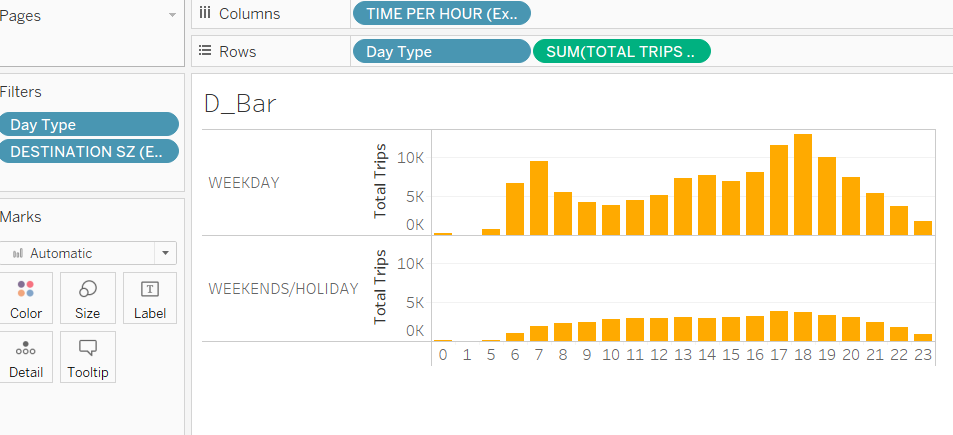
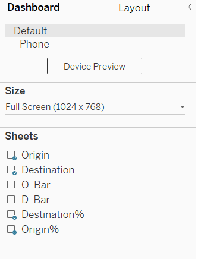

```{r setup, include=FALSE}

knitr::opts_chunk$set(echo = TRUE,
                      eval = TRUE,
                      warning = FALSE,
                      message = FALSE,
                      fig.retina = 3)

```

# 1. The Task

The task is to criticize the original data visualization in below Figure 1., suggest the alternative presentation, design the the proposed data visualization using Tableau, describe the step-by-step preparation and interpret the observations revealed by the data visualization prepared. 


The data source of above visualization is as below:
+ "origin_destination_bus_SZ_202201.csv", this data set was downloaded from LTA Datamall and URA region, planning area and planning subzone information were added by using GIS Overlay operation.
+ "MP14_SUBZONE_WEB_PL", this data provides URA Master Plan 2014 Planning Subzone boundary map in ESRI shape file format. It was downloaded from data.gov.sg.

# 2. Critique of Visualisation

## 2.1 Clarity

***(a) No dashboard title:*** The original design doesn't have dashboard title. It is unclear which country the data is about, which period and what type of trips.

***(b) Unclear Sub-chart title:***  "Adjacency Matrix" may be difficult for people who have no mathematics background to understand.

***(c) Confusing Tooltips***  "Adjacency Matrix" tooltips show "% of Total Total Trips along Table (Across)". This is confusing for people to understand what the data represents.

***(d) Missing annotation*** There is no annotation about how to use this interactive dashboard.

***(e) Abbreviation*** In the filters on the right of the dashboard, "Sz" is used to represent "Subzone", which is not easy to understand.

## 2.2 Aesthetic

***(a) No color differentiation:*** Both "Trips generated from" and "Trips attracted to" use the same blue color. This doesn't provide any support for readers to quickly understand the charts.

***(b) Redundant legend :*** The 0% to 100.0% grey scale for "% of Total Total Trips" is redundant. It doesn't provide any useful information.

***(c) Hidden Header Labels*** "WEEKENDS/HOLIDAYS" Y Axis label is not fully viewable due to lack of space.

***(d) Too many graphs:*** There are too many graphs displayed at the same time, regarding trips generated from origins, into destinations, over weekday, over weekend, weekday matrix and weekend matrix. Readers need to compare and analyze multiple graphs to draw conclusions.

## 2.3 Interative Design

***(a) No link between origins and destinations:*** This dashboard is supposed to review the inter and intra-subzone flows. However, the original design doesn't convey any information on what the destinations are for the selected origin and what origins are for the selected destination.

***(b) No filter on the adjacency matrix :*** There is no filter on the adjacency matrix. All the origins and destinations are squeezed into a single chart. It failed to convey any useful information if not looking at the tooltips.

***(c) Single Value List filter*** There are more than 300 subzones. List filter is not proper here due to the length and difficulty to use. Dropdown filter is more proper.

***(d) No link between bar charts and adjacency matrix:*** When filter either origin or destination bar charts, there is no change to the adjacency matrix.

# 3. Proposed Design

The initial sketch of proposed design is as follow:


## 3.1 Clarity

***(a) Dashboard Title:*** The proposed design has a clear dashboard title which shows the location, type of trips and time period of the data.

***(b) Sub-chart title:***  The proposed design uses "Destination%" and Origin%" as titles for the adjacency matrix, which is easier for people to understand.

***(c) Confusing Tooltips:***  The proposed design has edited the default tooltips generated to be more explanatory on the data.

***(d) Missing annotation:*** The proposed design has added annotation to explain how to use the interactive dashboard.

***(e) Abbreviation:*** The proposed design has edited all the abbreviations to show the full names of terms.

## 3.2 Aesthetic

***(a) Color differentiation:*** Two colors are used in the proposed design. Blue is used to represent origin information and orange is used to represent destination information.

***(b) Redundant legend :*** All the reduant filters generated during chart planning stages have been removed and only useful legends remained.

***(c) Hidden Header Labels*** "WEEKENDS/HOLIDAYS" labels are fully visible in the tooltip by adjusting the size of chart.

***(d) Embed bar charts into tooltips:*** To avoid overwhelm readers with too many information in a single screen. Trips by hour bar charts have been embedded into tooltips, which will only be shown once the mouse hangs over it. Weekday and weekend filter is added to have the choice to select which period to look into.

## 3.3 Interative Design

***(a) Origins and destinations map linkage:*** Origin and destination maps are linked. If a single origin is selected on the origin maps, the corresponding destinations will be shown in the destination map.

***(b) Filter on the adjacency matrix :*** Adjacency matrix is also linked to origin or destination filter.If a single origin is selected on the origin maps, the corresponding destinations and percentage share of total trips out of the origin will be shown in the "Destination%" chart. The size of circle reflects the degree of share.

***(c) Single Value List filter:*** Single value list filter has been changed to dropdown filter.

# 4. Proposed Visualisation on Tableau
Please view the proposed visualisation on Tableau Public [here](https://public.tableau.com/app/profile/sun.shengmei/viz/DataViz2_16483875359340/Dashboard1?publish=yes).
{width=100%}

# 5. Step-by-step Preparation
No.|Step                                                |Action
---|----------------------------------------------------|-----------------------------------------------------------------------------------------------------------------------
1  |Open Tableau Prep Builder and drag data file "origin_destination_bus__SZ_202201.csv" and "MP14_SUBZONE_WEB_PL.shp" into the panel.|{width=100%}
2  |Join "origin_destination_bus__SZ_202201.csv" and "MP14_SUBZONE_WEB_PL.shp" by applied join clause: ORIGIN_SZ = SUBZONE_N. Create an output, renamed as "Origin.hyper". |{width=100%}
3  |Join "origin_destination_bus__SZ_202201.csv" and "MP14_SUBZONE_WEB_PL.shp" by applied join clause: DESTINATION_SZ = SUBZONE_N. Create an output, renamed as "Destination.hyper". |{width=100%}
4  |Connect both "Origin.hyper" and "Destination.hyper" into Tableau.Join "Origin.hyper" and "Destination.hyper" by: Day Type = DAY TYPE(Extract 1)   |{width=100%}
5  |Rename "Extract" to "Origin_data" and "Extract1" to "Destination_data"|{width=100%}
6  |Create a new sheet "Origin".From "Origin_data" drag "Geometry" into the panel. Drag "Total Trips" to "Size". Drag "Origin SZ" to "Detail". Change the marks shape to "Circle". |{width=100%}
7  |Drag "Origin SZ" to "Filters". Select "All" and click "OK". |{width=100%}
8  |Click the triangle at the the end of "Origin SZ" filter and select "Show Filter". |{width=100%}
9  |Click the triangle at the the end of "Origin SZ" filter and select "Single Value (dropdown). |{width=100%}
10 |Repeat step 7&8 to add "Data Type" as filter. Click the triangle at the the end of "Day Type" filter and select "Single Value (list).|{width=100%}
11 |Click "Size" under "Marks" and increase the size to suitable level. |{width=100%}
12 |Click "Color" under "Marks", select dark blue color, change opacity to 70%, and select grey border color. |{width=100%}
13 |Hide "SUM(Total Trips)" card. For "Origin SZ" filter, select all.|{width=100%}
14 |Click "Fix Map" as shown, so that map is not zooming in and out with filter selections. |{width=100%}
15 |Double click title and change title name as shown in the picture. |{width=100%}
16 |Create a new sheet "O_Bar". This sheet will use data from "Origin_data" table. Change "Time per Hour" data tye by selecting "Convert to Dimension". |{width=100%}
17 |Drag "Time Per Hour" to "Columns" and "Total Trips" to "Rows". Drag "Day Type" to the left edge of the Y axis.|{width=100%}
18 |Add in "Origin SZ" and "Day Type" filter using the steps mentioned above. Your screen should be similar to this. |{width=100%}
19 |Select all the day types. Hold the X axis line and push it up to make the graph narrower. Do the same for Y Axis as well so that the label of "Day Type" can be viewed fully and the size of the whole chart is small.  |{width=100%}
20 |Under "O_Bar" sheet, right click on the 2nd X Axis cross with Y axis area and select "Hide Field Labels for Rows". Go back to the "Origin" sheet and click "Tooltip" under "Marks" panel. Change the tooltip to the one shown in the picture. |{width=100%}
21 |Create a new sheet "Destination%". From "Destination_data" table, drag "ORIGIN_SZ(Extract1)" into "Rows" and "DESTINATION_SZ(Extract1)" into "Columns". Drag "TOTAL TRIPS(Extract1)" into "Size". Drag "TOTAL TRIPS(Extract1)" into "Details". Change size shape into "Circle". |{width=100%}
22 |Click the triangle at the end of "SUM(TOTAL TRIPS)" with "Detail" under "Marks" panel. Select "Add Table Calculation". |{width=100%}
23 |Under "Table Calculation", select "Percent of Total" and "Compete using Table". |{width=100%}
24 |Drag "ORIGIN SZ(Extract1)" into "Filters", "Show Filter", and change filters type to "Single Value(dropdown)" using the steps done above.Hide "SUM(TOTAL TRIPS(Extract1)" card. Your screen should be similar to this picture. |{width=100%}
25 | From "Origin_data" table, drag "Day Type" into "Filters". Select "All" and click "OK". Using the steps done above, "Show Filter", and change filter type to "Single Value(dropdown)". |{width=100%}
26 |Change "Color" to orange, "Opacity" to 70% and "Border" to grey under "Marks".|{width=100%}
27 |Increase the circle size to the max. |{width=100%}
28 |Hide headers by right click Y axis and uncheck "Show Header". Do the same for X axis. |{width=100%}
29 |Click "Entire View" on the top of the Tableau. |{width=100%}
30 |Click "Tooltip" under "Marks" and change tooltips to what's shown in the picture.|{width=100%}
31 |Double click title and change color to orange and bold.|{width=100%}
32 |Fo back to "Origin" sheet, right click and duplicate the sheet. Rename the duplicated sheet as "Destination" |{width=100%}
33 |For the "Destination" sheet, firstly remove all the existing data, except "Day Type" filter. Then from "Destination_data" table, drag "Geometry(Extract1)" into the pane. Drag "DESTINATION_SZ(Extract1)" to "Detail". Drag "TOTAL TRIPS(Extract1)" to "Size". |{width=100%}
34 |Drag "DESTINATION_SZ(Extract1)" to "Filters", "Show Filter", and change filter type to "Single Value(dropdown)". Hide "SUM(TOTAL TRIPS(Extract1)" card on the right of the screen. |{width=100%}
35 |Select "All" for "DESTINATION_SZ(Extract1)" filter, fix map as done before. Change color of circle to orange.  |{width=100%}
36 |Double click the title. Change color to orange and name of the title to what's shown in the picture. |{width=100%}
37 |Go to "O_Bar" sheet, right click the sheet name and duplicate the sheet. Rename the duplicated sheet as "D_Bar".Remove all the existing data, except "Day Type" filter. |{width=100%}
38 |Under "Destination_data" table, change "TIME PER HOUR(Extract1)" to dimension as done before for the "Origin_data" table. Drag "TIME PER HOUR(Extract1)" into "Column" and "TOTAL TRIPS(Extract1)" into "Rows". Drag "DESTINATION SZ(Extract1)" into "Filters", "Show Filter", and change filter type to "Single Value(dropdown)". |{width=100%}
39 |Right click Y axis and select "Edit Axis" and change "Axis Titles" to "Total Trips". Right click on the 2nd X Axis cross with Y axis area and select "Hide Field Labels for Rows". |{width=100%}
40 |Shrink the size of "D_Bar" chart. Change the color of the bar to orange. |{width=100%}  
41 |Go back to the "Destination" sheet and click "Tooltip" and change the tooltip to what's shown in the picture.  |{width=100%}
42 | Go to "Destination%" sheet, right click the sheet name, and duplicate. Rename the duplicated sheet as "Origin%". Remove all the existing data, except "Day Type". Change the color of shape and title to blue. |{width=100%}
43 | From "Origin_data" table, drag "Origin SZ" to "Rows" and "Destination SZ" to "Columns". Hide "SUM(Total Trips)" card on the right side of screen. |{width=100%}
44 |Change "SUM(Total Trips)" under "Details" into "Percent of Total" and "Compute Using Table" as done before.Uncheck "Show Headers" for both X and Y Axis as done before. Your screen should be like this. |{width=100%}
45 |Click "Tooltip" under "Marks" and change the text to this. |{width=100%}
46 |Drag "Destination SZ" into "Filters", "Show Filter", and change filter type to "Single Value(dropdown)". |{width=100%}
47 |Create a new dashboard. Drag "Origin", "Destination", "Destination%" and "Origin%" into the board in sequence. |{width=100%}
48 |Go to the top tight corner "Day Type", look for the triangle on the right side, select "Apply to Worksheets", and "All Using this Data Sources". After that, remove the other "Day Type" filters from the Dashboard. |{width=100%}
49 |Click "Origin" chart and click "Use as Filter" on the right side of the chart. |{width=100%}
50 |Go to "Dashboard", and select "Actions". |{width=100%}
51 |Click the first action and click "Edit". For "Source Sheets", select "Origin" and for "Target Sheets", select the rest 3 sheets. For "Filter", "Source Field" key in "Origin Sz" and "Target Field" key in "ORIGIN SZ(Extract1)". Click "OK". |{width=100%}
52 | Click "Destination" chart and click "Use as Filter" on the right side of the chart. Go to "Dashboard", and select "Actions". Click the second action and click "Edit". For "Source Sheets", select "Destination" and for "Target Sheets", select the rest 3 sheets. For "Filter", "Source Field" key in "DESTINATION SZ(Extract1)" and "Target Field" key in "Destination SZ". Click "OK". |{width=100%}
53 | Remove the redundant filters on origin and destination.|{width=100%}
54 | Click the "Origin SZ" filter, look for the triangle, and select "Edit Title". Change the origin title to "Origin Subzone" and destination title to "Destination Subzone". |{width=100%}
55 | Drag "Text" from the left side bar of Tableau to the right side of dashboard and input the userguide there. |{width=100%}
56 | Resize the dashboard to full screen 1024x768 so that all the text of user guide can be viewed. |{width=100%}
57 | Click "Show dashboard title" at the bottom left of Tableau and input title. |{width=100%}

# 6. Major Observations

**(1) Jurong West Central, Bedok North and Tampines East are the top 3 origins in both weekday and weekend. Majority of the bus trips flow from these 3 origins is within the same region.** 
+ The top destinations of Jurong West Central is Jurong West Central, which is 25.86%. Yunnan accounts for another 28.1%.
+ The top destinations of Bedok North is Bedok North, which is 43.78%..
+ The top destinations of Tampines East is Tampines East, which is 44.24%.

**(2) Some bus trips travel far to other subzones.** Even though most bus trips are within nearby regions, some long-distance bus trip travel is also observed. 
+ From Woodlands, there are bus trips to Tampines East and Bedok observed. 
+ From Maritime square, there are bus trips to Woodlands observed.
+ From Chahgi Point, there are bus trips to Chinatown oberved.

**(3) Peak travel hour during weekday is 6-8am and 5-7pm. No similar pattern observed during weekend** 


