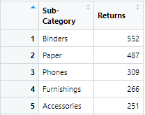

<<<<<<< HEAD:_site/TH_EX/TH_EX01/TH_EX01.Rmd
<<<<<<< HEAD:_site/TH_EX/TH_EX01/TH_EX01.Rmd
---
title: "Take-home Exercise 1"
description: |
  Pareto chart showing the distribution of returns by product sub-category in 2021 for superstores in United States and Singapore 2021 population pyramid using ggplot2.
author:
  - name: Sun Shengmei
    url: https://www.linkedin.com/in/shengmei-sun-9b262656/?originalSubdomain=sg
    affiliation: SMU MITB
    affiliation_url: https://scis.smu.edu.sg/master-it-business
date: "`r Sys.Date()`"
output:
   distill::distill_article:
    toc: true
    toc_depth: 3
---
```{r setup, include=FALSE}

knitr::opts_chunk$set(echo = TRUE,
                      eval = TRUE,
                      warning = FALSE,
                      message = FALSE,
                      fig.retina = 3)

```

# Task 1: Pareto Chart

## Overview

***Pareto chart*** is a popular data visualization use to reveal something like the 80-20 rule. Below chart was created using Tableau.


The purpose of the Pareto chart is to highlight the most important among a (typically large) set of factors. In market share study, Pareto charts are useful to reveal if the business is dominated by a handful of key products or customers. In general, businesses will try to avoid their businesses over-dependent by a few products or customers because if something happen to their key products or business partners, the businesses will be very badly affected.

In the nutshell, a Pareto chart is a dual axis chart. The y-axis on the left (also known as primary y-axis) shows the absolute frequency of the observations and their values are presented as bars. The y-axis on the right shows the cumulative frequency of the observed values and they are presented as dots. These dots are then joined by a smooth line.

### [The Task](https://isss608-ay2021-22t2.netlify.app/th_ex/th_ex01)

In this exercise, we are going to create a pareto chart showing the distribution of returns by product sub-category by using a data set from a retail store group.

## Getting Started

### Installing and loading the required libraries

Figure below shows the workflow of a typical data science and analytics process and the tidyverse R packages that specially designed to support the specific tasks in the data science and analytics process.


Before we get started, it is important for us to ensure that the required R packages have been installed. For the purpose of the exercise, the follow tidyverse packages will be used:

+ [**reaxl**](https://readxl.tidyverse.org/) package will be used to read and parse a worksheet into R as a tibble data frame format. (It is important to note that the R object is in tibble data frame and not the generic data frame).
+ [**dplyr**](https://dplyr.tidyverse.org/) package will be used to perform data transformation and data wrangling tasks
+ [**ggplot2**](https://ggplot2.tidyverse.org/) package will be used to building the pareto chart by using the principle of [Layered Grammar of Graphs](https://vita.had.co.nz/papers/layered-grammar.html).

{ width=50% }

The code chunk below is used to check if the necessary R packages are installed in R. If they have yet, then RStudio will install the missing R package(s). If are already been installed, then they will be launch in R environment.

```{r}

packages =c('tidyverse','readxl', 'knitr')

for(p in packages){
  if(!require(p, character.only = T)){
    install.packages(p)
  }
  library(p,character.only = T )
}

```


It is important note that **readxl** package has to be listed separately in the packages list because it is not part of the core tidyverse package.

## Data Import
In this exercise, superstore-2021 data set will be used. It is an MS Excel workbook. It consists of three worksheets, namely: Orders, People and Returns.

The code chunk below imports superstore-2021.xls into R environment by using [**reaxl**](https://readxl.tidyverse.org/).

```{r}

orders <- read_xls("data/Superstore-2021.xls",
                   sheet = "Orders")
returns <- read_xls("data/Superstore-2021.xls",
                    sheet = "Returns")

```


After parsing the worksheet into R, it is a good practice to check the structure and content of the newly tibble data frames in RStudio by opening the data tab.

## Data Wrangling

### Joining the two data frames

In this step, the [**left_join()**](https://dplyr.tidyverse.org/reference/mutate-joins.html) of dplyr is used to join the returns data frame and orders data frame by using Order ID as the unique identifier.

```{r}

joined_tab <- left_join(returns, orders,
                        by = c('Order ID' = 'Order ID'))

```

### Compute the frequency count by Sub-Category

Next, we are going to compute the frequency count of returns by sub-category. There are two ways to complete the task. The first way is by using the group-by method and the second way is by using the count method of dplyr.

#### The ***group-by*** method

In the code chunk below, [**group_by()**](https://dplyr.tidyverse.org/reference/group_by.html) of dplyr package is used to group the orders by Sub-Category. Then, [**summarise()**](https://dplyr.tidyverse.org/reference/summarise.html) of dplyr is used to count (i.e. [**n()**](https://dplyr.tidyverse.org/reference/context.html)) the number of returned orders.

```{r}

freq_returned <- joined_tab %>%
  group_by(`Sub-Category`) %>%
  summarise('Returns' = n()) %>%
  ungroup()

```

#### The ***count*** method

The code chunk below shows the alternative way to derive the frequency of returns by sub-category. In this case, [**count()**](https://dplyr.tidyverse.org/reference/count.html) of dplyr package is used.

```{r}

freq_returned <- joined_tab %>% 
  count(`Sub-Category`) %>%
  rename(Returns = n)

```

By default, count() will return a new field called n to store the result. In view of this, [**rename()**](https://dplyr.tidyverse.org/reference/rename.html) of dplyr is used to rename n to Returns.

### Sorting data

Before we can compute the cumulative frequency, we need to sort the values in the sub-category field by the values in the Returns field. To accomplish this task, the [**arrange()**](https://dplyr.tidyverse.org/reference/arrange.html) of dplyr package is used as shown in the code chunk below.

```{r}

freq_sorted <- freq_returned %>%
  arrange(desc(Returns))

```

The sorted data frame should look similar to the screenshot below.

{ width=50% }

### Computing the cumulative frequency

Out next task is to compute the cumulative frequency of returns by product sub-category. This task will be performed by using [**mutate()**](https://dplyr.tidyverse.org/reference/mutate.html) of dplyr package and [**cumsum()**](https://www.rdocumentation.org/packages/base/versions/3.6.2/topics/cumsum) of Base R.

```{r}

freq_cum <- freq_sorted %>%
  mutate(cumfreq = cumsum (Returns))

```

## Chart Plotting

### Bar chart

There are two types of bar charts: [**geom_bar**](https://ggplot2.tidyverse.org/reference/geom_bar.html) and [**geom_col**](https://ggplot2.tidyverse.org/reference/geom_bar.html). **geom_bar()** uses **stat_count()** by default: it counts the number of cases at each x position. **geom_col()** uses **stat_identity()**: it leaves the data as is. Since we want the heights of the bars to represent values in the data, we choose to use **geom_col** in this case. 

```{r, fig.show='hide'}

ggplot(data = freq_cum,
       aes(x = reorder(`Sub-Category`,-Returns))) +
  
  geom_col(aes(y = Returns), color = 'darkturquoise',fill = 'darkturquoise')

```

We can also use **geom_bar()** and override the default connection between **geom_bar()** and **stat_count()** by changing "stat" argument with below code:

```{r, fig.show='hide'}

ggplot(data=freq_cum,
       aes(x = reorder(`Sub-Category`,-Returns))) +
  
  geom_bar(aes(y = Returns), stat ="identity", color = 'darkturquoise', fill = 'darkturquoise')

```

[**geom_text**](https://ggplot2.tidyverse.org/reference/geom_text.html) are useful for labeling plots. **geom_text()** adds only text to the plot. **geom_label()** draws a rectangle behind the text. Since we still have cumulative % line and horizontal reference line to be plotted in the same chart, to keep the chart neat, **geom_text()** is a better choice.

```{r, results = "hide"}

geom_text(aes(y = Returns, label = Returns), size = 4,position = position_dodge(width = 0.5), vjust = -0.25)

```

### Line chart
In order to show the cumulative % of total No. of returns on the same plot with No.of returns, we need to add in a second y axis. [**scale_y_continuous**](https://ggplot2.tidyverse.org/reference/scale_continuous.html) has the argument of [**sec.axis**](https://ggplot2.tidyverse.org/reference/sec_axis.html).

1st axis limits are set (0,3,226). 3,226 is the total No. of returns of all categories. **labels** are specified in numbers with no decimal points since they represent count of frequency. 2nd axis is built on 1st axis limits, divided by 3,226 to make the limits (0,1). **labels** are specified in percentage with no decimal points. **breaks** are set between (0,1) with 0.1 interval. 

+ [**c()**](https://www.rdocumentation.org/packages/base/versions/3.6.2/topics/c) is a  generic function which combines combine values into a vector or list.
+ [**seq()**](https://www.rdocumentation.org/packages/base/versions/3.6.2/topics/seq) is a default method to generate sequence.

1st y axis is named as "No. of Returns". 2nd y axis is named as "Cumulative % of Total No. of Returns".

```{r, results = "hide"}

scale_y_continuous(name = "No. of Returns", 
    limits = c(0,3226), 
    breaks = c(seq(0,3226,322.6)),
    labels = scales::number_format(accuracy = 1),
    sec.axis = sec_axis(trans = ~./3226, 
                        name = "Cumulative % of Total No. of Returns",
                        labels = scales::percent_format(accuracy = 1), breaks = c(seq(0,1,0.1))))

```

[**geom_path**](https://ggplot2.tidyverse.org/reference/geom_path.html) connects the observations in the order in which they appear in the data. [**geom_line**](https://ggplot2.tidyverse.org/reference/geom_path.html) connects them in order of the variable on the x axis. Since we have sorted the data beforehand in a descending order, we can use either **geom_path** or **geom_line**. 

 **cumfreq/sum(Returns)X3226** are calculated and used as the y variable for the line chart. **group = 1** is a "dummy" grouping to override the default group by x variable.

```{r, results = "hide"}

geom_line(aes(y = cumfreq/sum(Returns)*3226, group = 1), size = 1, color = "salmon" )

```

### Horizontal reference line

In order to add a horizontal reference line to highlight the sub-categories that contributes to 80% of total No. of returns, [**geom_hline**](https://ggplot2.tidyverse.org/reference/geom_abline.html) is added. 

```{r, results = "hide"}

geom_hline(aes(yintercept = 0.8*3226), size = 1, color = "grey", linetype = "dashed")

```

### Add in points

[**geom_point**](https://ggplot2.tidyverse.org/reference/geom_point.html) is used to create scatterplots. In our case, we add in points to highlight the data points of cumulative % of total No. of returns. 

```{r, results = "hide"}

geom_point(aes(y = cumfreq/sum(Returns)*3226))

```

### Complete code chunk with proper labels and theme

For better presentation, labels and theme are customized for better presentation.

x axis is labelled as "Sub_Category" by using **xlab**. Label angle is set at 45 degree for better fit. 
Title is added and customized with proper size and format by modifying components of [**theme**](https://ggplot2.tidyverse.org/reference/theme.html).
Panel border, background and grid lines are also customized by modifying components of [**theme**](https://ggplot2.tidyverse.org/reference/theme.html).

The complete code chunk and output are shown below.

```{r}

ggplot(data = freq_cum,
       aes(x = reorder(`Sub-Category`,-Returns))) +
  geom_col(aes(y = Returns), color = 'darkturquoise',fill = 'darkturquoise') +
  geom_text(aes(y = Returns, label = Returns), size = 4, position = position_dodge(width = 0.5), vjust = -0.5) +
  scale_y_continuous(
    name = "No. of Returns", 
    limits = c(0,3226), 
    breaks = c(seq(0,3226,322.6)),
    labels = scales::number_format(accuracy = 1),
    sec.axis = sec_axis(trans = ~./3226, 
                        name = "Cumulative % of Total No. of Returns",
                        labels = scales::percent_format(accuracy = 1), 
                        breaks = c(seq(0,1,0.1)))) +
  geom_line(aes(y = cumfreq/sum(Returns)*3226, group = 1), size = 1, color = "salmon" ) +
  geom_hline(aes(yintercept = 0.8*3226), size = 1, color = "grey", linetype = "dashed") +
  geom_point(aes(y = cumfreq/sum(Returns)*3226)) +
  theme(axis.text.x = element_text(angle = 45, hjust = 1)) +
  labs(title = "Pareto Chart of No. of Returns by Product Category", 
       subtitle="8 product categories contribute to around 80% of total No. of returns",
       x="Sub-category",
       caption = "Superstores in United States in 2021") +
  theme(plot.title = element_text("Pareto Chart of No. of Returns by Product Category",
                                  size = 15, face = "bold", hjust = 0)) +
  theme(panel.border = element_rect(colour="grey60", fill = NA),
        panel.background = element_rect(fill = "white"),
        panel.grid.major = element_line(size = 0.5, linetype = 'solid',
                                colour = "grey90"),
        panel.grid.minor = element_line(size = 0.2, linetype = 'dashed',
                                colour = "grey95"))
```

# Task 2: Population Pyramid

## Overview

***Population Pyramid*** or "age-sex pyramid" is a graphical illustration of the distribution of a population by age groups and sex. Males are usually shown on the left and females on the right, and they may be measured in absolute numbers or as a percentage of the total population. The pyramid can be used to visualize the age of a particular population. It is also used in ecology to determine the overall age distribution of a population; an indication of the reproductive capabilities and likelihood of the continuation of a species ([Wikipedia](https://en.wikipedia.org/wiki/Population_pyramid)). Below chart was created using Tableau.


### [The Task](https://isss608-ay2021-22t2.netlify.app/th_ex/th_ex01)

In this exercise, we are going to create a population pyramid showing the distribution of Singapore 2021 population.

## Data Import

Since we have already installed the relevant packages in Task 1, we directly proceed to the data import.

For this task, the data entitle *Singapore Residents by Planning Area / Subzone, Age Group, Sex and Type of Dwelling, June 2021* is used. The data set is available at [Department of Statistics](https://www.singstat.gov.sg/) home page

The code chunk below imports respopagesextod2021.csv into R environment by using [**read_csv()**](https://readr.tidyverse.org/reference/read_delim.html) function of readr package.

```{r}

popagesex <- read_csv("data/respopagesextod2021.csv")

```

After parsing the worksheet into R, it is a good practice to check the structure and content of the newly tibble data frames in RStudio by opening the data tab.

## Data Wrangling

### Change the age group name for sorting 

We need to sort the values alphanumerically by the age group. The following code chunk changes age group “5_to_9” to “05_to_09” to allow for ggplot default labels to arrange the data according to age group. If not, “5_to_9” would be placed among the 50s group data.

+ [**mutate()**](https://dplyr.tidyverse.org/reference/mutate.html) adds new variables and preserves existing ones. 
+ [**case_when**](https://www.rdocumentation.org/packages/dplyr/versions/0.7.8/topics/case_when) allows us to vectorise multiple if and else if statements.

```{r}

popagesex <- popagesex %>%
  mutate(AG = case_when(AG == "0_to_4" ~ "00_to_04",
                        AG == "5_to_9" ~ "05_to_09",
                        TRUE ~ AG) )
```

### Select subset of data

#### The ***subset()*** method

[**subset()**](https://www.rdocumentation.org/packages/base/versions/3.6.2/topics/subset) returns subsets of vectors, matrices or data frames which meet conditions. We use this method to split population data by gender, so that we can plot male data on the negative side and female data on the positive side of the y axis.

```{r}

dataF <- subset(popagesex, Sex =="Females")
dataM <- subset(popagesex, Sex =="Males")

```

## Chart Plotting

### Bar chart

There are two types of bar charts: [**geom_bar**](https://ggplot2.tidyverse.org/reference/geom_bar.html) and [**geom_col**](https://ggplot2.tidyverse.org/reference/geom_bar.html). **geom_bar()** uses **stat_count()** by default: it counts the number of cases at each x position. **geom_col()** uses stat_identity(): it leaves the data as is. We can also use **geom_bar()** and override the default connection between **geom_bar()** and **stat_count()** by changing "stat" argument to "identity".

+ [**scale_y_continuous**](https://ggplot2.tidyverse.org/reference/scale_continuous.html) allows us to customize breaks and labels. Breaks are set between -160,000 to 160,000 with 20,000 interval. Labels are set as character and use "K" to represent 1,000. 
+ [**coord_flip()**](https://ggplot2.tidyverse.org/reference/coord_flip.html) flip cartesian coordinates so that horizontal becomes vertical, and vertical, horizontal. 
+ **theme_bw()** is chosen as default setting.
+ Title is added and customized with proper size and format by modifying components of [**theme**](https://ggplot2.tidyverse.org/reference/theme.html).

The full code chunk and output are shown below.

```{r, fig.width = 8}
ggplot(data=popagesex,
       aes(x = AG, fill = Sex)) +
  geom_bar (data = subset(popagesex, Sex =="Females"), aes(y = Pop), stat = "identity") +

  geom_bar (data = subset(popagesex, Sex =="Males"), aes (y = -Pop), stat = "identity") +

  xlab("Age") +
  scale_y_continuous(name = "Population",
                     breaks = c(seq(-160000, 160000, 20000)),
                     labels = paste0(as.character(c(seq(160, 0, -20), seq(20, 160, 20))), "K")) +
  coord_flip() +

  theme_bw() + 
  ggtitle("Singapore 2021 Population Pyramid") +
  theme(plot.title = element_text(size = 15, face = "bold", hjust = 0.5))

```

# Comparison of ggplot2 with Tableau

## Efficiency

Compared to gglpot2, Tableau is more user-friendly and more efficient.

## Customization 

ggplot2 allows for more customized solutions. Users' idea can be expressed in greater details and better accuracy. Comparing above 2 pareto charts plotted by Tableau and ggplot2 separately, the gglot2 chart shows not only the No. of returns and cumulative %, but also shows the total no. of returns by changing the axis limit. Captions and subtitles can also be added for detailed illustration.

## Variety of Solutions
ggplot2 allows for multiple solutions. The count of frequency step above were proceeded using both the count method and the the group_by method. The process of exploring different possibilities are interesting. 


  
=======
---
title: "Take-home Exercise 1"
description: |
  Pareto chart showing the distribution of returns by product sub-category in 2021 for superstores in United States and Singapore 2021 population pyramid using ggplot2.
author:
  - name: Sun Shengmei
    url: https://www.linkedin.com/in/shengmei-sun-9b262656/?originalSubdomain=sg
    affiliation: SMU MITB
    affiliation_url: https://scis.smu.edu.sg/master-it-business
date: "`r Sys.Date()`"
output:
   distill::distill_article:
    toc: true
    toc_depth: 3
---
```{r setup, include=FALSE}

knitr::opts_chunk$set(echo = TRUE,
                      eval = TRUE,
                      warning = FALSE,
                      message = FALSE,
                      fig.retina = 3)

```

# Task 1: Pareto Chart

## Overview

***Pareto chart*** is a popular data visualization use to reveal something like the 80-20 rule. Below chart was created using Tableau.


The purpose of the Pareto chart is to highlight the most important among a (typically large) set of factors. In market share study, Pareto charts are useful to reveal if the business is dominated by a handful of key products or customers. In general, businesses will try to avoid their businesses over-dependent by a few products or customers because if something happen to their key products or business partners, the businesses will be very badly affected.

In the nutshell, a Pareto chart is a dual axis chart. The y-axis on the left (also known as primary y-axis) shows the absolute frequency of the observations and their values are presented as bars. The y-axis on the right shows the cumulative frequency of the observed values and they are presented as dots. These dots are then joined by a smooth line.

### [The Task](https://isss608-ay2021-22t2.netlify.app/th_ex/th_ex01)

In this exercise, we are going to create a pareto chart showing the distribution of returns by product sub-category by using a data set from a retail store group.

## Getting Started

### Installing and loading the required libraries

Figure below shows the workflow of a typical data science and analytics process and the tidyverse R packages that specially designed to support the specific tasks in the data science and analytics process.


Before we get started, it is important for us to ensure that the required R packages have been installed. For the purpose of the exercise, the follow tidyverse packages will be used:

+ [**reaxl**](https://readxl.tidyverse.org/) package will be used to read and parse a worksheet into R as a tibble data frame format. (It is important to note that the R object is in tibble data frame and not the generic data frame).
+ [**dplyr**](https://dplyr.tidyverse.org/) package will be used to perform data transformation and data wrangling tasks
+ [**ggplot2**](https://ggplot2.tidyverse.org/) package will be used to building the pareto chart by using the principle of [Layered Grammar of Graphs](https://vita.had.co.nz/papers/layered-grammar.html).

{ width=50% }

The code chunk below is used to check if the necessary R packages are installed in R. If they have yet, then RStudio will install the missing R package(s). If are already been installed, then they will be launch in R environment.

```{r}

packages =c('tidyverse','readxl', 'knitr')

for(p in packages){
  if(!require(p, character.only = T)){
    install.packages(p)
  }
  library(p,character.only = T )
}

```


It is important note that **readxl** package has to be listed separately in the packages list because it is not part of the core tidyverse package.

## Data Import
In this exercise, superstore-2021 data set will be used. It is an MS Excel workbook. It consists of three worksheets, namely: Orders, People and Returns.

The code chunk below imports superstore-2021.xls into R environment by using [**reaxl**](https://readxl.tidyverse.org/).

```{r}

orders <- read_xls("data/Superstore-2021.xls",
                   sheet = "Orders")
returns <- read_xls("data/Superstore-2021.xls",
                    sheet = "Returns")

```


After parsing the worksheet into R, it is a good practice to check the structure and content of the newly tibble data frames in RStudio by opening the data tab.

## Data Wrangling

### Joining the two data frames

In this step, the [**left_join()**](https://dplyr.tidyverse.org/reference/mutate-joins.html) of dplyr is used to join the returns data frame and orders data frame by using Order ID as the unique identifier.

```{r}

joined_tab <- left_join(returns, orders,
                        by = c('Order ID' = 'Order ID'))

```

### Compute the frequency count by Sub-Category

Next, we are going to compute the frequency count of returns by sub-category. There are two ways to complete the task. The first way is by using the group-by method and the second way is by using the count method of dplyr.

#### The ***group-by*** method

In the code chunk below, [**group_by()**](https://dplyr.tidyverse.org/reference/group_by.html) of dplyr package is used to group the orders by Sub-Category. Then, [**summarise()**](https://dplyr.tidyverse.org/reference/summarise.html) of dplyr is used to count (i.e. [**n()**](https://dplyr.tidyverse.org/reference/context.html)) the number of returned orders.

```{r}

freq_returned <- joined_tab %>%
  group_by(`Sub-Category`) %>%
  summarise('Returns' = n()) %>%
  ungroup()

```

#### The ***count*** method

The code chunk below shows the alternative way to derive the frequency of returns by sub-category. In this case, [**count()**](https://dplyr.tidyverse.org/reference/count.html) of dplyr package is used.

```{r}

freq_returned <- joined_tab %>% 
  count(`Sub-Category`) %>%
  rename(Returns = n)

```

By default, count() will return a new field called n to store the result. In view of this, [**rename()**](https://dplyr.tidyverse.org/reference/rename.html) of dplyr is used to rename n to Returns.

### Sorting data

Before we can compute the cumulative frequency, we need to sort the values in the sub-category field by the values in the Returns field. To accomplish this task, the [**arrange()**](https://dplyr.tidyverse.org/reference/arrange.html) of dplyr package is used as shown in the code chunk below.

```{r}

freq_sorted <- freq_returned %>%
  arrange(desc(Returns))

```

The sorted data frame should look similar to the screenshot below.

{ width=50% }

### Computing the cumulative frequency

Out next task is to compute the cumulative frequency of returns by product sub-category. This task will be performed by using [**mutate()**](https://dplyr.tidyverse.org/reference/mutate.html) of dplyr package and [**cumsum()**](https://www.rdocumentation.org/packages/base/versions/3.6.2/topics/cumsum) of Base R.

```{r}

freq_cum <- freq_sorted %>%
  mutate(cumfreq = cumsum (Returns))

```

## Chart Plotting

### Bar chart

There are two types of bar charts: [**geom_bar**](https://ggplot2.tidyverse.org/reference/geom_bar.html) and [**geom_col**](https://ggplot2.tidyverse.org/reference/geom_bar.html). **geom_bar()** uses **stat_count()** by default: it counts the number of cases at each x position. **geom_col()** uses **stat_identity()**: it leaves the data as is. Since we want the heights of the bars to represent values in the data, we choose to use **geom_col** in this case. 

```{r, fig.show='hide'}

ggplot(data = freq_cum,
       aes(x = reorder(`Sub-Category`,-Returns))) +
  
  geom_col(aes(y = Returns), color = 'darkturquoise',fill = 'darkturquoise')

```

We can also use **geom_bar()** and override the default connection between **geom_bar()** and **stat_count()** by changing "stat" argument with below code:

```{r, fig.show='hide'}

ggplot(data=freq_cum,
       aes(x = reorder(`Sub-Category`,-Returns))) +
  
  geom_bar(aes(y = Returns), stat ="identity", color = 'darkturquoise', fill = 'darkturquoise')

```

[**geom_text**](https://ggplot2.tidyverse.org/reference/geom_text.html) are useful for labeling plots. **geom_text()** adds only text to the plot. **geom_label()** draws a rectangle behind the text. Since we still have cumulative % line and horizontal reference line to be plotted in the same chart, to keep the chart neat, **geom_text()** is a better choice.

```{r, results = "hide"}

geom_text(aes(y = Returns, label = Returns), size = 4,position = position_dodge(width = 0.5), vjust = -0.25)

```

### Line chart
In order to show the cumulative % of total No. of returns on the same plot with No.of returns, we need to add in a second y axis. [**scale_y_continuous**](https://ggplot2.tidyverse.org/reference/scale_continuous.html) has the argument of [**sec.axis**](https://ggplot2.tidyverse.org/reference/sec_axis.html).

1st axis limits are set (0,3,226). 3,226 is the total No. of returns of all categories. **labels** are specified in numbers with no decimal points since they represent count of frequency. 2nd axis is built on 1st axis limits, divided by 3,226 to make the limits (0,1). **labels** are specified in percentage with no decimal points. **breaks** are set between (0,1) with 0.1 interval. 

+ [**c()**](https://www.rdocumentation.org/packages/base/versions/3.6.2/topics/c) is a  generic function which combines combine values into a vector or list.
+ [**seq()**](https://www.rdocumentation.org/packages/base/versions/3.6.2/topics/seq) is a default method to generate sequence.

1st y axis is named as "No. of Returns". 2nd y axis is named as "Cumulative % of Total No. of Returns".

```{r, results = "hide"}

scale_y_continuous(name = "No. of Returns", 
    limits = c(0,3226), 
    breaks = c(seq(0,3226,322.6)),
    labels = scales::number_format(accuracy = 1),
    sec.axis = sec_axis(trans = ~./3226, 
                        name = "Cumulative % of Total No. of Returns",
                        labels = scales::percent_format(accuracy = 1), breaks = c(seq(0,1,0.1))))

```

[**geom_path**](https://ggplot2.tidyverse.org/reference/geom_path.html) connects the observations in the order in which they appear in the data. [**geom_line**](https://ggplot2.tidyverse.org/reference/geom_path.html) connects them in order of the variable on the x axis. Since we have sorted the data beforehand in a descending order, we can use either **geom_path** or **geom_line**. 

 **cumfreq/sum(Returns)X3226** are calculated and used as the y variable for the line chart. **group = 1** is a "dummy" grouping to override the default group by x variable.

```{r, results = "hide"}

geom_line(aes(y = cumfreq/sum(Returns)*3226, group = 1), size = 1, color = "salmon" )

```

### Horizontal reference line

In order to add a horizontal reference line to highlight the sub-categories that contributes to 80% of total No. of returns, [**geom_hline**](https://ggplot2.tidyverse.org/reference/geom_abline.html) is added. 

```{r, results = "hide"}

geom_hline(aes(yintercept = 0.8*3226), size = 1, color = "grey", linetype = "dashed")

```

### Add in points

[**geom_point**](https://ggplot2.tidyverse.org/reference/geom_point.html) is used to create scatterplots. In our case, we add in points to highlight the data points of cumulative % of total No. of returns. 

```{r, results = "hide"}

geom_point(aes(y = cumfreq/sum(Returns)*3226))

```

### Complete code chunk with proper labels and theme

For better presentation, labels and theme are customized for better presentation.

x axis is labelled as "Sub_Category" by using **xlab**. Label angle is set at 45 degree for better fit. 
Title is added and customized with proper size and format by modifying components of [**theme**](https://ggplot2.tidyverse.org/reference/theme.html).
Panel border, background and grid lines are also customized by modifying components of [**theme**](https://ggplot2.tidyverse.org/reference/theme.html).

The complete code chunk and output are shown below.

```{r}

ggplot(data = freq_cum,
       aes(x = reorder(`Sub-Category`,-Returns))) +
  geom_col(aes(y = Returns), color = 'darkturquoise',fill = 'darkturquoise') +
  geom_text(aes(y = Returns, label = Returns), size = 4, position = position_dodge(width = 0.5), vjust = -0.5) +
  scale_y_continuous(
    name = "No. of Returns", 
    limits = c(0,3226), 
    breaks = c(seq(0,3226,322.6)),
    labels = scales::number_format(accuracy = 1),
    sec.axis = sec_axis(trans = ~./3226, 
                        name = "Cumulative % of Total No. of Returns",
                        labels = scales::percent_format(accuracy = 1), 
                        breaks = c(seq(0,1,0.1)))) +
  geom_line(aes(y = cumfreq/sum(Returns)*3226, group = 1), size = 1, color = "salmon" ) +
  geom_hline(aes(yintercept = 0.8*3226), size = 1, color = "grey", linetype = "dashed") +
  geom_point(aes(y = cumfreq/sum(Returns)*3226)) +
  theme(axis.text.x = element_text(angle = 45, hjust = 1)) +
  labs(title = "Pareto Chart of No. of Returns by Product Category", 
       subtitle="8 product categories contribute to around 80% of total No. of returns",
       x="Sub-category",
       caption = "Superstores in United States in 2021") +
  theme(plot.title = element_text("Pareto Chart of No. of Returns by Product Category",
                                  size = 15, face = "bold", hjust = 0)) +
  theme(panel.border = element_rect(colour="grey60", fill = NA),
        panel.background = element_rect(fill = "white"),
        panel.grid.major = element_line(size = 0.5, linetype = 'solid',
                                colour = "grey90"),
        panel.grid.minor = element_line(size = 0.2, linetype = 'dashed',
                                colour = "grey95"))
```

# Task 2: Population Pyramid

## Overview

***Population Pyramid*** or "age-sex pyramid" is a graphical illustration of the distribution of a population by age groups and sex. Males are usually shown on the left and females on the right, and they may be measured in absolute numbers or as a percentage of the total population. The pyramid can be used to visualize the age of a particular population. It is also used in ecology to determine the overall age distribution of a population; an indication of the reproductive capabilities and likelihood of the continuation of a species ([Wikipedia](https://en.wikipedia.org/wiki/Population_pyramid)). Below chart was created using Tableau.


### [The Task](https://isss608-ay2021-22t2.netlify.app/th_ex/th_ex01)

In this exercise, we are going to create a population pyramid showing the distribution of Singapore 2021 population.

## Data Import

Since we have already installed the relevant packages in Task 1, we directly proceed to the data import.

For this task, the data entitle *Singapore Residents by Planning Area / Subzone, Age Group, Sex and Type of Dwelling, June 2021* is used. The data set is available at [Department of Statistics](https://www.singstat.gov.sg/) home page

The code chunk below imports respopagesextod2021.csv into R environment by using [**read_csv()**](https://readr.tidyverse.org/reference/read_delim.html) function of readr package.

```{r}

popagesex <- read_csv("data/respopagesextod2021.csv")

```

After parsing the worksheet into R, it is a good practice to check the structure and content of the newly tibble data frames in RStudio by opening the data tab.

## Data Wrangling

### Change the age group name for sorting 

We need to sort the values alphanumerically by the age group. The following code chunk changes age group “5_to_9” to “05_to_09” to allow for ggplot default labels to arrange the data according to age group. If not, “5_to_9” would be placed among the 50s group data.

+ [**mutate()**](https://dplyr.tidyverse.org/reference/mutate.html) adds new variables and preserves existing ones. 
+ [**case_when**](https://www.rdocumentation.org/packages/dplyr/versions/0.7.8/topics/case_when) allows us to vectorise multiple if and else if statements.

```{r}

popagesex <- popagesex %>%
  mutate(AG = case_when(AG == "0_to_4" ~ "00_to_04",
                        AG == "5_to_9" ~ "05_to_09",
                        TRUE ~ AG) )
```

### Select subset of data

#### The ***subset()*** method

[**subset()**](https://www.rdocumentation.org/packages/base/versions/3.6.2/topics/subset) returns subsets of vectors, matrices or data frames which meet conditions. We use this method to split population data by gender, so that we can plot male data on the negative side and female data on the positive side of the y axis.

```{r}

dataF <- subset(popagesex, Sex =="Females")
dataM <- subset(popagesex, Sex =="Males")

```

## Chart Plotting

### Bar chart

There are two types of bar charts: [**geom_bar**](https://ggplot2.tidyverse.org/reference/geom_bar.html) and [**geom_col**](https://ggplot2.tidyverse.org/reference/geom_bar.html). **geom_bar()** uses **stat_count()** by default: it counts the number of cases at each x position. **geom_col()** uses stat_identity(): it leaves the data as is. We can also use **geom_bar()** and override the default connection between **geom_bar()** and **stat_count()** by changing "stat" argument to "identity".

+ [**scale_y_continuous**](https://ggplot2.tidyverse.org/reference/scale_continuous.html) allows us to customize breaks and labels. Breaks are set between -160,000 to 160,000 with 20,000 interval. Labels are set as character and use "K" to represent 1,000. 
+ [**coord_flip()**](https://ggplot2.tidyverse.org/reference/coord_flip.html) flip cartesian coordinates so that horizontal becomes vertical, and vertical, horizontal. 
+ **theme_bw()** is chosen as default setting.
+ Title is added and customized with proper size and format by modifying components of [**theme**](https://ggplot2.tidyverse.org/reference/theme.html).

The full code chunk and output are shown below.

```{r, fig.width = 8}
ggplot(data=popagesex,
       aes(x = AG, fill = Sex)) +
  geom_bar (data = subset(popagesex, Sex =="Females"), aes(y = Pop), stat = "identity") +

  geom_bar (data = subset(popagesex, Sex =="Males"), aes (y = -Pop), stat = "identity") +

  xlab("Age") +
  scale_y_continuous(name = "Population",
                     breaks = c(seq(-160000, 160000, 20000)),
                     labels = paste0(as.character(c(seq(160, 0, -20), seq(20, 160, 20))), "K")) +
  coord_flip() +

  theme_bw() + 
  ggtitle("Singapore 2021 Population Pyramid") +
  theme(plot.title = element_text(size = 15, face = "bold", hjust = 0.5))

```

# Comparison of ggplot2 with Tableau

## Efficiency

Compared to gglpot2, Tableau is more user-friendly and more efficient.

## Customization 

ggplot2 allows for more customized solutions. Users' idea can be expressed in greater details and better accuracy. Comparing above 2 pareto charts plotted by Tableau and ggplot2 separately, the gglot2 chart shows not only the No. of returns and cumulative %, but also shows the total no. of returns by changing the axis limit. Captions and subtitles can also be added for detailed illustration.

## Variety of Solutions
ggplot2 allows for multiple solutions. The count of frequency step above were proceeded using both the count method and the the group_by method. The process of exploring different possibilities are interesting. 


  
>>>>>>> 13a4b44e32d649238eb7aa8300861c197a83b33d:_site/TH_EX/TH_EX01/th_ex01.Rmd
=======
---
title: "Take-home Exercise 1"
description: |
  Pareto chart showing the distribution of returns by product sub-category in 2021 for superstores in United States and Singapore 2021 population pyramid using ggplot2.
author:
  - name: Sun Shengmei
    url: https://www.linkedin.com/in/shengmei-sun-9b262656/?originalSubdomain=sg
    affiliation: SMU MITB
    affiliation_url: https://scis.smu.edu.sg/master-it-business
date: "`r Sys.Date()`"
output:
   distill::distill_article:
    toc: true
    toc_depth: 3
---
```{r setup, include=FALSE}

knitr::opts_chunk$set(echo = TRUE,
                      eval = TRUE,
                      warning = FALSE,
                      message = FALSE,
                      fig.retina = 3)

```

# Task 1: Pareto Chart

## Overview

***Pareto chart*** is a popular data visualization use to reveal something like the 80-20 rule. Below chart was created using Tableau.


The purpose of the Pareto chart is to highlight the most important among a (typically large) set of factors. In market share study, Pareto charts are useful to reveal if the business is dominated by a handful of key products or customers. In general, businesses will try to avoid their businesses over-dependent by a few products or customers because if something happen to their key products or business partners, the businesses will be very badly affected.

In the nutshell, a Pareto chart is a dual axis chart. The y-axis on the left (also known as primary y-axis) shows the absolute frequency of the observations and their values are presented as bars. The y-axis on the right shows the cumulative frequency of the observed values and they are presented as dots. These dots are then joined by a smooth line.

### [The Task](https://isss608-ay2021-22t2.netlify.app/th_ex/th_ex01)

In this exercise, we are going to create a pareto chart showing the distribution of returns by product sub-category by using a data set from a retail store group.

## Getting Started

### Installing and loading the required libraries

Figure below shows the workflow of a typical data science and analytics process and the tidyverse R packages that specially designed to support the specific tasks in the data science and analytics process.


Before we get started, it is important for us to ensure that the required R packages have been installed. For the purpose of the exercise, the follow tidyverse packages will be used:

+ [**reaxl**](https://readxl.tidyverse.org/) package will be used to read and parse a worksheet into R as a tibble data frame format. (It is important to note that the R object is in tibble data frame and not the generic data frame).
+ [**dplyr**](https://dplyr.tidyverse.org/) package will be used to perform data transformation and data wrangling tasks
+ [**ggplot2**](https://ggplot2.tidyverse.org/) package will be used to building the pareto chart by using the principle of [Layered Grammar of Graphs](https://vita.had.co.nz/papers/layered-grammar.html).

{ width=50% }

The code chunk below is used to check if the necessary R packages are installed in R. If they have yet, then RStudio will install the missing R package(s). If are already been installed, then they will be launch in R environment.

```{r}

packages =c('tidyverse','readxl', 'knitr')

for(p in packages){
  if(!require(p, character.only = T)){
    install.packages(p)
  }
  library(p,character.only = T )
}

```


It is important note that **readxl** package has to be listed separately in the packages list because it is not part of the core tidyverse package.

## Data Import
In this exercise, superstore-2021 data set will be used. It is an MS Excel workbook. It consists of three worksheets, namely: Orders, People and Returns.

The code chunk below imports superstore-2021.xls into R environment by using [**reaxl**](https://readxl.tidyverse.org/).

```{r}

orders <- read_xls("data/Superstore-2021.xls",
                   sheet = "Orders")
returns <- read_xls("data/Superstore-2021.xls",
                    sheet = "Returns")

```


After parsing the worksheet into R, it is a good practice to check the structure and content of the newly tibble data frames in RStudio by opening the data tab.

## Data Wrangling

### Joining the two data frames

In this step, the [**left_join()**](https://dplyr.tidyverse.org/reference/mutate-joins.html) of dplyr is used to join the returns data frame and orders data frame by using Order ID as the unique identifier.

```{r}

joined_tab <- left_join(returns, orders,
                        by = c('Order ID' = 'Order ID'))

```

### Compute the frequency count by Sub-Category

Next, we are going to compute the frequency count of returns by sub-category. There are two ways to complete the task. The first way is by using the group-by method and the second way is by using the count method of dplyr.

#### The ***group-by*** method

In the code chunk below, [**group_by()**](https://dplyr.tidyverse.org/reference/group_by.html) of dplyr package is used to group the orders by Sub-Category. Then, [**summarise()**](https://dplyr.tidyverse.org/reference/summarise.html) of dplyr is used to count (i.e. [**n()**](https://dplyr.tidyverse.org/reference/context.html)) the number of returned orders.

```{r}

freq_returned <- joined_tab %>%
  group_by(`Sub-Category`) %>%
  summarise('Returns' = n()) %>%
  ungroup()

```

#### The ***count*** method

The code chunk below shows the alternative way to derive the frequency of returns by sub-category. In this case, [**count()**](https://dplyr.tidyverse.org/reference/count.html) of dplyr package is used.

```{r}

freq_returned <- joined_tab %>% 
  count(`Sub-Category`) %>%
  rename(Returns = n)

```

By default, count() will return a new field called n to store the result. In view of this, [**rename()**](https://dplyr.tidyverse.org/reference/rename.html) of dplyr is used to rename n to Returns.

### Sorting data

Before we can compute the cumulative frequency, we need to sort the values in the sub-category field by the values in the Returns field. To accomplish this task, the [**arrange()**](https://dplyr.tidyverse.org/reference/arrange.html) of dplyr package is used as shown in the code chunk below.

```{r}

freq_sorted <- freq_returned %>%
  arrange(desc(Returns))

```

The sorted data frame should look similar to the screenshot below.

{ width=50% }

### Computing the cumulative frequency

Out next task is to compute the cumulative frequency of returns by product sub-category. This task will be performed by using [**mutate()**](https://dplyr.tidyverse.org/reference/mutate.html) of dplyr package and [**cumsum()**](https://www.rdocumentation.org/packages/base/versions/3.6.2/topics/cumsum) of Base R.

```{r}

freq_cum <- freq_sorted %>%
  mutate(cumfreq = cumsum (Returns))

```

## Chart Plotting

### Bar chart

There are two types of bar charts: [**geom_bar**](https://ggplot2.tidyverse.org/reference/geom_bar.html) and [**geom_col**](https://ggplot2.tidyverse.org/reference/geom_bar.html). **geom_bar()** uses **stat_count()** by default: it counts the number of cases at each x position. **geom_col()** uses **stat_identity()**: it leaves the data as is. Since we want the heights of the bars to represent values in the data, we choose to use **geom_col** in this case. 

```{r, fig.show='hide'}

ggplot(data = freq_cum,
       aes(x = reorder(`Sub-Category`,-Returns))) +
  
  geom_col(aes(y = Returns), color = 'darkturquoise',fill = 'darkturquoise')

```

We can also use **geom_bar()** and override the default connection between **geom_bar()** and **stat_count()** by changing "stat" argument with below code:

```{r, fig.show='hide'}

ggplot(data=freq_cum,
       aes(x = reorder(`Sub-Category`,-Returns))) +
  
  geom_bar(aes(y = Returns), stat ="identity", color = 'darkturquoise', fill = 'darkturquoise')

```

[**geom_text**](https://ggplot2.tidyverse.org/reference/geom_text.html) are useful for labeling plots. **geom_text()** adds only text to the plot. **geom_label()** draws a rectangle behind the text. Since we still have cumulative % line and horizontal reference line to be plotted in the same chart, to keep the chart neat, **geom_text()** is a better choice.

```{r, results = "hide"}

geom_text(aes(y = Returns, label = Returns), size = 4,position = position_dodge(width = 0.5), vjust = -0.25)

```

### Line chart
In order to show the cumulative % of total No. of returns on the same plot with No.of returns, we need to add in a second y axis. [**scale_y_continuous**](https://ggplot2.tidyverse.org/reference/scale_continuous.html) has the argument of [**sec.axis**](https://ggplot2.tidyverse.org/reference/sec_axis.html).

1st axis limits are set (0,3,226). 3,226 is the total No. of returns of all categories. **labels** are specified in numbers with no decimal points since they represent count of frequency. 2nd axis is built on 1st axis limits, divided by 3,226 to make the limits (0,1). **labels** are specified in percentage with no decimal points. **breaks** are set between (0,1) with 0.1 interval. 

+ [**c()**](https://www.rdocumentation.org/packages/base/versions/3.6.2/topics/c) is a  generic function which combines combine values into a vector or list.
+ [**seq()**](https://www.rdocumentation.org/packages/base/versions/3.6.2/topics/seq) is a default method to generate sequence.

1st y axis is named as "No. of Returns". 2nd y axis is named as "Cumulative % of Total No. of Returns".

```{r, results = "hide"}

scale_y_continuous(name = "No. of Returns", 
    limits = c(0,3226), 
    breaks = c(seq(0,3226,322.6)),
    labels = scales::number_format(accuracy = 1),
    sec.axis = sec_axis(trans = ~./3226, 
                        name = "Cumulative % of Total No. of Returns",
                        labels = scales::percent_format(accuracy = 1), breaks = c(seq(0,1,0.1))))

```

[**geom_path**](https://ggplot2.tidyverse.org/reference/geom_path.html) connects the observations in the order in which they appear in the data. [**geom_line**](https://ggplot2.tidyverse.org/reference/geom_path.html) connects them in order of the variable on the x axis. Since we have sorted the data beforehand in a descending order, we can use either **geom_path** or **geom_line**. 

 **cumfreq/sum(Returns)X3226** are calculated and used as the y variable for the line chart. **group = 1** is a "dummy" grouping to override the default group by x variable.

```{r, results = "hide"}

geom_line(aes(y = cumfreq/sum(Returns)*3226, group = 1), size = 1, color = "salmon" )

```

### Horizontal reference line

In order to add a horizontal reference line to highlight the sub-categories that contributes to 80% of total No. of returns, [**geom_hline**](https://ggplot2.tidyverse.org/reference/geom_abline.html) is added. 

```{r, results = "hide"}

geom_hline(aes(yintercept = 0.8*3226), size = 1, color = "grey", linetype = "dashed")

```

### Add in points

[**geom_point**](https://ggplot2.tidyverse.org/reference/geom_point.html) is used to create scatterplots. In our case, we add in points to highlight the data points of cumulative % of total No. of returns. 

```{r, results = "hide"}

geom_point(aes(y = cumfreq/sum(Returns)*3226))

```

### Complete code chunk with proper labels and theme

For better presentation, labels and theme are customized for better presentation.

x axis is labelled as "Sub_Category" by using **xlab**. Label angle is set at 45 degree for better fit. 
Title is added and customized with proper size and format by modifying components of [**theme**](https://ggplot2.tidyverse.org/reference/theme.html).
Panel border, background and grid lines are also customized by modifying components of [**theme**](https://ggplot2.tidyverse.org/reference/theme.html).

The complete code chunk and output are shown below.

```{r}

ggplot(data = freq_cum,
       aes(x = reorder(`Sub-Category`,-Returns))) +
  geom_col(aes(y = Returns), color = 'darkturquoise',fill = 'darkturquoise') +
  geom_text(aes(y = Returns, label = Returns), size = 4, position = position_dodge(width = 0.5), vjust = -0.5) +
  scale_y_continuous(
    name = "No. of Returns", 
    limits = c(0,3226), 
    breaks = c(seq(0,3226,322.6)),
    labels = scales::number_format(accuracy = 1),
    sec.axis = sec_axis(trans = ~./3226, 
                        name = "Cumulative % of Total No. of Returns",
                        labels = scales::percent_format(accuracy = 1), 
                        breaks = c(seq(0,1,0.1)))) +
  geom_line(aes(y = cumfreq/sum(Returns)*3226, group = 1), size = 1, color = "salmon" ) +
  geom_hline(aes(yintercept = 0.8*3226), size = 1, color = "grey", linetype = "dashed") +
  geom_point(aes(y = cumfreq/sum(Returns)*3226)) +
  theme(axis.text.x = element_text(angle = 45, hjust = 1)) +
  labs(title = "Pareto Chart of No. of Returns by Product Category", 
       subtitle="8 product categories contribute to around 80% of total No. of returns",
       x="Sub-category",
       caption = "Superstores in United States in 2021") +
  theme(plot.title = element_text("Pareto Chart of No. of Returns by Product Category",
                                  size = 15, face = "bold", hjust = 0)) +
  theme(panel.border = element_rect(colour="grey60", fill = NA),
        panel.background = element_rect(fill = "white"),
        panel.grid.major = element_line(size = 0.5, linetype = 'solid',
                                colour = "grey90"),
        panel.grid.minor = element_line(size = 0.2, linetype = 'dashed',
                                colour = "grey95"))
```

# Task 2: Population Pyramid

## Overview

***Population Pyramid*** or "age-sex pyramid" is a graphical illustration of the distribution of a population by age groups and sex. Males are usually shown on the left and females on the right, and they may be measured in absolute numbers or as a percentage of the total population. The pyramid can be used to visualize the age of a particular population. It is also used in ecology to determine the overall age distribution of a population; an indication of the reproductive capabilities and likelihood of the continuation of a species ([Wikipedia](https://en.wikipedia.org/wiki/Population_pyramid)). Below chart was created using Tableau.


### [The Task](https://isss608-ay2021-22t2.netlify.app/th_ex/th_ex01)

In this exercise, we are going to create a population pyramid showing the distribution of Singapore 2021 population.

## Data Import

Since we have already installed the relevant packages in Task 1, we directly proceed to the data import.

For this task, the data entitle *Singapore Residents by Planning Area / Subzone, Age Group, Sex and Type of Dwelling, June 2021* is used. The data set is available at [Department of Statistics](https://www.singstat.gov.sg/) home page

The code chunk below imports respopagesextod2021.csv into R environment by using [**read_csv()**](https://readr.tidyverse.org/reference/read_delim.html) function of readr package.

```{r}

popagesex <- read_csv("data/respopagesextod2021.csv")

```

After parsing the worksheet into R, it is a good practice to check the structure and content of the newly tibble data frames in RStudio by opening the data tab.

## Data Wrangling

### Change the age group name for sorting 

We need to sort the values alphanumerically by the age group. The following code chunk changes age group “5_to_9” to “05_to_09” to allow for ggplot default labels to arrange the data according to age group. If not, “5_to_9” would be placed among the 50s group data.

+ [**mutate()**](https://dplyr.tidyverse.org/reference/mutate.html) adds new variables and preserves existing ones. 
+ [**case_when**](https://www.rdocumentation.org/packages/dplyr/versions/0.7.8/topics/case_when) allows us to vectorise multiple if and else if statements.

```{r}

popagesex <- popagesex %>%
  mutate(AG = case_when(AG == "0_to_4" ~ "00_to_04",
                        AG == "5_to_9" ~ "05_to_09",
                        TRUE ~ AG) )
```

### Select subset of data

#### The ***subset()*** method

[**subset()**](https://www.rdocumentation.org/packages/base/versions/3.6.2/topics/subset) returns subsets of vectors, matrices or data frames which meet conditions. We use this method to split population data by gender, so that we can plot male data on the negative side and female data on the positive side of the y axis.

```{r}

dataF <- subset(popagesex, Sex =="Females")
dataM <- subset(popagesex, Sex =="Males")

```

## Chart Plotting

### Bar chart

There are two types of bar charts: [**geom_bar**](https://ggplot2.tidyverse.org/reference/geom_bar.html) and [**geom_col**](https://ggplot2.tidyverse.org/reference/geom_bar.html). **geom_bar()** uses **stat_count()** by default: it counts the number of cases at each x position. **geom_col()** uses stat_identity(): it leaves the data as is. We can also use **geom_bar()** and override the default connection between **geom_bar()** and **stat_count()** by changing "stat" argument to "identity".

+ [**scale_y_continuous**](https://ggplot2.tidyverse.org/reference/scale_continuous.html) allows us to customize breaks and labels. Breaks are set between -160,000 to 160,000 with 20,000 interval. Labels are set as character and use "K" to represent 1,000. 
+ [**coord_flip()**](https://ggplot2.tidyverse.org/reference/coord_flip.html) flip cartesian coordinates so that horizontal becomes vertical, and vertical, horizontal. 
+ **theme_bw()** is chosen as default setting.
+ Title is added and customized with proper size and format by modifying components of [**theme**](https://ggplot2.tidyverse.org/reference/theme.html).

The full code chunk and output are shown below.

```{r, fig.width = 8}
ggplot(data=popagesex,
       aes(x = AG, fill = Sex)) +
  geom_bar (data = subset(popagesex, Sex =="Females"), aes(y = Pop), stat = "identity") +

  geom_bar (data = subset(popagesex, Sex =="Males"), aes (y = -Pop), stat = "identity") +

  xlab("Age") +
  scale_y_continuous(name = "Population",
                     breaks = c(seq(-160000, 160000, 20000)),
                     labels = paste0(as.character(c(seq(160, 0, -20), seq(20, 160, 20))), "K")) +
  coord_flip() +

  theme_bw() + 
  ggtitle("Singapore 2021 Population Pyramid") +
  theme(plot.title = element_text(size = 15, face = "bold", hjust = 0.5))

```

# Comparison of ggplot2 with Tableau

## Efficiency

Compared to gglpot2, Tableau is more user-friendly and more efficient.

## Customization 

ggplot2 allows for more customized solutions. Users' idea can be expressed in greater details and better accuracy. Comparing above 2 pareto charts plotted by Tableau and ggplot2 separately, the gglot2 chart shows not only the No. of returns and cumulative %, but also shows the total no. of returns by changing the axis limit. Captions and subtitles can also be added for detailed illustration.

## Variety of Solutions
ggplot2 allows for multiple solutions. The count of frequency step above were proceeded using both the count method and the the group_by method. The process of exploring different possibilities are interesting. 


  
>>>>>>> 13a4b44e32d649238eb7aa8300861c197a83b33d:_site/TH_EX/TH_EX01/th_ex01.Rmd
 